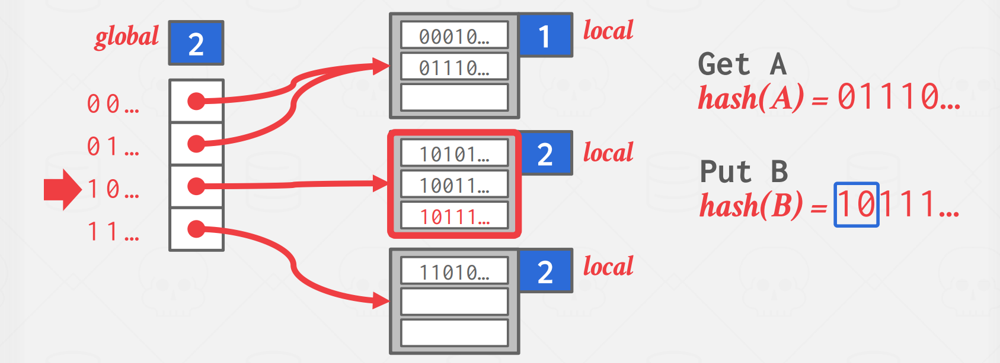
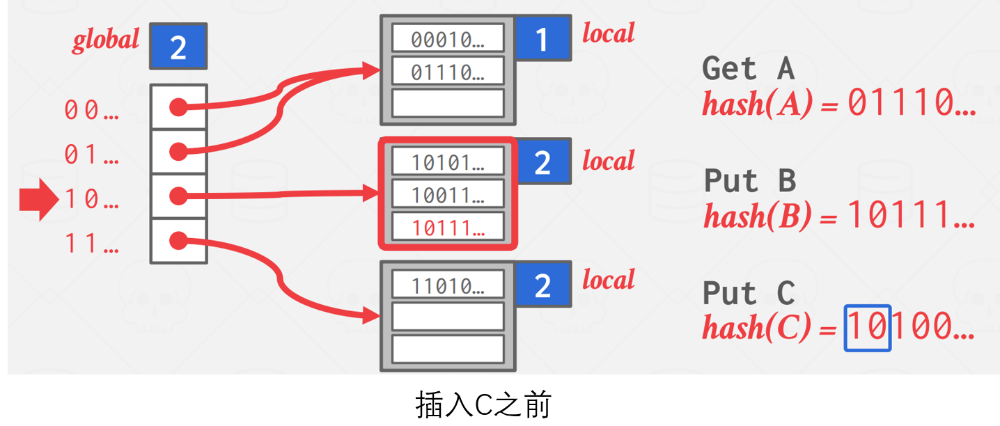
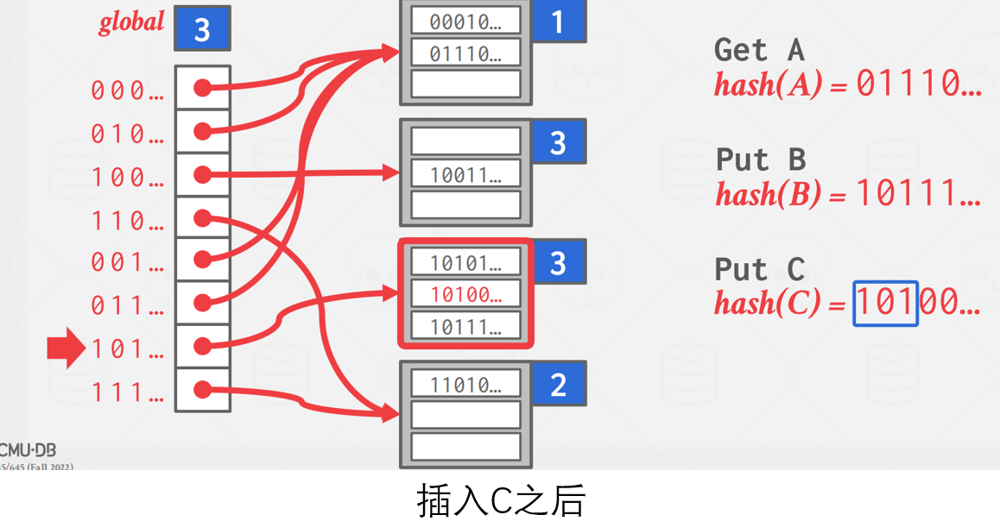
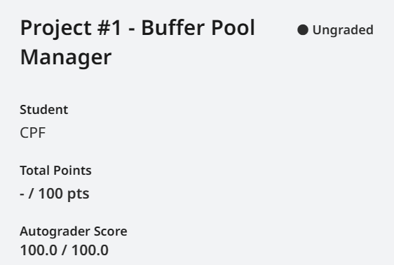

# Project 1-Buffer Pool

<b>发布时间：2023-9-12      最后编辑时间：2023-9-13</b>

在数据库的实际使用场景中，数据的大小往往远大于计算机内存的容量(8G、16G...)。在这种情况下，期望将所有数据全部加载进入内存，再进行查询是不可能的。数据库管理系统(Data Base Management System, DBMS)通过在内存中的**缓存池(Buffer pool)**结构来解决这一问题。缓存池占据内存中的特定区域, 它允许DBMS处理大于内存大小的数据。当其上层结构向其查询某个特定页时，缓存池需要负责提供相应的页：如果缓存池中恰好有上层需要的页，则直接将对应页的指针返回给上层；如果没有，那么则需要从硬盘中加载对应的页。由于缓存池全权负责和内存磁盘间的数据交互，因而在其上层看来，就好像所有的数据都存在了内存中。

可以看到，缓存池的这一角色和操作系统中虚拟内存非常相似。那为何我们不直接使用操作系统为我们提供的虚拟内存服务(mmap)呢？Andy在课程中给出的解释是，DBMS永远比操作系统更清楚自己需要什么。例如，使用缓存池可以将某个特定的页固定(Pin)起来，以确保该页不被驱逐，而使用虚拟内存的话，操作系统无法保证你希望驻留在内存中的页不被驱逐。

## Task1 Extendible Hash Table

本项目的开始需要手写一个可拓展的哈希表(Extendible Hash Table)。该哈希表用来存储缓存池中 page id 和 frame id 的映射关系。

>关于page id 和 frame id: DBMS中每个页具有特定的page id， 而frame id 则指的是缓存池中储存页的数组的索引。

可拓展哈希表每个键(Key)对应大小固定的桶(bucket)，因而在哈希值分布不均匀的情况下，其平均查找长度(Average Search Length, ASL)比链哈希(Chained Hashing)要低——在链哈希最极端的情况下，所有的键有着相同的哈希值，存放在同一个链表内，这时查询的时间复杂度将退化为O(n)（这里假设顺序查找）。

Extendible Hash Table 由一个 directory 和多个 bucket 组成。

- **目录（directory）**: 存放指向桶的指针，是一个数组。用于寻找 key 对应 value 所在的桶。
- **桶（bucket）**: 存放 value，是一个链表。一个桶可以至多存放指定数量的 value。

首先让我们来了解如何使用可拓展哈希表进行查找操作。可拓展哈希表示意图如上图所示。注意图中的"global"和"local"代指全局深度和局部深度。当需要查询A时，计算A的哈希值为"01110..."。由于此时全局深度为2，因而取前两位"01"作为key在目录中进行查找(当然，也可以取后两位)。注意到目录中的"00"和"01"共用同一个桶，这是因为它们指向的桶的局部深度为1,而"00"和"01"的第一位均为0。对B的查询同理，不过注意"10"和"11"对应桶的局部深度为2，因而两者指向不同的桶。

当需要插入值是，首先看看其对应的桶是否已满，如果未满则直接插入；如果已满，则需要执行裂桶(split)操作。

- 如果需要分裂的桶的局部深度小于全局深度，则将局部深度+1，分裂为两个桶，之后将其中存储的值，包括新插入的值，分配到对应的桶中。

- 如果需要分裂的桶的局部深度等于全局深度，如下图例子所示，那么则需要增加全局深度后再进行裂桶操作。

该任务不要求处理收缩(shrink)，因而删除则直接找到对应值后删除即可。

## Task2 LRU-K Replacement Policy

当缓存池需要空闲帧，但所有帧均已满时，则需要从数组中驱逐出某个页，来为新的页腾出空间。选择哪个页进行驱逐，取决于缓存替换策略（Buffer Replacement Policies）。最知名的缓存替换策略为LRU（Least Recently Used）算法，其每一次需要驱逐时，驱逐最久未被使用的页。这一策略依据的原理为时间局部性:在一个具有良好时间局部性的程序中，被引用一次的页很可能在不久的将来被再次引用。

然而，LRU算法不能很好的处理sequential flooding问题。当数据库在对长序列进行扫描时，如果采用LRU算法，则缓存中的原有内容会被序列中内容代替。但问题在于，序列很可能只被访问一次，即在扫描序列中，最近被访问的内容往往短时间内不会被再次访问。

这一问题的解决方法之一是使用LRU算法，即以页最后第K次被访问的时间戳作为驱逐的依据。驱逐时，驱逐时间戳最小的页。

## Task3 Buffer Pool Manager Instance

在完成上面两个任务之后，就可以开始实现缓存池了。总体来说该实验并不难，按照文档的要求进行即可。

## 总结

项目一在四个项目中可以算是最简单的一个。按照文档要求捋清楚思路，事先写好伪代码，并结合测试样例调试，很容易就能通过。另外，该项目还设计到了读写锁的操作，但相比于P2而言，这里对并行的考察并不十分严格，想要省事的话可以直接一把大锁锁住公共的数据结构。

附gradescore提交的结果:

