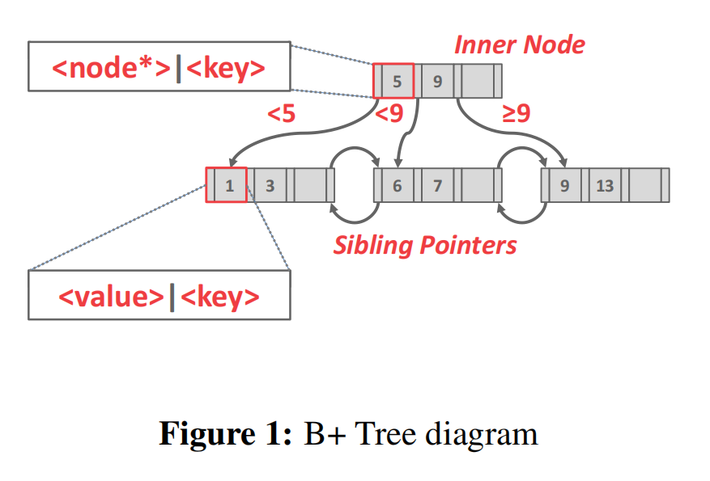
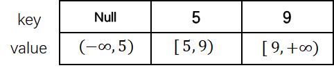
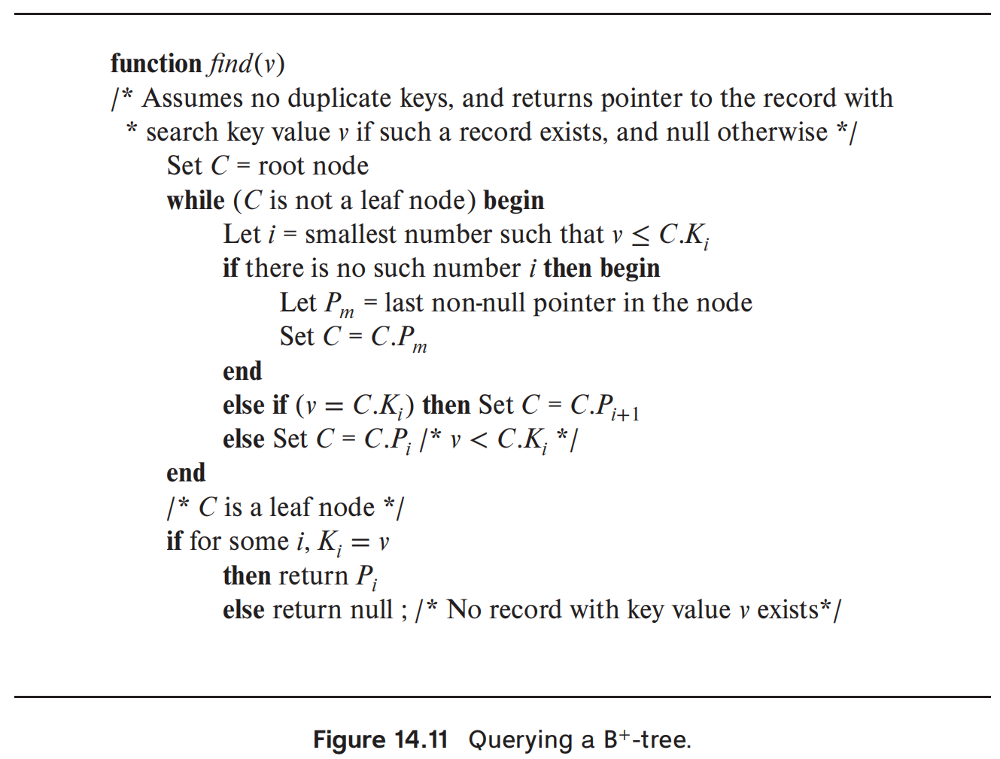
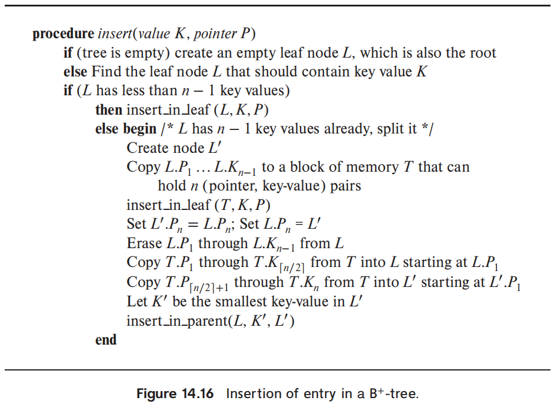
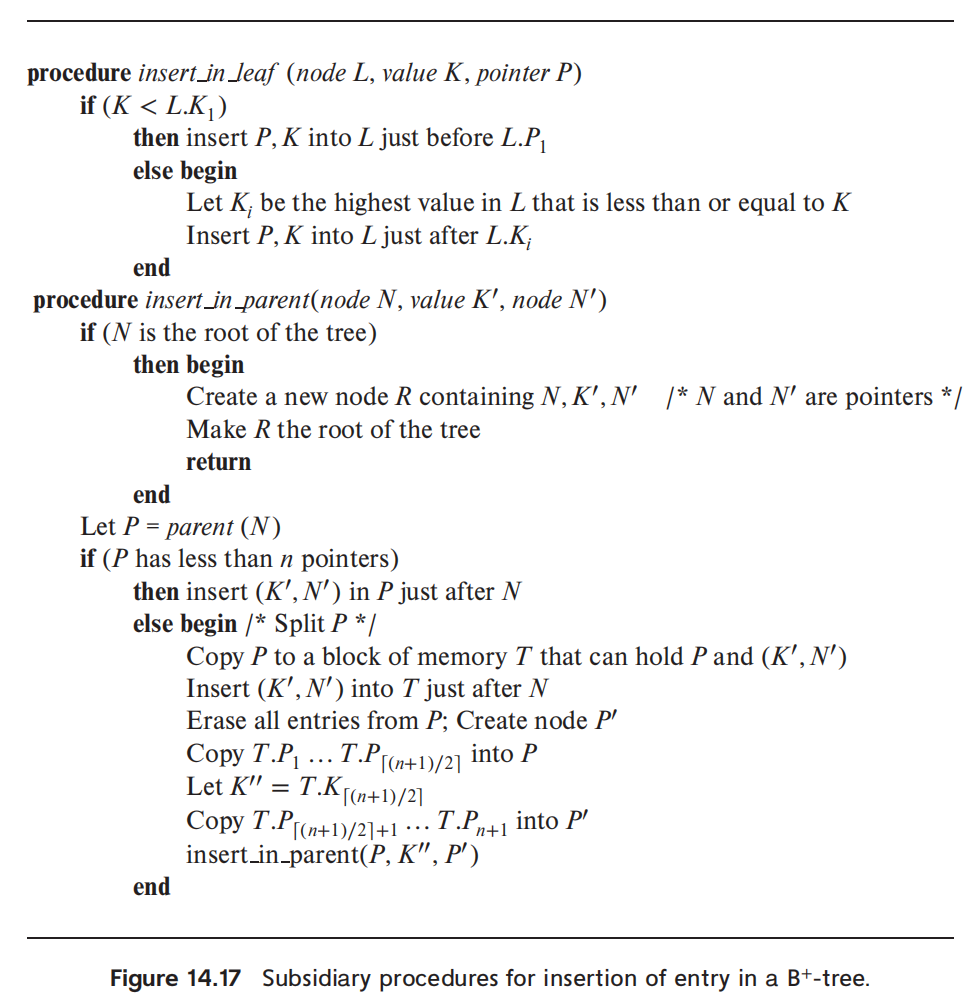
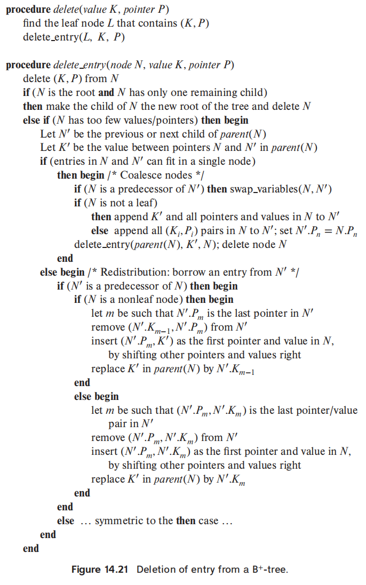
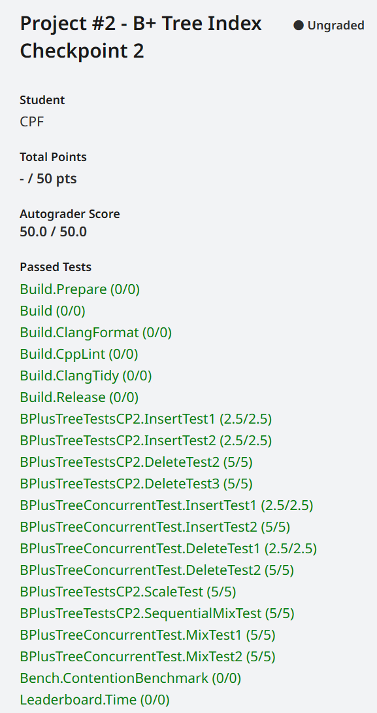

# Project 2-B+ Tree

<font size=3><b>发布时间：2023-9-12      最后编辑时间：2023-9-13</b></font>


## 1.概述
<div align="center"></div> 

上图展示了DBMS的层次结构。在上图所述的结构层次中，B+ 树处于的层次为 "Access Methods"。其目标是从内存池中检索出上层所需要的页。

本项目目的是为你的数据库系统实现索引(Index)。数据库系统使用索引，在快速检索数据的同时无需遍历数据库表的每一行。该结构提供了快速随机查找和高效有序记录访问的基础。

在本项目中，你将实现一个B+树动态索引结构。B+树是平衡树结构，其内部结点指导搜索，而叶子结点包含真实的数据。因为树结构会动态的变大变小，因此你需要处理分割和融合结点的逻辑。


### 1.1 索引

> <font color="blue">An index on an attribute of a relation is a data structure that allows the database system to find those tuples in the relation that have a specified value for that attribute efficiently, without scanning through all the tuples of the relation. </font>
>
> 属性的索引是一种特定的数据结构，其允许数据库系统高效的搜索哪些具有特定值的元组，而不需要遍历整个关系(即整个表)中的全部元组。
>
> —— Database System Concepts (7th Edition) ：P164

值得注意的是，在每个数据库创建的索引数量之间存在权衡关系。虽然更多的索引可以更快地查找查询,但索引也使用存储并需要维护。

更具体的讲解也可以参考该网站:  [索引 - 廖雪峰的官方网站 ](https://www.liaoxuefeng.com/wiki/1177760294764384/1218728442198976)

### 1.2 平衡树

[平衡树]([平衡树 - 维基百科，自由的百科全书 (wikipedia.org)]([平衡树 - 维基百科，自由的百科全书 (wikipedia.org)](https://zh.wikipedia.org/wiki/%E5%B9%B3%E8%A1%A1%E6%A0%91))是计算机科学中的一类数据结构，为改进的[二叉查找树](https://zh.wikipedia.org/wiki/%E4%BA%8C%E5%8F%89%E6%9F%A5%E6%89%BE%E6%A0%91)。一般的二叉查找树的查询复杂度取决于目标结点到树根的距离（即深度），因此当结点的深度普遍较大时，查询的均摊复杂度会上升。为了实现更高效的查询，产生了平衡树。

在这里，平衡指所有叶子的深度趋于平衡，更广义的是指在树上所有可能查找的均摊复杂度偏低。

### 1.3 B+树

> <font color="blue">A B+Tree is a self-balancing tree data structure  that keeps data sorted and allows searches,  sequential access, insertions, and deletions always  in O(log n). </font> 
>
> B+树是一个自平衡树的数据结构，其可以保持数据有序，并允许搜索、序列访问、插入和删除，并且以上操作的时间复杂度均为 $O(n)$。


<div align="center"></div> 

上图展示了B+树的基本结构。可以看到，其在形式上是一个M路的搜索树。其中每个树节点包含一个键值对数组，其中键(key)储存索引基于的属性值，而值的内容取决结点类型：对内部结点，值是指向其子节点的指针(事实上是PID，想拿到指针需要自己调用 **BufferPoolManager**)；对叶子结点，值储存 record ID 或 tuple。一般来说，键的实际数目比值的数目少1。例如上例中，根节点的键为5、9，值为三个指针，分别代表三个范围 : $(-\infty, 5)$ ,  $[5, 9)$,  $[9, +\infty)$。上图根节点的具体存储形式见下图，可以看到第一项的键为null。

<div align="center"></div> 

B+树具有以下几个重要特点：

- 绝对平衡(每个叶子结点的深度相同)；
- 除了跟结点之外的其他内部结点总是至少半满 ($M/2 - 1 <= num\;of\;keys <= M-1$);
- 具有 k 个键 (key) 的内部结点有K+1个非空子结点。

**可视化网站：** [Data Structure Visualization (usfca.edu)](https://www.cs.usfca.edu/~galles/visualization/Algorithms.html)

### 1.4 聚簇索引

> From Chat-gpt
>
> 聚簇索引（Clustered Indexes）是数据库中一种特殊类型的索引，它对表中的数据行进行物理上的重新组织，使得具有相似键值的行在存储上紧密相连或"聚簇"在一起。
>
> 简单来说，聚簇索引是根据表中某一列（或多列）的值对数据进行排序和存储的一种方式。与其他类型的索引不同，聚簇索引决定了数据在磁盘上的物理存储顺序，这意味着具有相近键值的行将存储在一起，形成一个簇。
>
> 为了更好地理解聚簇索引，可以将其比喻为一本书。假设你有一本按照书名排序的书籍目录，每个书名都对应着实际书籍的位置。在这种情况下，书籍的物理存储顺序与它们在目录中的顺序相同。聚簇索引就是类似于这个目录，它定义了数据在磁盘上的物理存储顺序，而实际的数据行就是书籍。
>
> 由于相似的行存储在一起，使用聚簇索引可以提供一些性能优势。当查询需要连续访问聚簇索引列上的数据时，由于相邻行存储在一起，磁盘的读取效率会提高。此外，由于数据的物理存储顺序与索引顺序一致，某些范围查询（例如按范围进行筛选或排序）也可以受益于聚簇索引。
>
> 需要注意的是，每个表只能有一个聚簇索引，因为它决定了数据的物理存储方式。在创建聚簇索引时，数据库系统将会根据指定的列值对数据进行排序，并按照这种排序方式组织数据存储。如果需要根据不同的列进行不同的排序方式，可以考虑使用非聚簇索引来辅助查询。
>
> 总结一下，**聚簇索引是数据库中一种根据表中某一列（即主键）排序对数据进行存储的方式**，它将具有相近键值的行存储在一起。通过聚簇索引，可以提高某些查询的性能，尤其是需要连续访问索引列或进行范围查询的情况。


## 2 B+ Tree Pages

在该任务中，需要实现储存B+树的三种 page:

- B+ Tree Parent Page: 基类；
- B+ Tree Internal Page: 继承自B+ Tree Parent Page， 表示B+ 树的内部结点；
- B+ Tree Leaf Page: 继承自B+ Tree Leaf Page, 表示B+树的外部结点；


## 3 B+Tree Data Structure

该部分实现B+树的搜索(**GetValue()**)，插入(**Insert()**)与删除(**Delete()**)功能。

### 3.1 搜索

从根节点开始，循环的向下层搜索，直至检索到叶子结点为止。

该函数实现相对简单，其中需要注意的在于如何利用 `page_id` 获取对应的页。当我们取得了某个 `page_id ` 之后，使用 `BufferPoolManager` 可以获得Page指针，之后使用类型转换将Page中数组指针强制转化转化为指向 `BPlusTreePage` 的指针:

```c++
auto node = reinterpret_cast<BPlusTreePage*>(page.GetData());
```

注意到DBMS中所有的页统一为3KB. 搜索函数伪代码如下

<div align="center"></div> 


### 3.2 插入

插入过程的伪代码如下图所示(参考 Database System Concepts (7th Edition) )。其中的关键在于如果插入导致结点被塞满，则需要进行分裂操作。分裂操作可能需要迭代进行，因为子结点的分裂会导致其父结点孩子数变多，进而可能导致分裂。

<div align="center"></div> 

<div align="center"></div>

### 3.3 删除

当从结点中删除内容时，可能出现以下情况：

- 如果是根节点，那么单独讨论；

- 删除后结点包含的键数目仍然满足关系  $M/2 - 1 <= num\;of\;keys <= M-1$ : 该情况下无需处理；
- 删除后结点包含的键的数目小于 $M/2 - 1$ : 该情况下又分为以下情况
  - 如果存在相邻的兄弟结点，和其组合后的新结点数目满足要求，那么俩结点组合成新的结点。这种情况下，父节点的键数目会减少，因此需要设计迭代删除的逻辑。
  - 如果不存在上述情况，则从兄弟结点那里借来一个结点(redistrubution)，用以满足键值对数目要求；

<div align="center"></div>


总结来说，该部分的难点在于逻辑复杂，细节较多。需要足够的耐心来按照伪代码的逻辑来进行实现。


## 4 Index Iterator

上述构建的B+树中，叶子结点按照key的值，以链表的方式进行连接。在该任务中，需要实现迭代器 `IndexIterator`, 用于对索引存储的值进行顺序遍历。具体来说，需要实现 `isEnd()`、`operator++()`、`operator*()` 、`operator==()`、`operator!=()`五个成员函数。

在使用 `IndexIterator` 的时候需要注意，`operator++()`定义的是前置运算符，后置运算符的形式是`operator++(int)`。


## 5  Concurrent Index

在该部分中，需要通过锁机制来使B+树支持并发控制。这里的锁需要加在每个结点上，而不能一把大锁锁住整个表。这里采用的并发控制策略为 Latch crabbing/coupling, 之所以叫 crab(螃蟹)，是因为其工作机制酷似螃蟹“横行”的行走方式。

### 5.1 basic latch crabbing

基本的latch crabbing 方式如下：

- 获得父结点的锁；
- 获得子节点的锁；
- 如果子结点被认为是安全的，那么释放父节点的锁。所谓“安全”指的是结点更新时不会分裂(插入)，也不会融合或重分配（删除）；

对于搜索过程来说，需要给结点加读锁，不需要考虑结点安全问题；对插入和删除过程，上写锁需要检查结点安全性。

### 5.2 基于乐观锁的优化方式

上述基本策略的问题在于，并发过程中每一个事务进行查找/删除操作的时候，都要获取根结点的写锁，越是靠底层的结点。越容易被上写锁，这限制了并发性。为了解决这一问题，我们可以采用乐观的上锁方案，即假设结点在多数情况下总是安全的(考虑到多数情况下，查询的次数往往比插入/删除多，这种假设在大多场合是合理的)。而当查找/删除过程中，不幸发现需要修改的叶子结点不是安全的(即需要分裂，合并或重分配)，那么中止该次操作，从根节点开始重新来过——但这次需要采用上一小节的悲观操作进行更新。


## 6 总结 

该实验是四个实验里公认最难的一个。其难点在于细节多且杂，并且调试困难(并发部分)。

附gradescore提交的结果:

<div align="center"></div>


