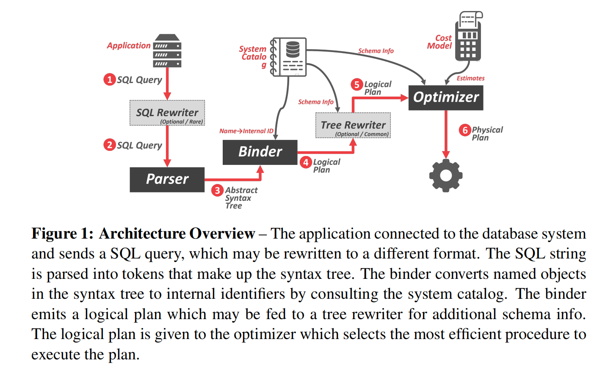
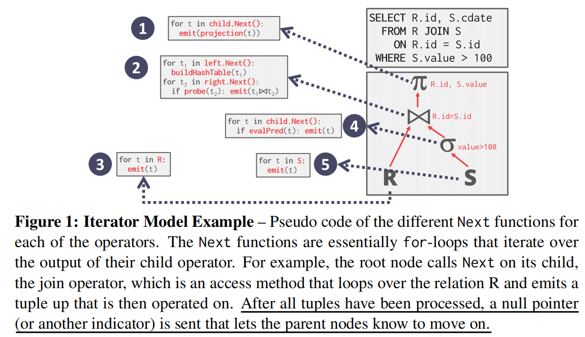
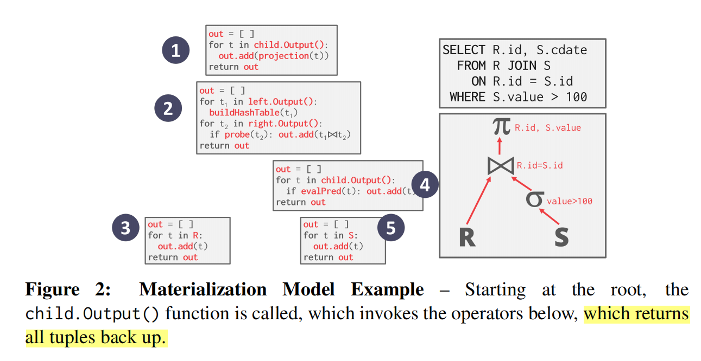

# Project #3 - Query Execution

<font size=3><b>发布时间：2023-9-25 最后编辑时间：2023-9-25</b></font>


个人认为，p3是该课程四个项目里面最有意思的一个。在之前的项目中，我们实现了数据库的内存池和索引结构。而在本项目中，我们需要让我们的BUSTUB能够执行输入的SQL查询。为了做到这一点，我们需要在本项目中	实现若干 **operator executors** ， 并实现优化规则 (**operator executors**) 用于优化 **operator executors**. 

该项目的完成需要我们去理解整个bustub数据库的代码结构，从而在需要的时候知道从哪里去调用哪些函数，这是该项目与之前两个项目最明显的区别——在之前的两个项目中，我们只需要去关心特定文件内的代码，而不需要关心整个工程的结构内容；之前的项目中，难点在于写代码，而本项目的难点在于阅读项目代码。

该项目和之前项目的另一个不同之处在于，其测试文件不在是使用 gtest 编写的 c++文件，而是真正的 SQL 查询。即，当我们完成p3之后，我们事实上已经得到了一个可以使用的数据库了（当然，此时还不支持多事务并发，关于多事务并发，需要在 p4 实现）。该课程为我们准备了一个网页版的 BUSTUB：[BusTub Shell (cmu.edu)](https://15445.courses.cs.cmu.edu/fall2022/bustub/), 通过该网页，可以实际感受我们的数据库应该以怎样的方式进行工作。


## 1 当运行一个 SQL 语句，数据库做了那些事

[BusTub Shell](https://15445.courses.cs.cmu.edu/fall2022/bustub/) 中已经预先加载了部分表格。我们可以使用 `\dt` 命令查看当前数据库中存在的表：

```shell
bustub> \dt
+-----+----------------+------------------------------+
| oid | name           | cols                         |
+-----+----------------+------------------------------+
| 0   | __mock_table_1 | (colA:INTEGER, colB:INTEGER) |
| 1   | __mock_table_2 | (colC:VARCHAR, colD:VARCHAR) |
| 2   | __mock_table_3 | (colE:INTEGER, colF:VARCHAR) |
| ... | ...            | ...                          |
+-----+----------------+------------------------------+
```


下面让我们来运行一个简单的SQL指令进行查询：

```shell
bustub> SELECT * FROM __mock_table_1;
+---------------------+---------------------+
| __mock_table_1.colA | __mock_table_1.colB |
+---------------------+---------------------+
| 0                   | 0                   |
| 1                   | 100                 |
| 2                   | 200                 |
| 3                   | 300                 |
| 4                   | 400                 |
| 5                   | 500                 |
| ...                 | ...                 |
+---------------------+---------------------+
```


想要知道我们的数据库是如何解析这一指令，可以使用 `EXPLAIN` 命令:

```shell
bustub> EXPLAIN SELECT * FROM __mock_table_1;
=== BINDER ===
BoundSelect {
  table=BoundBaseTableRef { table=__mock_table_1, oid=0 },
  columns=[__mock_table_1.colA, __mock_table_1.colB],
  groupBy=[],
  having=,
  where=,
  limit=,
  offset=,
  order_by=[],
  is_distinct=false,
}
=== PLANNER ===
Projection { exprs=[#0.0, #0.1] } | (__mock_table_1.colA:INTEGER, __mock_table_1.colB:INTEGER)
MockScan { table=__mock_table_1 } | (__mock_table_1.colA:INTEGER, __mock_table_1.colB:INTEGER)
=== OPTIMIZER ===
MockScan { table=__mock_table_1 } | (__mock_table_1.colA:INTEGER, __mock_table_1.colB:INTEGER)
```


当我们的指令传入BUSTUB数据库系统之后，需要经过以下几层(注：以下内容部分参考迟先生的文章 :[BusTub 养成记：从课程项目到 SQL 数据库 - 知乎 (zhihu.com)](https://zhuanlan.zhihu.com/p/570917775))

- **Parser:** 该结构将 SQL语句解析为抽象语法树(Abstract Syntax Tree, AST), 更具体的说，是 Postgres AST。该项目使用的 parser是  libpg_query，在代码中的位置为 `root/third_party/libpg_query`。

  > 注：如果是对数据库领域比较感兴趣，或是看过Andy的视频，那么你不会对PostgreSQL感到陌生。这是一个非常知名的开源数据库。而libpg_query是在postgres parser的基础上改进版: "This directory holds the core parser that is used by DuckDB. It is based on the [Postgres parser](https://github.com/pganalyze/libpg_query), but has been stripped down and generally cleaned up to make it easier to modify and extend."

- **Binder** :   通过 libpg_query 产生 Postgres AST 后，Binder 将会把这个 AST 改写成 BusTub 可以理解的一个更高级的 AST。在这个过程中，我们会将所有 identifier 解析成没有歧义的实体。个人理解是，这里的 binder相当于第三方的 libpg_query与 bustub 之间的一个适配器。注意项目中的 binder 和课上说的 binder 作用略有不同。

- **Planner** : 递归遍历 Binder 产生的 BusTub AST，产生一个初步的查询计划。查询计划被以树的形式组织。数据从树的叶子结点流向根结点，根节点输出查询结果。

- **Optimizer** : BusTub optimizer 是一个 rule-based 优化器。我们将不同的规则按顺序应用到当前的执行计划上，产生最终的执行计划。Optimizer 优化过后的查询计划在不改变正确性的情况下提升了查询的性能。

- **executor**: 执行器(executor) 是与 planner 对应的树形结构，负责执行具体的操作。本实验的主要任务就是实现数据库所需要的各种形形色色的 executor,包括：

  - **Access Method Executors**： `seq_scan_executor`, `insert_executor` , `delete_executor` 、`index_scan_executor`. 他们的共同点在于都位于树结构的最底端，即没有子结点。
  - **Aggregation & Join Executors**：聚合算子 `AggregationExecutor` 用于支持聚合运算, 包括 `AVE()`, `MIN()`, `MAX()` 等聚合函数，以及 `GRUOP BY`以及`HAVING` 从句。而该项目的 `join` 算子包括 NestedLoopJoin 和 NestedLoopJoin 两种类型，分别用于无索引和有索引两种场景。
  - **Sort + Limit Executors and Top-N Optimization** :实现 `sort_executor`、`limit_executor` 和 `topn_executor` 。


<div align="center"></div>


## 2 Processing Models : Iterator Model

DBMS的处理模型 (Processing Models) 定义了系统执行查询计划的方式。在课程中，我们学习到了三种处理模型：

- **Iterator Model**: 别名为 volcano model 或 pipeline model。父节点通过循环来从子节点获取tuple, 每一轮循环父节点通过调用 `Next()` 函数向子节点请求数据的时候，只获取一条数据。由于一次调用仅返回一条数据，因而占用内存小，但缺点是存在大量的函数调用。

  注意到使用 Iterator model 时， 一些需要阻塞直到其得到了子节点的全部数据。这种算子被称作 *pipline breakers*。*pipline breakers* 的一些典型例子包括 join、subquery 以及聚合算子。


<div align="center"></div>


- **Materail Model**： 该方法不同于使用循环获取数据的 iterator model, 一次性获取所有数据，且一次性处理所有数据。该种方法更加适合于 OLTP(Online Transaction Processing) 型数据库，因为OLTP系统通常一次查询只访问少量的元组。反之，该方法不适合 OLAP(Online analytical processing) 型数据库，因为OLAP一次查询往往涉及大量中间数据，使用 Material 会导致数据溢出到磁盘，从而降低处理速度。

  <div align="center"></div>

- **Vectorized/ Batch Model**: 介于以上两种模型之间模型，一次发射/接收一个 batch, 类似于深度学习中 min batch 的概念。


## 3 如何开始

刚开始本次实验时，我的感觉是不清楚该如何下手来实现要求的算子，因为该实验需要对整个系统如何运行都要有了解，而不是像前两个项目那样只要阅读少量几个项目涉及的文件。具体来说，可以通过运行该项目的测试文件，并在需要实现的接口处打断点，当程序停在断点处时，通过看堆栈来了解程序的调用逻辑。

### 3.1 BustubInstance

该类定义于 `root/src/common/bustub_instance.cpp` 目录下，用于表示我们的数据库实例。 对本次实验来说，我们需要理解其中的 `BustubInstance::ExecuteSql` 成员函数,如下所示。可以看到该函数接受一个 SQL 字符串作为参数，在开始和结束使用事务来包裹整个查询过程。

``` c++
/* In "root/src/common/bustub_instance.cpp" */
auto BustubInstance::ExecuteSql(const std::string &sql, ResultWriter &writer) -> bool {
  auto txn = txn_manager_->Begin();
  auto result = ExecuteSqlTxn(sql, writer, txn);
  txn_manager_->Commit(txn);
  delete txn;
  return result;
}
```


查询的核心内容在 `BustubInstance::ExecuteSqlTxn` 成员函数中。可以看到其大致执行过程和上面叙述的一样，是按照 parse->Binder->Planner->Optimizer->executor的顺序进行的。

```cpp
/* In "root/src/common/bustub_instance.cpp" */ 
auto BustubInstance::ExecuteSqlTxn(const std::string &sql, ResultWriter &writer, Transaction *txn) -> bool {
  /* skip */

  bool is_successful = true;

  std::shared_lock<std::shared_mutex> l(catalog_lock_);
  bustub::Binder binder(*catalog_);
  binder.ParseAndSave(sql);
  l.unlock();

  for (auto *stmt : binder.statement_nodes_) {
    auto statement = binder.BindStatement(stmt);
	/* skip */

    std::shared_lock<std::shared_mutex> l(catalog_lock_);

    // Plan the query.
    bustub::Planner planner(*catalog_);
    planner.PlanQuery(*statement);

    // Optimize the query.
    bustub::Optimizer optimizer(*catalog_, IsForceStarterRule());
    auto optimized_plan = optimizer.Optimize(planner.plan_);

    l.unlock();

    // Execute the query.
    auto exec_ctx = MakeExecutorContext(txn);
    std::vector<Tuple> result_set{};
    is_successful &= execution_engine_->Execute(optimized_plan, &result_set, txn, exec_ctx.get());

    // Return the result set as a vector of string.
    auto schema = planner.plan_->OutputSchema();

    // Generate header for the result set.
    writer.BeginTable(false);
    writer.BeginHeader();
    for (const auto &column : schema.GetColumns()) {
      writer.WriteHeaderCell(column.GetName());
    }
    writer.EndHeader();

    // Transforming result set into strings.
    for (const auto &tuple : result_set) {
      writer.BeginRow();
      for (uint32_t i = 0; i < schema.GetColumnCount(); i++) {
        writer.WriteCell(tuple.GetValue(&schema, i).ToString());
      }
      writer.EndRow();
    }
    writer.EndTable();
  }

  return is_successful;
}
```


### 3.2 ExecutionEngine

其中和完成本次实验关系最大的是优化和执行两部分。对于查询执行部分，程序调用 `execution_engine` 中的 `Execute()` 成员函数。其中 `ExecutionEngine::PollExecutor ` 所执行的内容，即为 iterator model 的实现过程——即循环调用 `Next()` 函数从子结点那里获取元组。而其中的 `executor`, 即为我们要实现的内容。

```c++
/* In "root/src/include/execution/execution_engine.h" */ 
/**
 * The ExecutionEngine class executes query plans.
 */
class ExecutionEngine {
 public:
  /**
   * Construct a new ExecutionEngine instance.
   * @param bpm The buffer pool manager used by the execution engine
   * @param txn_mgr The transaction manager used by the execution engine
   * @param catalog The catalog used by the execution engine
   */
  ExecutionEngine(BufferPoolManager *bpm, TransactionManager *txn_mgr, Catalog *catalog)
      : bpm_{bpm}, txn_mgr_{txn_mgr}, catalog_{catalog} {}

  DISALLOW_COPY_AND_MOVE(ExecutionEngine);

  /**
   * Execute a query plan.
   * @param plan The query plan to execute
   * @param result_set The set of tuples produced by executing the plan
   * @param txn The transaction context in which the query executes
   * @param exec_ctx The executor context in which the query executes
   * @return `true` if execution of the query plan succeeds, `false` otherwise
   */
  // NOLINTNEXTLINE
  auto Execute(const AbstractPlanNodeRef &plan, std::vector<Tuple> *result_set, Transaction *txn,
               ExecutorContext *exec_ctx) -> bool {
    BUSTUB_ASSERT((txn == exec_ctx->GetTransaction()), "Broken Invariant");

    // Construct the executor for the abstract plan node
    auto executor = ExecutorFactory::CreateExecutor(exec_ctx, plan);

    // Initialize the executor
    auto executor_succeeded = true;

    try {
      executor->Init();
      PollExecutor(executor.get(), plan, result_set);
    } catch (const ExecutionException &ex) {
#ifndef NDEBUG
      LOG_ERROR("Error Encountered in Executor Execution: %s", ex.what());
#endif
      executor_succeeded = false;
      if (result_set != nullptr) {
        result_set->clear();
      }
    }

    return executor_succeeded;
  }

 private:
  /**
   * Poll the executor until exhausted, or exception escapes.
   * @param executor The root executor
   * @param plan The plan to execute
   * @param result_set The tuple result set
   */
  static void PollExecutor(AbstractExecutor *executor, const AbstractPlanNodeRef &plan,
                           std::vector<Tuple> *result_set) {
    RID rid{};
    Tuple tuple{};
    while (executor->Next(&tuple, &rid)) {
      if (result_set != nullptr) {
        result_set->push_back(tuple);
      }
    }
  }

  [[maybe_unused]] BufferPoolManager *bpm_;
  [[maybe_unused]] TransactionManager *txn_mgr_;
  [[maybe_unused]] Catalog *catalog_;
};
```


### 3.3 Optimizer::Optimize

以下代码为 BUSTUB 自带的优化策略，其中 OptimizeSortLimitAsTopN(p) 是需要我们自己实现的。此外该实验的 Leaderboard 需要我们自己添加新的优化方式，以提高程序的运行效率。

```c++
auto Optimizer::Optimize(const AbstractPlanNodeRef &plan) -> AbstractPlanNodeRef {
  if (force_starter_rule_) {
    // Use starter rules when `force_starter_rule_` is set to true.
    auto p = plan;
    p = OptimizeMergeProjection(p);
    p = OptimizeMergeFilterNLJ(p);
    p = OptimizeNLJAsIndexJoin(p);
    p = OptimizeOrderByAsIndexScan(p);
    p = OptimizeSortLimitAsTopN(p);
    return p;
  }
  // By default, use user-defined rules.
  return OptimizeCustom(plan);
}
```


## 4 总结

以上介绍了实验3的大致内容，以及整个项目的大致结构。正如之前所强调的那样，本项目的难点在于阅读代码，理解整个BUSTUB是如何工作的，理解从哪里获取所需要的功能。关于项目的具体实现细节，网上现有的教程介绍的已经很详尽了，例如 [做个数据库：2022 CMU15-445 Project3 Query Execution - 知乎 (zhihu.com)](https://zhuanlan.zhihu.com/p/587566135)，在此不做赘述。


