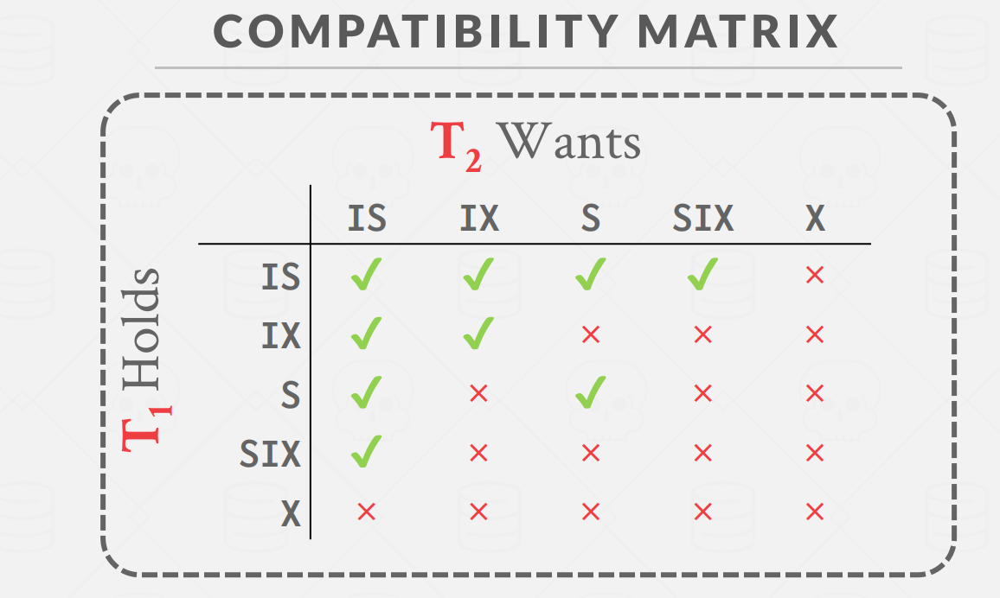

# Project #4 - Concurrency Control

<font size=3><b>发布时间：2023-10-05 最后编辑时间：2023-10-06</b></font>


终于到了15445的第最后一个部分了！在这一部分中，我们需要为BUSTUB提供对事务 (transaction) 的支持。为了实现这一点，我们需要添加**锁管理器( lock manager)**。锁管理器负责管理维护表和元组两类对象的五种不同模式的锁：intention-shared (**IS**), intention-exclusive (**IX**), shared-intention-exclusive (**SIX**), shared (**S**)， exclusive (**X**).


## 1 基本概念

### 1.1 事务

一个事务由若干条SQL语句组成。一个事务以 **BEGIN** 命令开始，并且一定按照以下两种方式之一结束：

- **提交 (COMMIT)** : 提交一个事务之后，DBMS将会把该事务对数据做出的改变更新到数据库中，使之变成永久的。当一个事务被提交之后，DBMS将会自动开始一个新事务；
- **抛弃（ABORT.）** ：撤销该事务造成的所有更新， 数据库状态会恢复到事务执行之前的状态。

事务是支持数据库并发控制的基础。想象一下，我们该如何设计一个能够同时处理多个事务，且彼此间互不干扰的数据库。一个最直观的方法就是，以单线程的方式顺序的执行所有的事务。这种方式的结果确实是我们所期望的，但问题是，这种方式实在是太慢了。像淘宝这样的网站，每秒都有数以万计的的请求，如果所有的请求都单线程的执行，造成的延时是用户无法接受的。因此我们需要在保证结果和串行一致的同时，设计并行的算法。正确的并行算法需要满足 **ACID** 原则：

- **A**tomicity (原子性) ： 原子性保证一个事务中所有的SQL语句要么全部被执行，要不一条也不执行；
- **C**onsistency （一致性）：一致性保证数据库的结果必须是逻辑上正确的。
- **I**solation (隔离性) ：DBMS 应该为并行运行的事务提供一种错觉，就好像同时只有其自己一条事务在运行,并行运行的事务之间彼此不能互相干扰(Serializable Schedule)。
- **D**urability (持久性): 提交过后的所有改变是永久的。


### 1.2 两阶段锁与锁等级

两阶段的加锁原则是一种消极的并发控制协议。DBMS通过判断一个事务是否拥有所要访问对象的锁来决定其是否有权访问对象。两阶段的锁的过程如下：

- Growing : 在此阶段，在此阶段，事务可以像锁管理器申请锁或者请求升级对某个对象的锁；
- Shrinking ：一旦当事务释放了它拥有的第一个锁，事务就进入了 Shrinking 阶段。在此阶段，只允许释放锁，不允许获得新的锁。

通过两阶段锁的方式，可以保证并发控制满足上述的 ACID 四项原则。

在BUSTUB中，只有表级和元组级两种锁级别。层次化的锁管理机制决定了，当事务拥有了某个表的读锁或者写锁，那么它同时具有了表中所有元组的读锁或者写锁。除了我们锁熟知的读写锁(即share and exclusive)之外，为了支持层次化的锁管理，还需要额外的三种锁类型：

- Intention-Shared (IS)： 当一个表被加上了 IS 锁，说明该表具有的元组可能被加读锁；
- Intention-Exclusive (IX): 当一个表被加上了 IX 锁，说明该表具有的元组可能被加写锁；
- Shared+Intention-Exclusive (SIX): 顾名思义，就是 S锁 + IX 锁。即事务在拥有表的读锁同时，打算去读取表中的某个元组。

这五种锁的兼容性矩阵如下图所示

<div align="center"></div>


### 1.3 死锁

在给我们自己编写的程序设计多线程的时候，死锁是可以通过合理的锁管理避免的（参考CSAPP第12章，互斥锁加锁顺序规则）。然而对于多事务并发控制而言，由于我们无法预知事务需要请求什么资源，因此死锁现象是难以避免的。例如现在有A和B两个表，分别代表A银行和B银行。如果一个事务尝试从A银行转账到B银行，而另一个事务同时尝试从B银行转账到A银行，那么完全可能出现这样一种可能，事务1拥有A的写锁，需要B的写锁，但事务2拥有B的写锁，需要A的写锁。这种情况下，A等B释放锁，B却等A释放锁，即发生了死锁。

在本项目中采用有向图的方式检测是否发生了死锁。将每一个资源(表或者元组)视为一个结点。如果一个事务拥有了资源A的锁，在等待获取资源B 的锁，则将A和B之间建立一个有向边。DBMS定期运行死锁检查程序，当检测到图中存在环形结构时，则代表发生了死锁。


## 2 具体任务

### 2.1 Lock Manager

在该部分，需要实现锁管理器 （见`lock_manager.h`）中的 `LockTable`, `UnlockTable`, `LockRow`, `UnlockRow` 四种方法。

lock manager 加锁和释放锁的核心任务是要维护其中的私有变量 `table_lock_map_` 和 `row_lock_map_`:

```cpp
  /** Structure that holds lock requests for a given table oid */
  std::unordered_map<table_oid_t, std::shared_ptr<LockRequestQueue>> table_lock_map_;
  /** Coordination */
  std::mutex table_lock_map_latch_;

  /** Structure that holds lock requests for a given RID */
  std::unordered_map<RID, std::shared_ptr<LockRequestQueue>> row_lock_map_;
  /** Coordination */
  std::mutex row_lock_map_latch_;
```

其中 `LockRequestQueue` 用于储存所有等待获得或正在持有某个对象的锁的请求的集合：

```cpp
/**
 * Structure to hold a lock request.
 * This could be a lock request on a table OR a row.
 * For table lock requests, the rid_ attribute would be unused.
 */
class LockRequest {
    public:
    LockRequest(txn_id_t txn_id, LockMode lock_mode, table_oid_t oid) /** Table lock request */
        : txn_id_(txn_id), lock_mode_(lock_mode), oid_(oid), on_table_(true) {}
    LockRequest(txn_id_t txn_id, LockMode lock_mode, table_oid_t oid, RID rid) /** Row lock request */
        : txn_id_(txn_id), lock_mode_(lock_mode), oid_(oid), rid_(rid), on_table_(false) {}

    /** Txn_id of the txn requesting the lock */
    txn_id_t txn_id_;
    /** Locking mode of the requested lock */
    LockMode lock_mode_;
    /** Oid of the table for a table lock; oid of the table the row belong to for a row lock */
    table_oid_t oid_;
    /** Rid of the row for a row lock; unused for table locks */
    RID rid_;
    /** If it's a table lock*/
    bool on_table_;
    /** Whether the lock has been granted or not */
    bool granted_{false};
};

class LockRequestQueue {
    public:
    void InsertIntoQueue(const std::shared_ptr<LockRequest> &request, bool place_first) {
        if (!place_first) {
            request_queue_.push_back(request);
            return;
        }
        const auto it = std::find_if_not(request_queue_.begin(), request_queue_.end(),
                                         [](const std::shared_ptr<LockRequest> &request) { return request->granted_; });
        request_queue_.insert(it, request);
    }
    /** List of lock requests for the same resource (table or row) */
    std::list<std::shared_ptr<LockRequest>> request_queue_;
    /** For notifying blocked transactions on this rid */
    std::condition_variable cv_;
    /** txn_id of an upgrading transaction (if any) */
    txn_id_t upgrading_ = INVALID_TXN_ID;
    /** coordination */
    std::mutex latch_;
};
```


具体的实现过程可以参见 [做个数据库：2022 CMU15-445 Project4 Concurrency Control ](https://zhuanlan.zhihu.com/p/592700870)， 这里单独强调一下其中条件变量的使用。

当我们需要实现某个事务的锁请求排队等待的逻辑，采用如下的简单循环是有问题的：

```cpp
while (!GrantLock(...)) {
    sleep(1);
}
```

一来是休眠的时间不好确定，而更严重的问题是，程序运行到此处时，应当是持有对指定对象请求队列锁的。如果在等待过程一直不释放锁的话，那么其他想要访问或者释放该对象锁的事务就没法进行了（因为拿不到请求队列锁）。因此看起来，我们需要类似以下代码的逻辑:

```cpp
while (!GrantLock(...)) {
    queue_lock.unlock();
    pause();
    queue_lock.lock();
}
```

其中 `pause()`函数暂时挂起了程序，直到被外来信号打断。并且，循环中的内容理应是原子的，不然如果在`pause()`运行之前，外来信号就到了，那么函数可能永远停在这里。

> 注： 以上内容可以参考 CSAPP第8章异常控制8.5.7节 sigsuspend() 函数

在c++中，实现类似操作可以通过条件变量的方式，具体来说，代码如下：

```cpp
// 等待在条件变量上
while(!GrantLock(...)){
    queue->cv_.wait(queue_lock)
}
// 另一种写法
queue->cv_.wait(queue_lock,[&](){
    return GrantLock(...);
})
```

这里如果其他线程想要将处于等待状态的线程激活，需要使用

```cpp
// do something changing the state of resource...
cv.notify_all();
```

`notify_all()` 可以看作一次广播，会唤醒所有正在此条件变量上阻塞的线程。在线程被唤醒后，其仍处于 wait 函数中。在 wait 函数中尝试获取 latch。在成功获取 latch 后，退出 wait 函数，进入循环的判断条件，检查是否能获取资源。若仍不能获取资源，就继续进入 wait 阻塞，释放锁，挂起线程。若能获取资源，则退出循环。这样就实现了阻塞等待资源的模型。条件变量中的条件指的就是满足某个条件，在这里即能够获取资源。


### 2.2 Deadlock Detection

这里要求采用深度优先遍历算法来检测有向图中的环。建议在做之前去做一下力扣的这道题 [207. 课程表 - 力扣（LeetCode）](https://leetcode.cn/problems/course-schedule/description/)


### 2.3 Concurrent Query Execution

这一部分需要我们改写上一个实验的部分算子，以支持并发的查询。具体来说，需要改写的算子有 `sequential scan`, `insert` 以及 `delete`。


## 3 总结

个人感觉实验四的难度在四个实验里面排名第二。本人在这个实验花费了将近半个月的时间...

但伴随这本实验的结束，15445的所有实验就已经宣告结束了。完结，撒花 🎉🎉🎉🎉🎉


