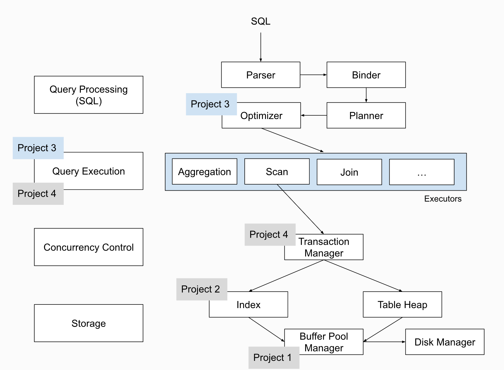

# CMU15445
<b>发布时间：2023-9-10      最后编辑时间：2023-9-13</b>

CMU15-445是卡耐基梅隆大学的一门数据库课程。该门课程涉及到数据库方方面面，包括数据模型、存储模型、查询语言（SQL）、存储体系结构（堆、日志结构）、索引（顺序保留树、哈希表）、事务处理与恢复、查询处理与优化和并行体系结构（多核、分布式）等。

该门课程的一大亮点在于, 其在实验部分使用C++语言设计了一个关系型数据库 [bustub](https://github.com/cmu-db/bustub)。学生需要按照课程的要求，一步步的完善bustub的内容：

- project 1 中，需要为数据库实现缓存池。利用缓存池可以尽可能的避免由磁盘IO带来的性能损失；
- project 2 实现了基于B+树的索引。利用索引可以更加快速的进行数据查询；
- project 3 实现数据库的 Execution 层中各种常用的算子，并添加优化策略；
- project 4 实现锁管理器，以支持多事务并发；

该项目的总体框架如下图所示。可以看到，该项目可以说麻雀虽小，五脏俱全，涵盖了数据库从底层到顶层的全部内容。此外， bustub 作为一个 C++ 编写的中小型项目，涵盖了程序构建(cmake)、代码规范(clang-tidy)、单元测试 (google test)等众多要求，可以作为一个优秀的开源项目学习。

## 前置要求

- C++语法基础，尤其需要掌握C++11之后的modern c++语法。该项目使用语言版本为C++17（必需，该课程进行的前提是完成 [p0](https://15445.courses.cs.cmu.edu/fall2022/project0/) 的测试，以验证你具有完成该项目所需的c++知识）；
- 基本的计算机常识，诸如操作系统、数据结构等(非必需，课程内对涉及的相关知识会进行介绍)；
- 基本的数据库知识, 如SQL基本指令(非必需，课程前几节课会简单介绍)；

## 资源汇总

由于本人推的是Fall2022版本的课程，因而以下资料基本上也都是2022年的内容：

- [CMU 15-445/645 :: Intro to Database Systems (Fall 2022)](https://15445.courses.cs.cmu.edu/fall2022/) ：15445的课程主页；
- [CMU15-445 22Fall通关记录](https://www.zhihu.com/column/c_1605901992903004160) ：十一佬的通关记录，个人认为是众多15445经验贴里面总结的最详实的了；
- [CMU 15445 -2022通关小结](https://zhuanlan.zhihu.com/p/592547524) ：同样是诸多经验贴里面最翔实的那一批；
- [BusTub 养成记：从课程项目到 SQL 数据库 ](https://zhuanlan.zhihu.com/p/570917775) ：课程TA迟先生对项目的介绍；
- [CMU 15-445: Database Systems - CS自学指南 (csdiy.wiki)](https://csdiy.wiki/%E6%95%B0%E6%8D%AE%E5%BA%93%E7%B3%BB%E7%BB%9F/15445/) ：CS自学指南里对课程的简单介绍；

