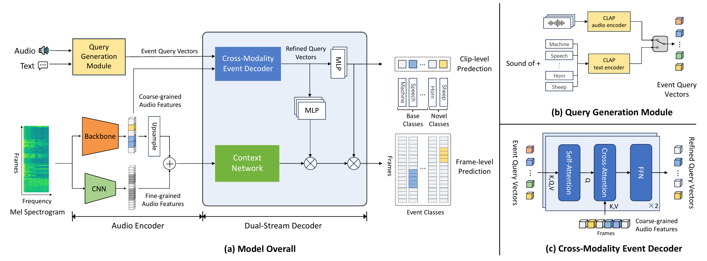
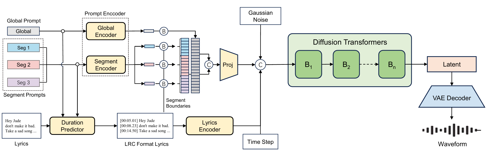

# Blog of C.P.F.

### 🎓 Education

#### University of Science and Technology of China (Sep. 2023 - Present)  
Master’s Student, Department of Electronic Engineering and Information Science  
- Research Focus: 
  - computational auditory perception, including sound event detection(SED), multimodal audio understanding, and LLM-based audio understanding;
  - audio AIGC (speech/music/audio)
- Advisor: Assoc. Prof. Yan Song (National Engineering Research Center for Speech and Language Information Processing)  
- Expected Graduation: June 2026  

#### Dalian University of Technology (Sep. 2019 - June 2023)  
Bachelor of Engineering, Electronic Information Engineering  
- GPA: 93.20 / 100  
- Rank: 2 / 183 (Top 1%)  

### 📧 Contact
- e-mail: [cqi525@mail.ustc.edu.cn](mailto:cqi525@mail.ustc.edu.cn)  or [good_luck_cpf@163.com](mailto:good_luck_cpf@163.com)  
- github: [GitHub: cai525](https://github.com/cai525)   

### 📖 Works

#### Detect Any Sound : Open-Vocabulary Sound Event Detection with Multi-Modal Queries

**Pengfei Cai**, Yan Song, Qing Gu, Nan Jiang, Haoyu Song, Ian McLoughlin

In ACM MM, 2025   \[ [paper](https://arxiv.org/abs/2507.16343) \| [demo](https://cai525.github.io/Transformer4SED/demo_page/DASM/index.html) \| [code](https://github.com/cai525/Transformer4SED/tree/main/docs/DASM)  \]

#### SegTune: Structured and Fine-Grained Control for Song Generation
**Pengfei Cai**, Joanna Wang, Haorui Zheng, Xu Li, Zihao Ji, Teng Ma, Zhongliang Liu, Chen Zhang, Pengfei Wan

\[ [paper](https://www.arxiv.org/pdf/2510.18416) \| [demo](https://cai525.github.io/SegTune_demo/) \]

#### Prototype based Masked Audio Model for Self-Supervised Learning of Sound Event Detection

**Pengfei Cai**, Yan Song, Nan Jiang, Qing Gu, Ian McLoughlin

In ICASSP, 2025    \[ [paper](https://ieeexplore.ieee.org/document/10889422) \| [code](https://github.com/cai525/Transformer4SED/blob/main/docs/pmam/readme.md)  \]

#### MAT-SED: A MaskedAudio Transformer with Masked-Reconstruction Based Pre-training for Sound Event Detection

**Pengfei Cai**, Yan Song, Kang Li, Haoyu Song, Ian McLoughlin

In Interspeech, 2024   \[ [paper](https://www.isca-archive.org/interspeech_2024/cai24_interspeech.html) \| [code](https://github.com/cai525/Transformer4SED/blob/main/docs/mat-sed)  \]

#### Kling-Foley: Multimodal Diffusion Transformer for High-Quality Video-to-Audio Generation

 Jun Wang*, Xijuan Zeng*, Chunyu Qiang, Ruilong Chen, Shiyao Wang, Le Wang, Wangjing Zhou, **Pengfei Cai**, Jiahui Zhao, Nan Li, Zihan Li, Yuzhe Liang,
Xiaopeng Wang, Haorui Zheng, Ming Wen, Kang Yin, Yiran Wang, Nan Li, Feng Deng, Liang Dong, Chen Zhang, Di Zhang, Kun Gai

\[ [paper](https://arxiv.org/pdf/2506.19774) \| [demo](https://klingfoley.github.io/Kling-Foley/)  \]

#### Parameter-Efficient Tuning of Large Audio-Language Models for DCASE 2025 Challenge Task 5

**Pengfei Cai**, Yanfeng Shi, Qing Gu, Nan Jiang, Yan Song

DCASE 2025 challenge， Audio Question Answering task，second place \[ [DCASE](https://dcase.community/challenge2025/task-audio-question-answering) \| [technical report](https://dcase.community/documents/challenge2025/technical_reports/DCASE2025_Cai_95_t5.pdf) \]

