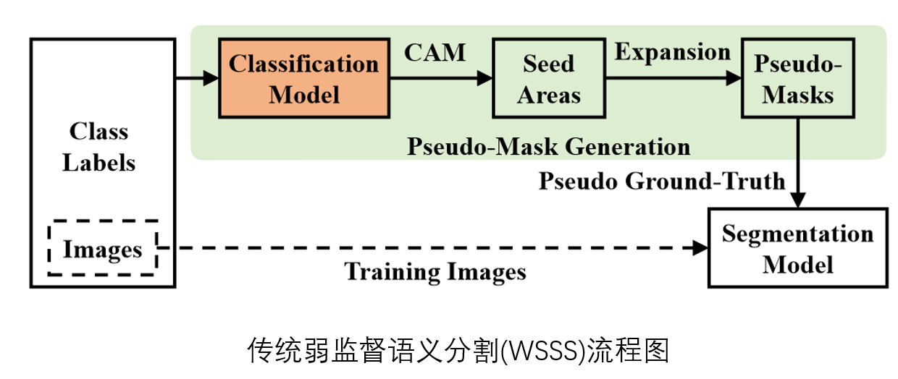
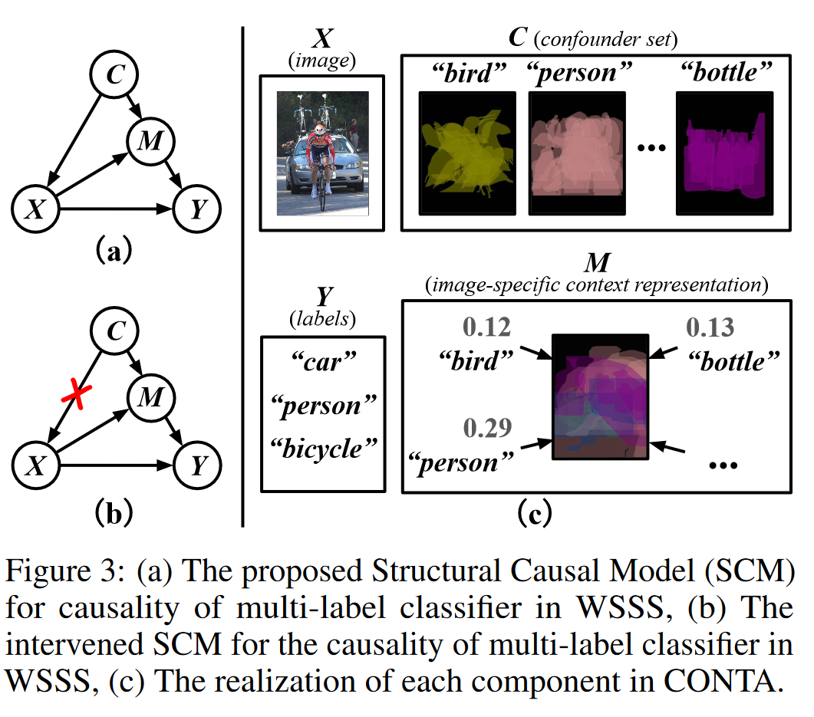

<head>
    
    
</head>

# Cause intervention(因果干预)

本文的起因是读到了ICASSP2023的一篇论文[^1],其中的核心是因果干预(Cause intervention)，于是按照文中引用文献大致学习了因果干预方法在计算机视觉和音频领域的应用。

## 1 基本概念

首先用一个例子来具体说明为什么我们需要因果干预。

假设我们现在去统计是否穿戴奢侈品与是否长寿之间的关联性，我们很可能发现，这两个指标之间呈现较强的相关性，即穿戴奢侈品的人更可能长寿。那么我们可以认为是穿戴奢侈品导致长寿吗？似乎并不能说得通。实施情况是，穿戴奢侈品的人更加富有，因而能享受更好的医疗条件，进而导致长寿。当然富有对长寿的作用不是绝对的，这里只是为了说明这一问题而举的简化的例子。

从上图可以看出，”富有“这一变量直接影响”奢侈品“和”长寿“两个变量。在因果理论中，将这种变量称为混淆因子（confonder）。假设  $P(C=1/X=1)=0.9$ ，$P(Y=1/C=1)=0.9$，$P(Y=1/C=0)=0.4$，$P(Y)$ 仅由  $C$决定 ，则：

$$\begin{align}
P(Y=1|X=1)&=\sum_{c}P(Y=1|X=1，C=c)P(C=c|X=1)\\
&=0.9\times0.9+0.4\times 0.1\\
&=0.85
\end{align} \tag{1}$$

显然这一结果是不合理的。造成这种不合理的原因是混淆因子的存在。

使用do算子进行因果干预可以解决这一问题。该算子人为的假设变量 X 与 C 之间无关，即现在无论贫穷与富贵，人人都能用上奢侈品。现在再次计算奢侈品与长寿的关系，这里不妨假设使用奢侈品的概率为0.1：

$$\begin{align}
P(Y=1|X=1)&=\sum_{c}P(Y=1|X=1，C=c)P(C=c)\\
&=0.9\times0.1+0.4\times 0.9\\
&=0.45
\end{align} \tag{2}$$

这下结果变得相对合理了。

## 2 因果干预在计算机视觉领域应用

传统弱监督语义分割流程图如下图所示。首先训练分类模型，通过类别激活图[^2]（Classification Activation Map, CAM）获得种子区域；之后将种子区域通过特定的算法进行扩大后得到伪掩膜；之后利用伪掩膜训练一个新的分割模型。

传统的弱标签语义分割方法容易受上下文先验的影响：例如如果训练集中“鸭子”总是和“水”出现在一起，模型很可能认为，分类模型得出“鸭子”的标签，是由图片中“鸭子”部分和“水面”部分共同导致的。对于分类而言，这种想法没有问题。但对上图中的弱监督语义分割问题而言，这种现象将导致CAM除了鸭子区域外，还包含了水面。而另一个可能的风险是，如果测试集中仅有鸭子没有水，模型可能会无法识别出鸭子。

造成这一现象的根本原因还是训练集本身不够丰富，无法包含所有的情况。例如如果训练集足够丰富，包含各种场景下的鸭子，那这一问题就不会出现。

Zhang等[^3]采用因果干预的方法解决这一问题。在论文中，他们构建了如下图所示的结构化因果模型。其中上下文先验C作为混淆因子。通过对上下文C和图片X之间进行干预，从而使结果摆脱上下文先验的影响。由于其中C在开始时是未知量，因而采用EM算法不断进行迭代以期望C达到收敛。

## 3 因果干预在声音事件检测领域的应用

同样的现象在声音事件检测任务中也可能出现。论文[^1] 中针对声音事件检测问题中相似的问题，同样采用因果干预的策略，其结构框图参考论文[^4]获得，如下所示。

值得注意的是，虽然该篇文章思路比较新，但取得的效果与基线相比并未获得显著提升。

## 引用

本文参考资源：

1. [[NeurIPS 2020 oral\] 基于因果干预的弱监督语义分割 - 知乎 (zhihu.com)](https://zhuanlan.zhihu.com/p/260967655) 
2. [无监督的视觉常识特征学习——因果关系上的一点探索（CVPR 2020） - 知乎 (zhihu.com)](https://zhuanlan.zhihu.com/p/111306353)

引文：

[^1]: IMPROVING WEAKLY SUPERVISED SOUND EVENT DETECTION WITH CAUSAL INTERVENTION, ICASSP 2023
[^2]: Bolei Zhou, Aditya Khosla, et.al. Learning deep features for discriminative localization. In CVPR, 2016.
[^3]: Causal Intervention for Weakly-Supervised Semantic Segmentation 
[^4]: Improving Weakly-supervised Object Localization via Causal Intervention, MM 2021

