
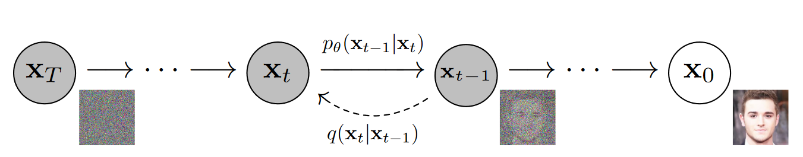

# Denoising Diffusion Probabilistic Models(DDPM)

扩散模型在2015被提出[^1]。本文的贡献在于

- 给出了扩散模型严谨的数学推导;

- 分析了DDPM和去噪得分匹配之间的关系，提出了预测噪声的训练目标；

- 并且首先证明了扩散模型可以生成高质量的样本。

## 1 扩散模型概述

Diffusion 的前向过程(forward process or diffusion process) 利用马尔可夫链，逐步向原始数据中添加高斯噪声。

$$q( \mathbf{x}_ {1: T}\vert\mathbf{x}_ {0}  ):=\prod \limits^{T}_{t=1} q( x_ {t} \vert\mathbf{x}_ {t-1}  )，q(   \mathbf{x}_t     \vert\mathbf{x}_{t-1}   ):=N( \mathbf{x}_t ; \sqrt {1-\beta_{t}}\mathbf{x}_ {t-1}   ,   \beta _ {t}   \mathbf{I}) \qquad  (1)$$

从数学上可以推导出前向过程中任意轮次t时 x 的分布，以及已知 $\mathbf{x}_0$ 和 $\mathbf{x}_t$ 的条件下，$\mathbf{x}_{t-1}$ 的分布:

$$q( \mathbf{x}_ {t}   \vert\mathbf{x}_ {0}  )= \mathcal{N}(  \mathbf{x}_ {t}  ;  \sqrt {\overline\alpha} _ {t}\mathbf{x}_ {0},  (1-  \overline\alpha _ {t}  )\mathbf{I}) \qquad (2)$$				

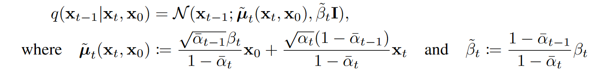 (3)

其中 $\alpha_t := 1-\beta_t$,  $\overline\alpha_t :=\prod^{t}_{s=1}\alpha_s $

反向过程(Reverse process)中，从 $\mathbf{x}_T\sim \mathcal{N}(\mathbf{x}_T;\mathbf{0},\mathbf{I})$ 中采样，并利用公式(2)进行去噪，以恢复原始图片，如下所示

$$p_{\theta}(\mathbf{x}_ {0:T}  ):=p(\mathbf{x}_T)\prod \limits^{T}_{t=1} p_{\theta}( x_ {t-1} \vert\mathbf{x}_ {t}  )，  p_ {\theta }  (  \mathbf{x}_{t-1}  \vert\mathbf{x}_t  ):=N(  \mathbf{x}_ {t  -1};  \mathbf{\mu} _ {\theta }  (  \mathbf{x}_ {t}  ,t),  \Sigma_ {\theta }  ( \mathbf{x}_ {t} ,t)) \qquad (4) $$		

其中 $\theta$ 代表模型参数。方差 $\Sigma_ {\theta }  ( \mathbf{x}_ {t} ,t)$ 一般取固定值 $\sigma_t^2 \mathbf{I}$ , 而 实验表明 $\sigma_t^2$  取 $ \widetilde\beta_t$ 和 $\frac{1-\overline \alpha_{t-1}}{1-\overline \alpha_{t}}\beta_t$结果相近，都是可供选择的取值。 

> 1. Data scaling：这里的图片数据x被线性缩放到了[-1, 1]的区间内；
> 2. 扩散过程中，涉及的的参数 $\beta_{t}$是预先设定的，本文设定该参数从 $\beta_{1}=10^{-4}$ 线性增长到  $\beta_{T}=0.02$ 。 注意到 $\beta$ 是一个相对较小的值。
> 3. 在前向传播过程中，由于 $ \sqrt {1-\beta_{t}} < 1$ , 因此在前向过程， x中的信号分量值逐渐减小，逐步从原始数据分布转变到正态分布:

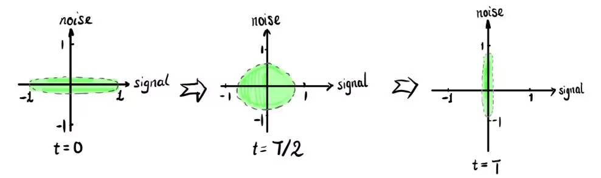

## 2 数学推导

### 2.1 变分上界

diffusion 属于基于似然的生成式方法，其目标是优化负对数似然的变分上界:

$\mathbb{E}[-  \log   p_ {\theta }  (  \mathbf{x}_ {0}  )]  \leqslant   \mathbb{E}_ {q}  [-  \log    \frac {p_ {\theta }(\mathbf{x}_{0:T})}{q(\mathbf{x}_{1:T}\vert\mathbf{x}_{0})}]  =  \mathbb{E}_ {q}  [-  \log p(\mathbf{x}_ {T})-  \sum \limits_ {t \geq 1}  {\log }   \frac {p_ {\theta }(\mathbf{x}_ {t-1}\vert\mathbf{x}_ {t})}{q(\mathbf{x}_ {t}\vert\mathbf{x}_ {t-1})} ] =: L \qquad (5)$			

prof:

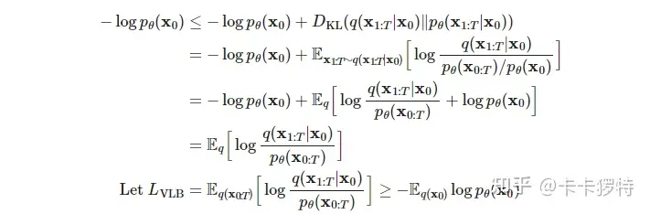

损失函数L可整理为:

    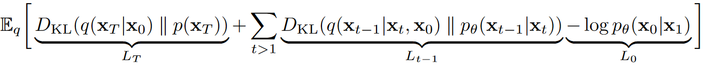 (6)

### 2.2 预测噪声

从(6)中，可以看到DDPM的训练目标是使得每一步的反向过程分布和正向传播后验分布尽可能接近(考虑到两个分布的方差是可以人为设定为一样，因此可以理解为让期望尽可能接近)。由于二者同为高斯分布，并且方差均为定值，易得KL散度为

    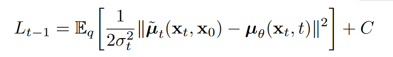	(7) 

从(7)中可以看出，反向过程中模型需要做的就是预测前向过程的后验均值。当重参数化 $\mathbf{x}_t$ 为 $\mathbf{x}_t(\mathbf{x}_0, \mathbf \epsilon)=\sqrt{\overline \alpha_t}\mathbf{x}_0 + \sqrt{1-\overline \alpha_t}\mathbf \epsilon $ ,进一步化简(7)可得

    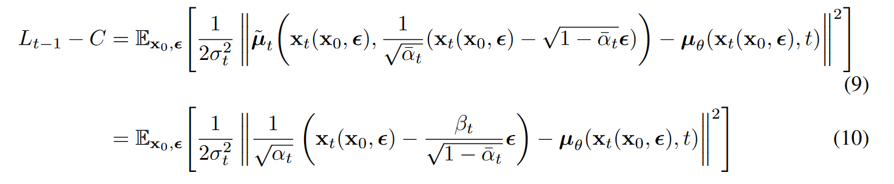

我们可以按照 $\widetilde u_t $ 的格式来参数化 $\widetilde u_\theta $ ,其中 $\epsilon_\theta(\mathbf{x}_t)$ 作为函数估计器，尝试估计噪声$\epsilon$ 。

    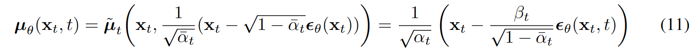

利用(11)式，可以简化(10)为

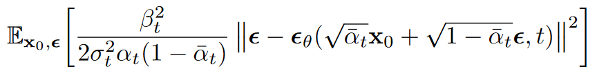 (12)

### 2.3 简化的训练目标

注意到公式(12)的损失函数项前有系数项。将系数项删除，可以简化损失函数的形。这在本质上相当于针对不同时间T，对损失函数做加权，如下图所示。t比较小时(即加噪不足够充分时)，权重较小；而对t较大时的项数，给予大权重。从之后的分析可以看出，t较小时，模型主要进行感知压缩(perceptual compression)，而t较大时进行语义压缩(semantic compression)。重加权更加强调了模型对语义层面的学习。

    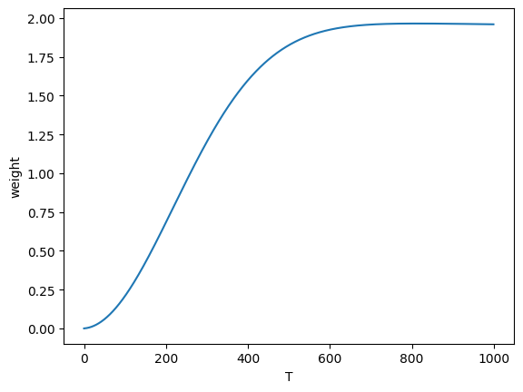

优化后的的diffusion算法如下

    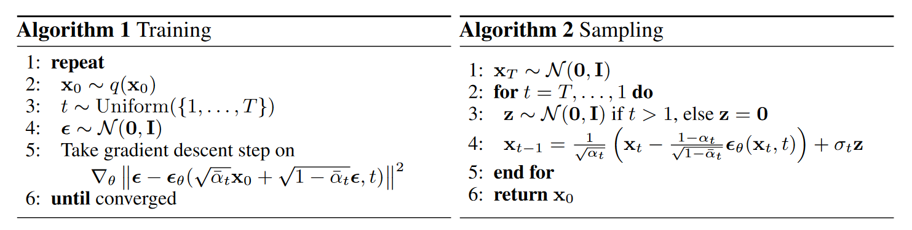

> 1. 为什么要预测 $x_t$ 中的 噪声分量 $\epsilon$  ，而不是去估计信号分量 $x_0$ 或者  $\widetilde u_t $ ?
>
>    "There is also the possibility of predicting $x_0$ , but we found this to lead to worse sample quality early in our experiments"；
>
>    至于预测 $\widetilde u_t $ ，在这篇文章之前，确实是diffusion 领域的普遍做法，但文中的消融实验表明，该方案在使用简化的损失函数时效果不佳；
>

## 3 实验分析

-  网络结构: [U-Net](https://www.zhihu.com/question/567185149)

### 3.1 Progressive coding

本章从编码的角度来分析diffusion模型，为理解diffusion模型的本质提供了一个极好的视角。

下图的算法从信息论的角度分析diffusion过程中的信息传递过程。考虑到信息的本质是消除不确定性，信息的量度应为收到图片后信源的熵(用 $p(x_0 \vert x_t)$)减去未收到图片前的熵 $p(x_0 \vert x_{t+1})​$。图5中

- 图5.1: Distortion 指每个阶段的图片失真，可以看到随着反向过程的进行，失真程度越来越低；
- 图5.2 : rate指描述各阶段表示图片包含信息的比特率，通过计算图片的熵来确定，随着重建的进行，图像比特率升高；
- 图5.3: Distortion和rate的关系:可以看到在反向恢复过程的后期，图片的比特率增长很快，但失真下降却很慢，说明大量的比特被用于发送的一些人眼难以感知的细微信息，即感知信息；

    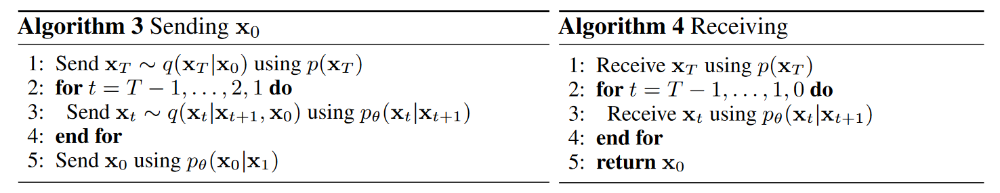

    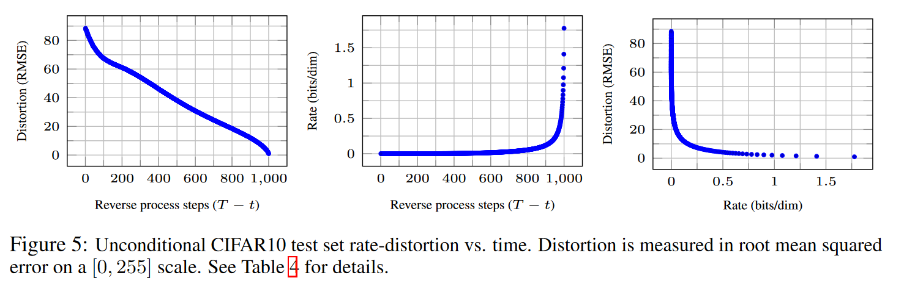

下图进一步说明了上述的观点：图6展示的反向过程中，大尺度特征首先被恢复，之后才是图像的细节特征；而图7说明，在t较小时做采样，恢复得到的人脸只有局部细节发生变化；而当在t很大，趋向高斯噪声时再采样，才能得到风格各异的人脸图像。

    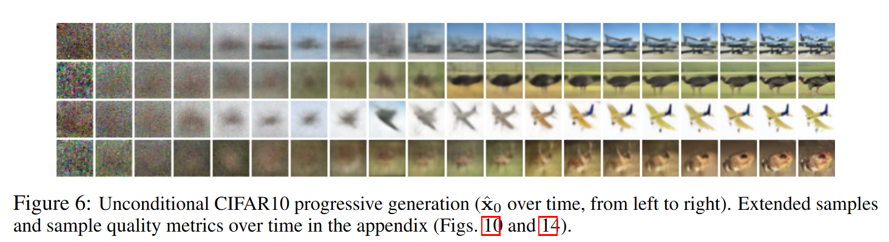

    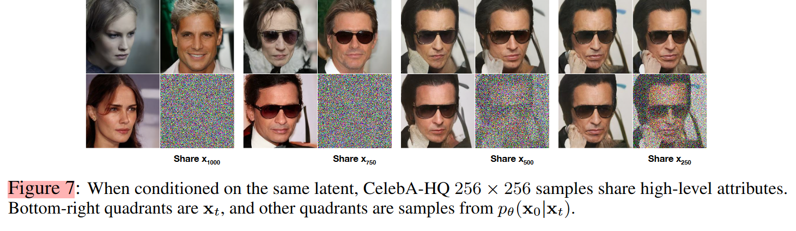

### 3.2 和自回归解码的关系

注意到，DDPM的过程和自回归过程有着相似的操作，即均通过将模型输出不断的送回输入，循环往复，最终得到生成结果。公式(16) 更是表明，DDPM的损失函数在形式上和自回归解码高度相似。因而论文将DDPM解释为一种广义的自回归过程。作者认为，相比于以掩码作为加噪方式的传统自回归解码，高斯噪声更加自然，并且展现了更好的归纳偏置(如对细节的关注)。另一方面，基于mask的自回归解码的回归次数受限于序列长度，但加噪则可以是任意次数。因而高斯噪声加噪的DDPM可以缩短扩散轮次，提高速度，亦或是增加扩散轮次，提高质量。

    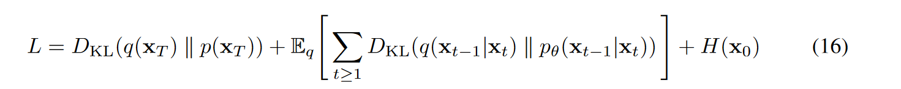

> Bert 和 GPT中的 mask 可以视为广义上的加噪。

## Reference

[^1]: Deep unsupervised learning using nonequilibrium thermodynamics