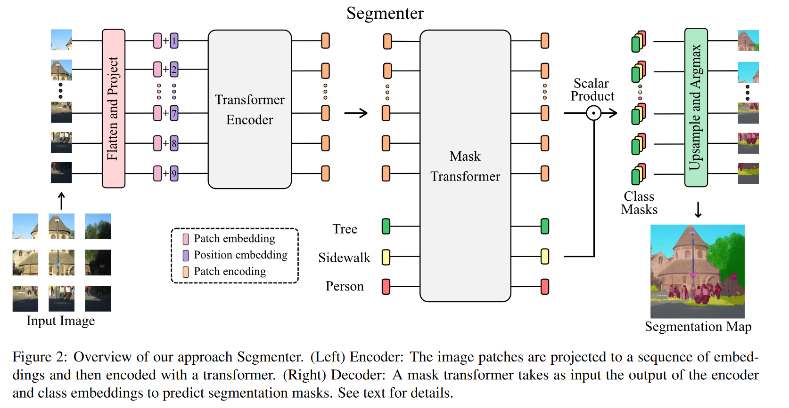
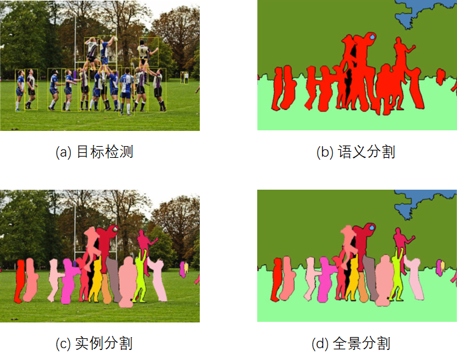
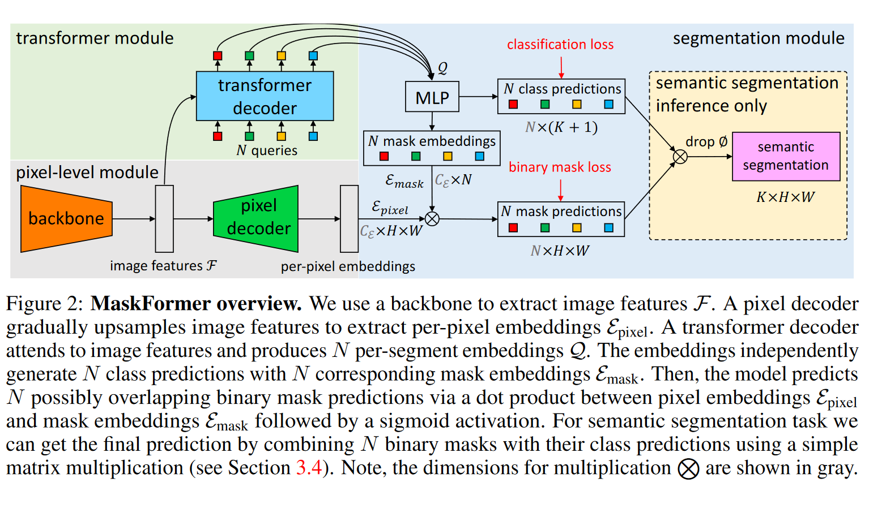
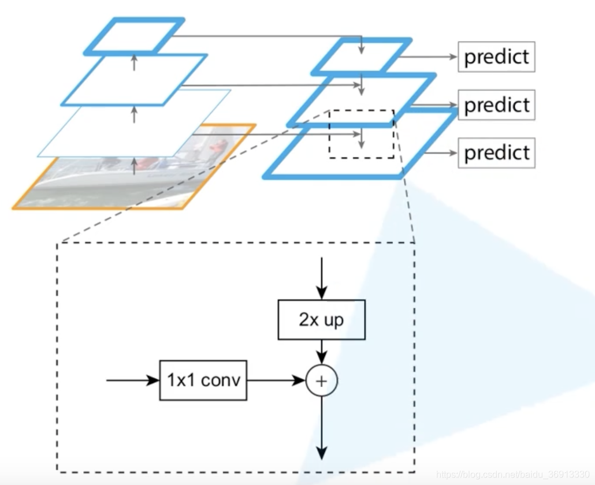
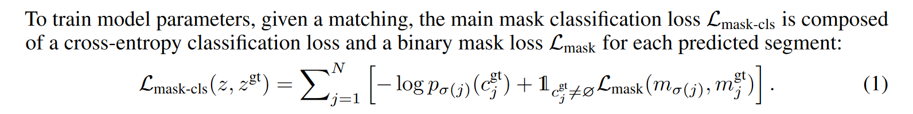
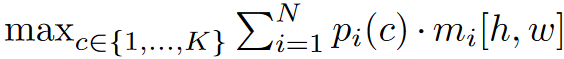
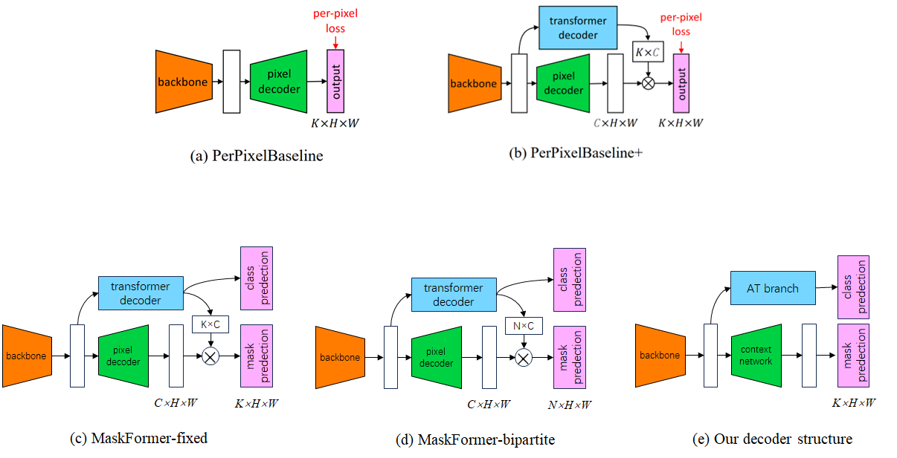

# Segmenter&Maskformer

## 1 Segmenter: Transformer for Semantic Segmentation[^1]

### 1.1 动机

图像语义分割模型无法通过单个像素确定该位置的语义类别，需要依赖像素的上下文信息才能达成进行分类。传统的语义分割方法（Fully Convolutional Networks, FCN）通常依赖于卷积编解码器架构体系结构，其中编码器会生成低分辨率的图像特征，而解码器通过上采样特征得到类别掩码(mask)。但是，CNN的局部性质限制了对图像中全局信息的访问。而上下文信息对于分割任务尤其重要。为解决此问题，DeepLab方法引入特征聚集，并进行扩张的卷积和空间金字塔池。这允许扩大卷积网络的感受野并获得多尺度特征。但是，这种方法仍然依赖CNN作为主干模型，因此输出的特征偏向局部信息。

在本文中，我们介绍了一种用于语义分割的变换器模型 Segmenter。与基于卷积的方法相比，Segmenter使用预训练的ViT作为主干模型，允许在第一层即可对全局上下文进行建模。此外，本文探究了使用逐像素线性解码器和基于mask的Transformer解码器之间的差异。

### 1.2 结构

## 2 Per-Pixel Classification is Not All You Need for Semantic Segmentation[^2]

## 2.1 动机

通常语义分割被视作单个像素的分类任务，而实例分割(包括全景分割)则被视为掩码分类任务。本文的看法是：可以使用一个基于掩模分类的模型，以统一的方式解所有的分割任务(语义分割，实例分割...)。在该想法的支持下，我们提出了maskformer，这是一个简单的掩码分类模型，该模型预测了一组二进制掩码，每个掩码都与单个全局类标签预测相关联。

### 2.2 背景知识

 语义分割(semantic segmentation )、实例分割(instance segmentaion)和全景分割(Panoramic segmentation):  语义分割根据语义，为图像中的每个像素打标签; 实例分割只关心需要检测的类别，并将待检测类别的不同个体标记出来；全景分割则在实例分割的基础上，额外需要标记出背景的语义信息。

传统的语义分割采用逐像素分类的方式得到结果, 其输出的类别数是一定的;而实例分割则是预测一系列二进制编码，每个掩码代表一个实例，其输出的掩码数是可变的。

 

### 2.3 结构和损失函数

#### 2.3.1 结构

结构如上图所示，其中:

- backbone: CNN 或者ViT(文中采用Swin)结构。注意采用 Swin 做backbone时，存在32倍的下采样;

- pixel decoder: 采用类似FPN(Feature Pyramid Networks)的结构，逐层上采样；

  

- transformer decoder: 采用标准的解码器架构，由multi-head self-attention，encoder-decoder attention以及 feed-forward network组成。 其中encoder-decoder attention以cls queries 作为 queries, 以 来自编码器的特征作为key-value。decoder的数目为6层。但作者发现，对于语义分割任务而言，只需一层decoder也可以做的很好(详情见实验部分)。

  - cls queries 初始化为零向量；
  - 对每个queries加了可学习的位置编码；

#### 2.3.2 损失函数

maskformer输入N个cls queries(N通常取100, 不一定等于类别数K，事实上N一般小于类别数)，用于查询图像中存在的实例。类别分支的输出用于判断N个掩码的类别，而另一个分支输出N个掩码。

计算损失函数时，对于语义分割任务，可以采用fixed matching策略，如果N=K。这种策略将每个queries分配到固定的类别上。但作者通过实验发现， bipartite matching-based assignment 效果要比fixed matching更好，尤其在类别数比较多的情况下。bipartite matching策略下，每个queries匹配的类别不是固定的，需要结合ground truth 计算。

总的损失函数如下，由N个查询的分类损失和掩码损失相加组成。

#### 2.3.3 语义分割任务的推理阶段

推理阶段对实例分割任务，对每个query得到的mask，取概率最大的类作为该mask的类别即可。但对语义分割任务，采用以下公式计算得到的结果要优于上述硬分配方式:

在上面的公式中，$m_i$ 代表[h,w] 位置属于 $mask _i$的概率, 而 $p_i(c)$ 代表$mask _i$属于第i类的概率。

### 2.4 实验部分

#### 2.4.1 五种结构

实验部分对比了下图中a-d的模型结构。其中(a)是最基本的逐像素预测结构，(b)在A的基础上，添加了transformer decoder 分支，这样A和B的区别仅在于损失计算方式上(per-pixel vs. mask classification)，换句话说，也就是**损失函数上增加了额外的全局类别损失**。(c) 图为采用fixed matching的结构，其中N=K； (d)为bipartite matching， 而(e)为我们之前采用的声音事件检测模型架构。

#### 2.4.2 实验结果与消融

- maskformer同时在语义分割和全景分割任务中取得了SOTA；
- 对于语义分割任务，当数据集类别数较多时，maskformer相比于逐像素的方法性能提升更加明显；
- 对于a,b,c,d四种模型，性能排序依次为 (d) > (c)  > (b) > (a);
- 当查询数N=100时，模型在不同数据集性能最好，即使当 N<K。显然maskformer中同一个query可以查询不同类别;
- 作者统计了不同query对应的类别，可以发现其分布并不是均匀的: 有的query对应了很多事件，而有些query甚至不对应一个特定的事件；
- 作者对共享一个query的列表关系进行了分析，但有趣的是，作者发现共享一个query的类别可能具有语义相似性(“house” and “building”),也可能几乎不存在语义相关性((e.g. “water” and “sofa”)。
- 虽然实验中decoder的数目为6层。但作者发现，对于语义分割任务而言，只需一层decoder也可以做的很好。作者认为，对于实例分割任务，需要有足够多层的解码器，用于将不同的实例之间区分开，而对于语义分割则不存在这一问题(对语义的编码在编码层已经做得很好了)，所以对语义分割任务，只需要浅浅的一层解码器也能做的不错。

## Ref

[^1]: Segmenter: Transformer for Semantic Segmentation, ICCV 2021
[^2]: Per-Pixel Classification is Not All You Need for Semantic Segmentation, NIPS 2021

