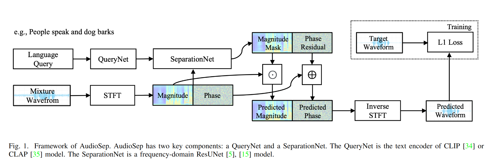

# Separate Anything You Describe

语言查询音频源分离 (Language-queried audio source separation, LASS) 是计算听觉场景分析 (CASA) 的新范式。LASS 旨在根据自然语言查询从音频混合中分离出目标声音，为数字音频应用提供自然且可扩展的界面。尽管 LASS 的最新研究在特定源（例如乐器、有限类别的音频事件）上取得了良好的分离性能，但无法在**开放域**中分离音频概念。在这项工作中，我们引入了 AudioSep，这是一个使用自然语言查询进行开放域音频源分离的基础模型。我们在大型多模态数据集上训练 AudioSep，并广泛评估其在音频事件分离、乐器分离和语音增强等众多任务上的能力。AudioSep 使用音频字幕或文本标签作为查询展示了强大的分离性能和令人印象深刻的零样本泛化能力，大大优于以前的音频查询和语言查询声音分离模型。

## 1. 动机

基于语言查询的音频分离(LASS) 根据自然语言查询从音频混合中分离出目标声音。不同于传统的基于标签的音频分离，LASS不限制查询音频的类别，可以无缝拓展到开集识别。

本工作建立一个使用自然语言描述的声音分离基础模型AudioSep。AudioSep利用**大规模数据集**，实现在**开放域场景**中的稳健泛化, 以全面解决各种声源的分离问题。

### 1.1 Label-queried sound separation

查询特定声源的一种直观方法是使用其声音类别的标签 。虽然获取标签查询比获取音频或视觉查询所需的工作量要少，但标签集通常是预定义的，并且仅限于一组有限的类别，这导致将分离系统推广到开放域场景时存在很大的挑战。对新的类别，需要重新训练声音分离模型，或使用诸如<u>持续学习</u>之类的复杂方法。此外，标签信息缺乏描述多个声音事件间关系的能力，例如它们的空间关系和时间顺序。当用户想要分离多个声源而不是单个声音事件时，这会带来挑战。

### 1.2   Audio-queried sound separation

开集音频分离的另一种常见做法是基于音频查询的分离策略[^1][^2], 如下图所示。训练过程中，利用SED系统挖掘出含有事件的活动片段，从该片段中提取出对应事件的query, 通过该查询在音频分离模型中获取分离的音频片段。测试阶段，将未见过的声音类别的片段提取的特征作为查询，以分离出对应类别的声音。该种方式效果良好，但缺陷在于测试时人工准备所需的音频查询比较麻烦。

个人感觉是，这种方式下进行的分离更像是用特定的输入模式对原始音频进行**匹配和检索**，检索出模式匹配的音频片段。而本文的方法也可以从这个角度出发来理解，只不过检索的输入查询从音频模态转换到了文本模态，因而需要采用额外的方式对两种模态进行对齐。

## 2. 方法

模型总体结构如上图所示，核心结构包括 QueryNet,负责对文本查询进行编码；以及 SeparationNet, 负责根据文本查询，从原始音频的幅度谱和相位谱中提取目标音频。

### 2.1 Query Net

QueryNet 采用预训练好的CLAP中的 Text Encoder, 作用是通过对比学习，将音频和文本描述带入联合音频文本潜在空间。训练过程中该分支全程冻结。

### 2.2 Separation Net

SeparationNet 采用 frequency-domain ResUNet model, 如下图所示。该网络通过短时傅里叶变化，得到音频的幅度谱和相位谱:

$$X = |X|e^{j\angle X}$$

 和下图不完全一致的是，这里网络输入复数谱X(包含实部和虚部两个通道)，输出文本查询对应的 magnitude mask $M$ 和 phase residual $\angle M$。目标音频的复频谱可以通过以下公式得到:

$S=M \odot X =|M|\odot|X|e^{j(\angle M + \angle X)}$

AudioSep应用 Feature-wise Linearly modulated (FiLm) layer, 用于将文本特征引入分离模型。不妨将音频特征表示为 $H^=\mathbb{R}^{m \times h \times w}$, 对第i层特征 $H_{i}$ 做以下操作: 

$$FiLM(H_i|\gamma_i H_i, \beta_i) = \gamma_i H_i + \beta_i$$ 

其中 $(\gamma, \beta)=g(e_q)$ , $e_q$ 为文本嵌入，g 为两层MLP。

> 这里看起来像类似SE-Net的做法? 不过SE-Net是采用Squeeze后的原始特征经过MLP后做逐通道的Recalibration，而这里是用文本嵌入过MLP后做Recalibration；

### 2.3 训练Loss

将两个原始音频 $s_1$ 和 $s_2$ 等能量的混合，并采用与 $s_1$ 或 $s_2$ 对应的 文本描述为query。在波形上计算L1损失函数, 以监督分离音频与目标音频尽可能一致。

## 4. 后续相关工作

[Exploring Text-Queried Sound Event Detection with Audio Source Separation](https://arxiv.org/pdf/2409.13292) . ICASSP 2025 在投。该工作利用AudioSep 强大的开集分离能力将混合音频进行分离，之后在末端单独训练小的CRNN网络做SED。作者希望通过这种方式解决由于混叠声音事件的检测难题。

[^1]: Zero-shot Audio Source Separation through Query-based Learningfrom Weakly-labeled Data, AAAI 2022
[^2]: Universal Source Separation with Weakly Labelled Data
[^3]: DECOUPLING MAGNITUDE AND PHASE ESTIMATION WITH DEEP ResUNet FOR MUSICSOURCESEPARATION, ISMIR2021