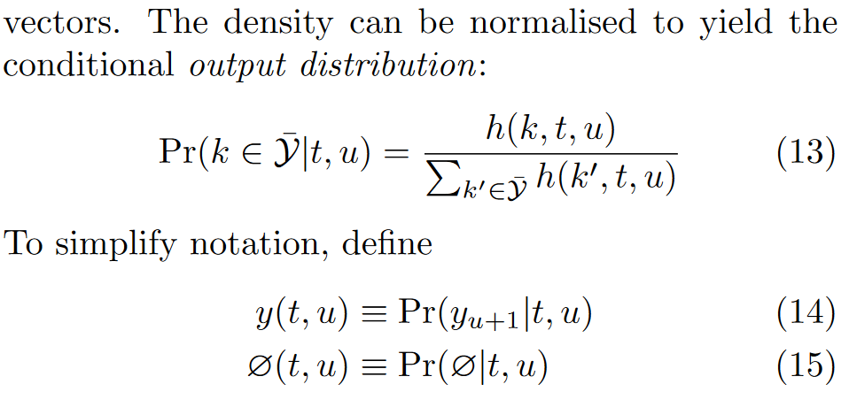
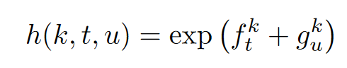
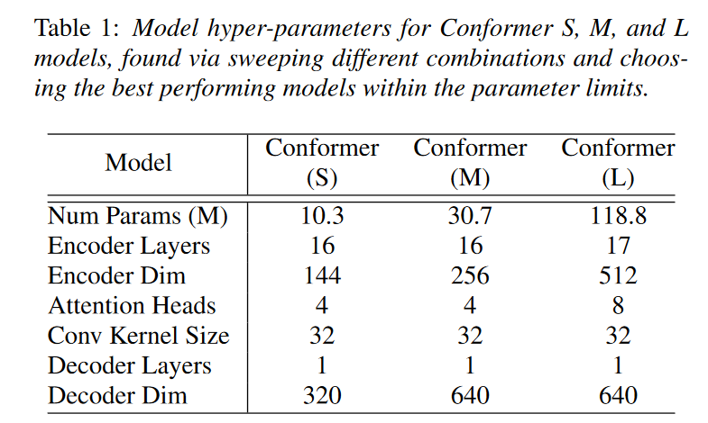

# Transduction 系列模型

语音识别的一大难点在于其 输入(音频) 和 输出(文本) 之间并不是等长的。如何处理输入和输出之间对齐关系是 ASR 中的核心问题之一。

## 1 CTC

CTC 是早期的 语音识别方案，其结构如下所示。在CTC结构中，输入和输出是等长的。其对齐方式可以通过以下图片说明：

<div align="center"></div>


该结构的缺点在于，每一次的输出都是独立决定的，仅和当前的嵌入向量有关。 这是我们不希望看到的。

<div align="center"></div>

Transduction 系列结构通过将输入序列和输出序列分别编码的方式，以实现输入和输出序列之间的对齐。


## 2 RNN-T[^1]

### 2.1 对齐方式

在讨论具体结构之前，首先先来了解Transduction 的对齐方式。Transduction 将状态切换以外的其他位置都标记为  $ \empty $ , 如 $y_1, y_2, y_3$ 和序列 $y_1, \empty , \empty , y_2 , \empty , y_3$ 等价。 

###  2.2 结构

RNN-T 中最早提出了 Transduction 结构，如下图所示:

<div align="center"></div>

上图中，文本和音频分别通过编码器(在后来的部分文献中，也将文本编码器称作解码器）。在原始的RNN-T中，两者均为RNN结构(音频编码器两层LSTM，文本编码器一层LSTM)。之后通过一个 Joint 网络后，得到输出的概率矩阵。Joint 网络的结构如下图所示，其输出为输出概率矩阵。


<div align="center"></div>

该矩阵的每一个坐标 $(t,u)$ 处的向量确定了该状态下的转移概率, 即如果在时刻 t, 对应的文本状态为 u, 那么下一跳转移到不同状态的概率。如果词汇表的大小一共为M，即有M种 文本 token， 那么考虑到 $ \empty $ 的存在，下一跳的状态数为 (M+1)。

<div align="center"></div>

对于上述的 $h（.）$ 函数, RNN-T 的定义方式为：

<div align="center"></div>

> 思考：为什么上式中 $f$ 和 $g$ 是相加而非相乘呢? 如何解释这里的相加？


### 2.3  训练与预测

<div align="center"></div>

上述模型的输出为一个上图所示的概率矩阵。网格中存在若干条路径，每条路径代表一个可能的输出序列。在所有的这些序列中，合法的序列是起点为左下角，终点为右上角的序列。所有的合法序列之和即为输入为 $\bf{x}$ 的条件下输出 $\bf{y}$ 的概率。我们的优化目标是要最大化 $P(\bf{y} 	\vert \bf{x})$ 。

<div align="center"></div>


 现在的问题是，该如何计算所有合法序列的和，要知道所有合法序列的数量为 $C^{U}_{T}$ 个，具有NP复杂度，肯定不能直接硬算。因而这里采用了动态规划的思想。

记从起点到达 $(t, u)$ 的概率为  $\alpha (t,u)$ , 从 $(t, u)$ 到终点的概率为 $\beta (t, u)$ 。那么从起点经由 $(t, u)$ 到达终点的概率自然为 $\alpha (t,u) \beta(t, u)$ 。我们可以通过动态规划的方式得到上述网格中每个点的 $\alpha$ 和 $\beta$ 。递推公式如下所示：

<div align="center"></div>

<div align="center"></div>

递推得到以上结果的时间复杂度仅为 $O(T\times U)$。下图展现了 网格中 $\alpha(t,u)$ , $\beta(t,u)$ 和 $\alpha(t,u) \beta(t,u)$ 的可视化。

<div align="center"></div>

由于从起点到终点，一定会经过从图的左上角到右下角的写对角线，我们可以据此分解概率如下：

<div align="center"></div>

事实上这不是唯一的计算方式。也可以用 $\alpha(T,U)$ 的值作为优化目标（之后的transformer-Transduction 就是这么做的）。

在非流式的预测过程中，音频编码器输入完整的音频，得到音频嵌入特征。文本编码端(或者按照有些论文的说法，解码器端) 最开始输入\<SOS\> 标识（start of sentence）。解码的过程从音频特征的开始循环到结束，每次循环得到文本序列中下一个文本的概率。如果采用贪心法编码，则将每次预测结果中可能性最大的状态作为下一状态，如以下代码所示：

```python
def greedy_search(model: Transducer, encoder_out: torch.Tensor) -> List[int]:
    """
    Args:
      model:
        An instance of `Transducer`.
      encoder_out:
        A tensor of shape (N, T, C) from the encoder. Support only N==1 for now.
    Returns:
      Return the decoded result.
    """
    assert encoder_out.ndim == 3

    # support only batch_size == 1 for now
    assert encoder_out.size(0) == 1, encoder_out.size(0)
    blank_id = model.decoder.blank_id
    device = model.device

    sos = torch.tensor([blank_id], device=device, dtype=torch.int64).reshape(1, 1)
    decoder_out, (h, c) = model.decoder(sos)
    T = encoder_out.size(1)
    t = 0
    hyp = []

    sym_per_frame = 0
    sym_per_utt = 0

    max_sym_per_utt = 1000
    max_sym_per_frame = 3

    while t < T and sym_per_utt < max_sym_per_utt:
        # fmt: off
        current_encoder_out = encoder_out[:, t:t+1, :]
        # fmt: on
        logits = model.joiner(current_encoder_out, decoder_out)
        # logits is (1, 1, 1, vocab_size)

        log_prob = logits.log_softmax(dim=-1)
        # log_prob is (1, 1, 1, vocab_size)
        # TODO: Use logits.argmax()
        y = log_prob.argmax()
        if y != blank_id:
            hyp.append(y.item())
            y = y.reshape(1, 1)
            decoder_out, (h, c) = model.decoder(y, (h, c))

            sym_per_utt += 1
            sym_per_frame += 1

        if y == blank_id or sym_per_frame > max_sym_per_frame:
            sym_per_frame = 0
            t += 1

    return hyp

```

而如果采用 beam-search, 则每次搜索时需要保留概率最大的两个路径，详细做法见原论文伪代码。

> 注意同一帧可能解码出多个 token 的情况，如 $ABC \empty D$ 的 ABC 是连着的。
>
> <div align="center"></div>


## 3 Transformer-T[^2]

本文主要贡献为：

- 利用Transformer结构 (Transformer-XL) 代替了RNN-T 中的LSTM；
- 说明基于 Transformer-XL 的Transformer-T适合进行流式的语音识别；

### 3.1 对 Joint 层的改进

<div align="center"></div>

### 3.2 Transformer-XL[^3]

该模型使用的 Transformer 结构为 transformer-XL。该结构相对于原始 transformer的改进为以下两点

#### 3.2.1 Segment-Level Recurrence with State Reuse

原始的 Transformer 对于过长的序列面临计算量等问题。一种基本的思路是分块解决。但这种思路的问题是，对块边缘的点，会由于缺失上下文导致效果不佳。 Transformer-XL 对此的改进方案是采用了递归的策略，将上一个块的特征 $h_\tau$ 和 本层的特征 $h_{\tau+1}$ 直接进行拼接，区别在于之前块的特征不进行反向传播。

<div align="center"></div>


<div align="center"></div>

<div align="center"></div>


这样做不仅能够建立起快与块之间的上下文关联，同时预测时可以将之前块attention的计算结果缓存起来，以供之后使用。因此该结构相当适合用于流式语音处理。

> 注：NLP中编码器和解码器的区别：
>
> 一般NLP中谈到编码器和解码器，均指 "Transformer is All you need" 里面的编码器和解码器结构。两者最大的区别在于，编码器可以看到整个序列，但解码器只能看到过去。因而我们可以说，上文的 transformer-XL 就是一个纯解码器的结构。编码器模型和解码器模型的典型代表是bert 和 GPT。

#### 3.2.2 相对位置编码

<div align="center"></div>


### 3.3 实验设置与结果

- 该模型处理将频谱图转化成token的方法是将4帧拼接成一帧作为token( Frame-based);
- 模型结构为 
  - 音频编码器：18层 transformer block; 
  - 文本编码器:  2层 transformer block;

- 实验结果表明该模型可以在 LibriSpeech 语料库上取得SOTA性能;
- 作者讨论了流式模型中上下文(context)大小对性能的影响；


## 4 [Conformer-T]([Thu-3-10-9 Conformer: Convolution-augmented Transformer for Speech Recognition - ASR Neural Network Architectures II - Transformers - INTERSPEECH 2020](http://www.interspeech2020.org/index.php?m=content&c=index&a=show&catid=418&id=1331))[^5]

作者认为，transformer 虽然善于建模长时依赖性，但不善于提取细粒度的局部特征。而CNN则比较擅长捕捉局部信息（由于其局部性）。之前的工作[^4]将CNN和transformer串联结合，如下图所示。

<div align="center"></div>

本文延续这一思路，研究如何将卷积和自注意力有机结合起来。为了实现这一目标，作者提出了一种自注意力和卷积的新颖组合，希望实现两全其美的方案——自注意力学习全局交互，而卷积有效捕获基于相对偏移的局部相关性。

模型结构如下所示，其创新点为：

- “马卡龙状”的前馈层, 每个前馈网络只有1/2的权重；

  <div align="center"></div>

- CNN 的设计思路同 mobile-Net,  采用深度可分离卷积(逐层-逐点)， 以节省计算量；
- attention 仍然使用了transformer-XL中的相对位置编码；


<div align="center"></div>

模型具体结构：

<div align="center"></div>

此外，在纯文本语料库上训练了3层LSTM用于语言模型。


## Reference

[^1]: Sequence Transduction with Recurrent Neural Networks, 2012
[^2]: TRANSFORMER TRANSDUCER: A STREAMABLE SPEECH RECOGNITION MODEL WITH TRANSFORMER ENCODERS AND RNN-T LOSS, ICASSP2020
[^3]: Transformer-XL: Attentive Language Models Beyond a Fixed-Length Context
[^4]: LITE TRANSFORMER WITHLONG-SHORT RANGE ATTENTION , ICLR2020
[^5]: Conformer: Convolution-augmented Transformer for Speech Recognition, interspeech2020

