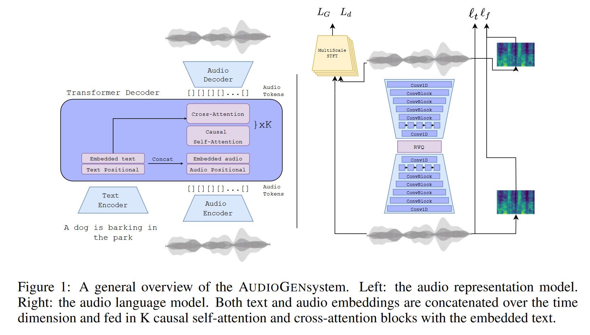
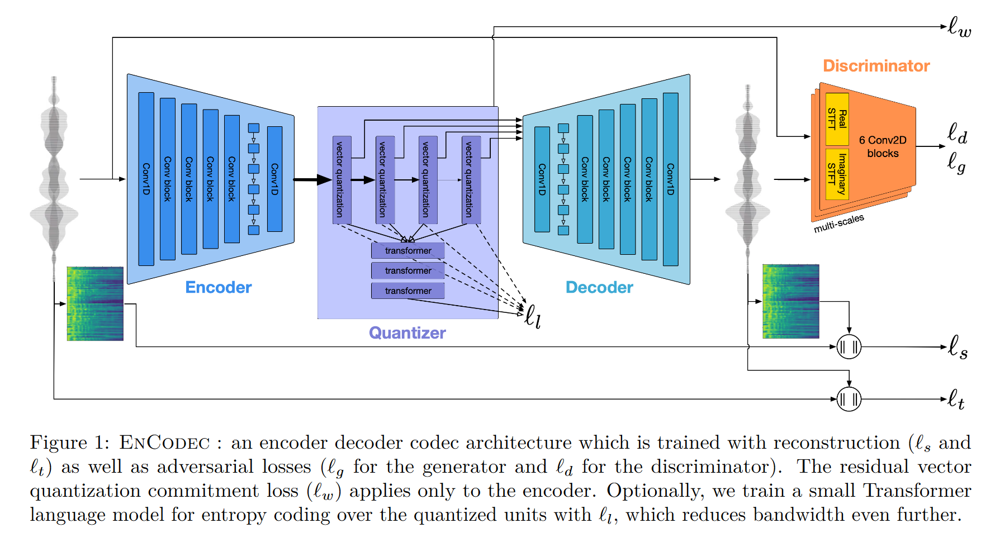
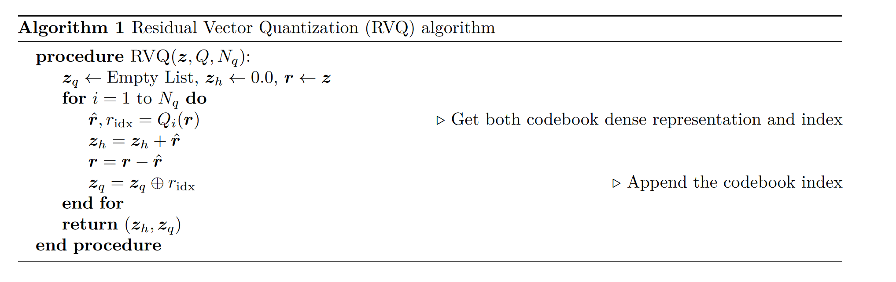
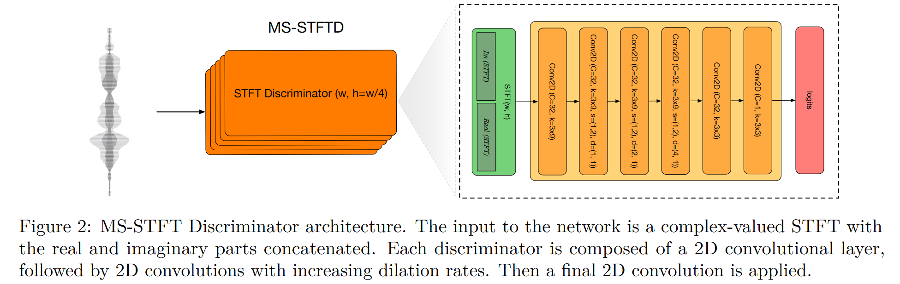
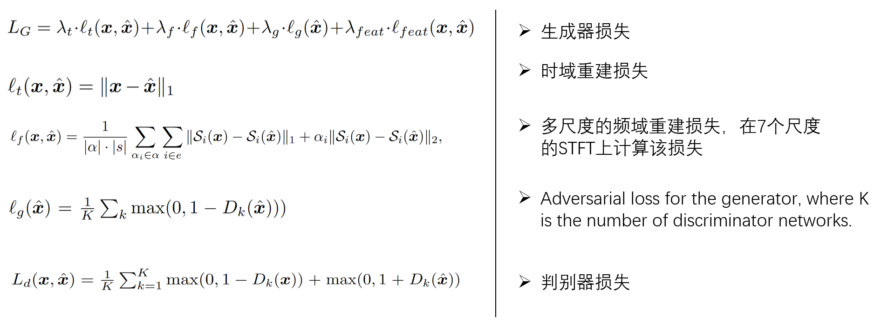
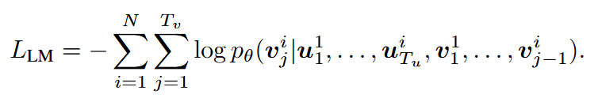
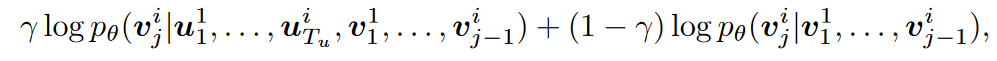

# AUDIOGEN: TEXTUALLY GUIDED AUDIO GENERATION

ICLR 2023

## 1 动机

迄今为止，文本、图像、语音的生成模型都取得了相当大的进步，而在音频领域，目前仍缺乏类似的生成模型。文本引导的音频生成模型，在电影、视频游戏和任何虚拟创作的配音任务上都有着潜在的应用。

虽然图像生成和音频生成有很多共同点，但也存在一些关键差异。

- 音频本质上是一维信号，因此在区分重叠“事件”方面自由度较小；
- 现实世界的音频本身具有混响，这使得区分物体和周围环境的任务更加困难；
- 心理声学的特性；
- 带有文本描述的音频数据比成对的文本图像数据的数量低几个数量级；

## 2 模型结构

AUDIOGEN是基于自回归的文本引导音频生成模型，其训练过程包含两个主要阶段。

- 第一阶段使用**基于自编码器的音频压缩模型**将原始音频编码为离散的标记序列。该模型以端到端方式进行训练，以从压缩表示中重建输入音频，并以一组判别器添加感知损失。该步骤旨在不损失音频保真度的同时对原始音频进行压缩。
- 第二阶段训练自回归的Transformer 解码器，该模型对从第一阶段获得的离散音频嵌入进行操作，同时也以文本嵌入作为条件。模型使用在大量文本语料库上预先训练的单独文本编码器模型 T5 来编码文本。预训练的文本编码器能够推广到当前文本音频数据集中不存在的文本概念。在处理多样性和描述性有限的文本注释时，这一点尤其重要。

### 2.1 音频编解码

这里采用了Mata 团队自身的EnCodec提取离散表征，而EnCodec和**VQ-GAN**，以及音频编解码领域的**SoundStream**结构相似。

生成器
- 编码器以原始波形作为输入，由1D卷积-ResNet-LSTM-1D卷积构成;
- 中间的量化模块由Residual Vector Quantization构成，通过残差量化以提高量化精度，而单个量化模块采用的量化方式为最近邻量化；

 - 解码器与编码器结构对称，只是将下采样换成上采样；

判别器

- 由多个子判别器构成，子判别器以将STFT后的实数和虚数谱连在一起，作为模型输入;
- 不同判别器做STFT时采用了不同的窗长，从而实现多尺度的判决;
- 判别器输出logit,并且计算损失时不加log，参考**WGAN**;

损失函数计算:

采用WGAN的框架进行训练，损失分为生成器和判别器损失。

> 关于该编码器结构，可参考 [溯源:从VQ-VAE到RVQ--语音信号的离散化方法 ](https://zhuanlan.zhihu.com/p/627515982) 理解该方法

### 2.2 音频语言模型训练

编码器得到的量化码字 $z_q$ 通过查找表(Look-Up-Table, LUT) 映射到连续空间得到 $\textbf{v}$。文本特征则由预训练的T5模型编码得到文本嵌入$\textbf{u}$ 。文本和音频嵌入连接，得到语言模型的输入。

整个模型可以视作编码器-解码器架构，其中预训练的T5模型视作编码器，而我们只需要训练解码器。为了更好的加强文本的引导性，模型中加入了cross-attention层，计算文本与音频的cross-attention。其损失函数计算如下所示, 其旨在自回归的预测下一步的内容

- Classifier Free-Guidance(CFG): 该方法是生成模型中权衡生成质量和生成多样性的常用方法之一, 最早在diffusion相关工作中使用。在该工作中，训练时以10%的概率丢弃文本条件。在推理过程中，以以下的方式进行采样，以线性搭配条件生成概率和无条件生成概率:

  

- Multi-stream audio inputs： 尽管编码过程中对原始波形做了32倍的下采样，但每秒仍有约500个token。因而在处理长音频时，模型会非常慢。Multi-stream audio inputs将音频拆成了若干个流，每个流独立送入模型处理。这样增加了推理速度，但降低了质量(注: 该方法的具体处理方式需要看源码，论文中说的确实模糊)

## 3 实验

略

### 4 Limitations

- 本文采用编码器的下采样系数比较小(32)， 因此导致音频的推理时间长，且对长序列建模效果不佳。当合成音频分辨率需要更高(例如48K)时，这个问题将更加严重;
- 合成音频数据缺乏对缺乏对场景中时间顺序的理解，例如很难合成诸如"狗**先**吠叫**然后**鸟儿嗡嗡作响"；
- 训练时，为解决训练集(AudioSet)数据分布不均衡的问题，筛除了多数语音。可能是因为这个原因，反应到模型中就是，合成的语音只是听起来像是人在说话，但多数没有实际意义。