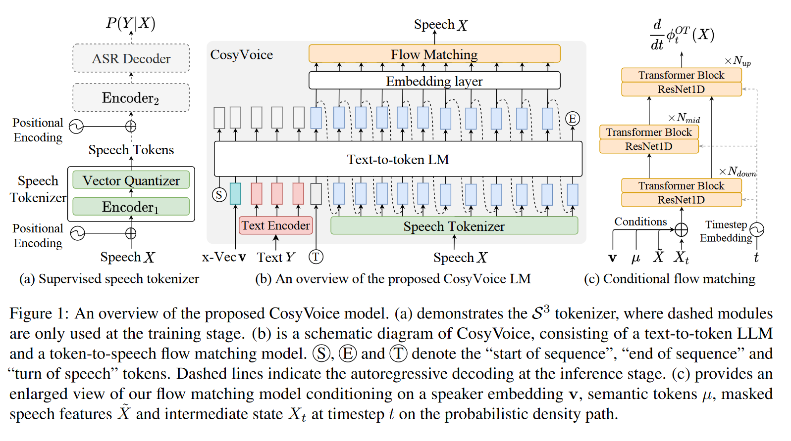

# CosyVoice: A Scalable Multilingual Zero-shot Text-to-speech Synthesizer based on Supervised Semantic Tokens

## 1 动机

近年来，基于大语言模型(LLM) 的TTS模型因其高自然度和零样本合成能力而成为主流。在这种范式中，语音信号被离散化为标记序列，使用文本作为提示通过 LLM 对其进行建模，然后通过基于标记的声码器将其重建为波形。

显然，语音标记在基于 LLM 的 TTS 模型中起着至关重要的作用。当前的语音标记是以无监督的方式学习的，缺乏明确的语义信息和与文本的对齐。在本文中，我们提出用监督语义标记来表示语音，这些标记是通过在多语言语音识别模型的编码器中插入矢量量化模块得出的。基于这些标记，我们进一步提出了一种基于编解码器的语音生成合成器 CosyVoice，它由用于文本到标记生成的 LLM 和用于标记到语音合成的条件流匹配模型组成。实验结果表明，在零样本语音克隆中，监督语义标记在内容一致性和说话人相似性方面明显优于现有的无监督标记。此外，我们发现利用大规模数据可以进一步提高合成性能，这表明 CosyVoice 具有可扩展性。据我们所知，这是首次将监督语音标记纳入 TTS 模型的尝试。

该研究以多种新颖的方式为语音生成领域做出了贡献：

- 该研究首先将监督语音标记集成到 TTS 模型，从而增强了零样本语音克隆中的内容一致性和说话者相似性。

- 本文提出了 CosyVoice，这是一种可扩展的零样本 TTS 合成系统，它将用于文本到标记生成的 LLM 与用于标记到语音合成的条件流匹配模型相结合，从而无需额外的音素生成器和强制对齐器。

- 为了进一步提高生成的语音的质量，CosyVoice将说话人嵌入向量合并到 LLM 中，将语音建模分为语义、说话者和韵律组件。LLM 对语义内容和韵律进行建模，而条件流匹配模型则捕获音色和环境信息。

## 2 方法

### 2.1 Supervised Semantic Tokens for Speech
CosyVoice 从多语种的ASR模型中获取tokens, 作者认为这种做法比之前基于无监督的策略， 如Hubert等纯自监督的方法提取特征，更能编码语义等信息。

简单的来说，这里就是采用了类似于 Whisper 的 encoder-decoder 结构，只不过在编码器中插入了一个额外的量化模块，对特征进行量化。此外，额外的量化损失也被引入。值得注意的是，这里的量化损失不是基于VQ-VAE范式的，在反向传播过程中，不更新码本，码本通过 EMA 进行更新，类似流式的K-means。

### 2.2 Large Language Model for TTS

LLM部分和VALL-E比较类似，由文本编码器对文本进行编码获得文本token，音频编码器 (2.1部分)对语音进行编码。区别主要在于以下几点:

1. 引入了额外的标记token S, T, 分别标记序列的开始以及从文本切换到语音;

2. 利用声纹模型，提取说话人嵌入向量 v，以单独提供说话人信息;

3. 文本不是像VALLE那样转成音素后传入，而是先通过Byte Pair Encoded (BPE) tokenizer 转成子词，再通过文本编码器编码:

$$
\bar{Y} = \text{TextEncoder}(\text{BPE}(Y))
$$

### 2.3 Optimal-transport Conditional Flow Matching
TODO

