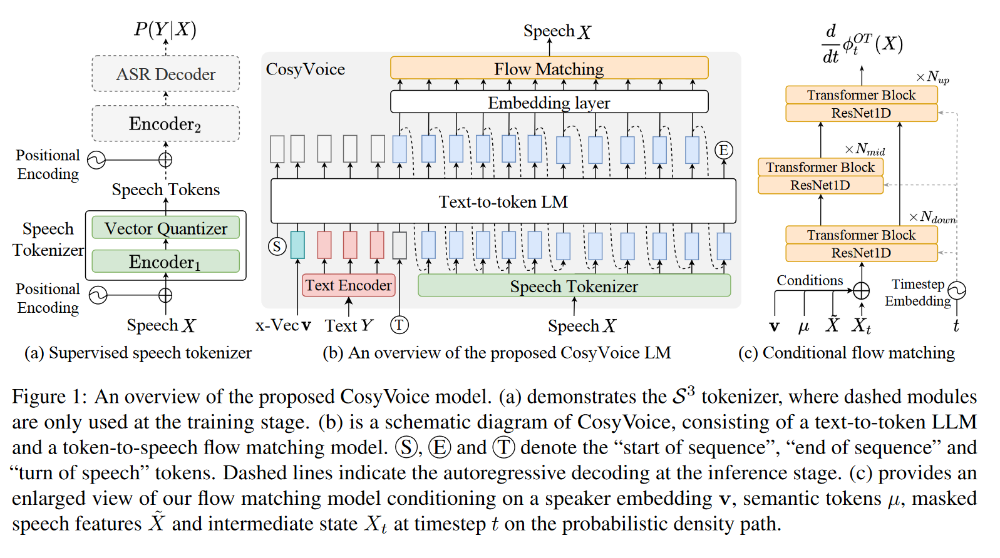
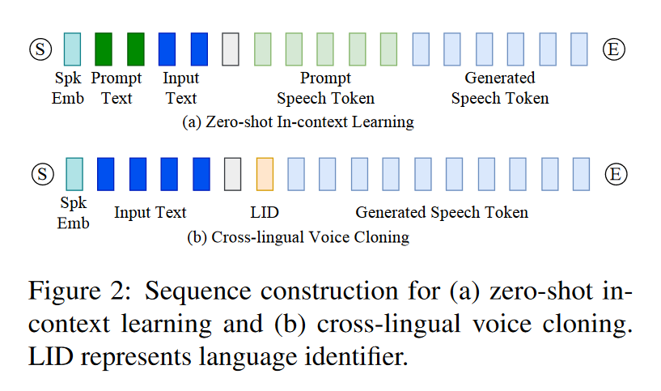
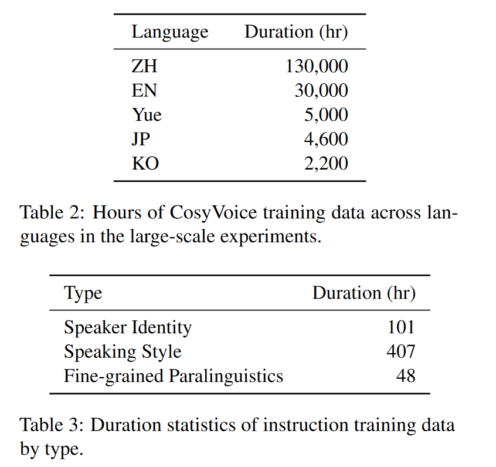
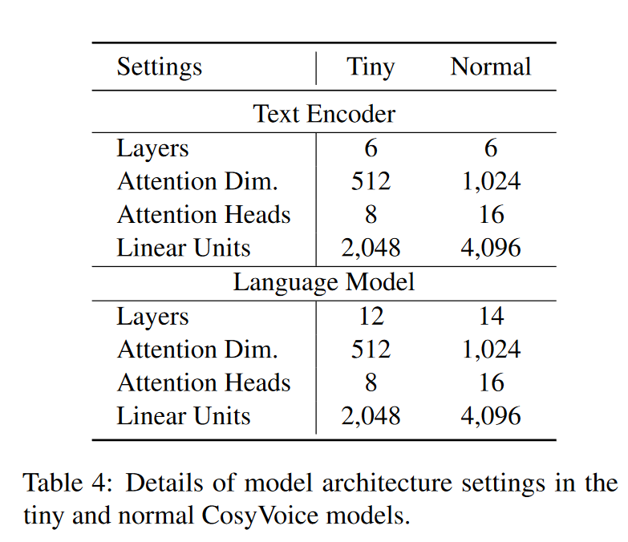
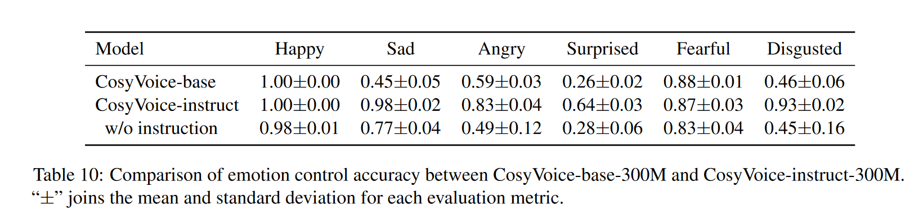
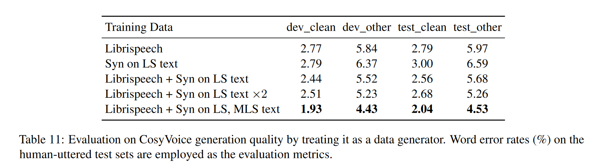

# CosyVoice

CosyVoice: A Scalable Multilingual Zero-shot Text-to-speech Synthesizer based on Supervised Semantic Tokens

## 1 动机

近年来，基于大语言模型(LLM) 的TTS模型因其高自然度和零样本合成能力而成为主流。在这种范式中，语音信号被离散化为标记序列，使用文本作为提示通过 LLM 对其进行建模，然后通过基于标记的声码器将其重建为波形。

显然，语音标记在基于 LLM 的 TTS 模型中起着至关重要的作用。当前的语音标记是以无监督的方式学习的，缺乏明确的语义信息和与文本的对齐。在本文中，我们提出用监督语义标记来表示语音，这些标记是通过在多语言语音识别模型的编码器中插入矢量量化模块得出的。基于这些标记，我们进一步提出了一种基于编解码器的语音生成合成器 CosyVoice，它由用于文本到标记生成的 LLM 和用于标记到语音合成的条件流匹配模型组成。实验结果表明，在零样本语音克隆中，监督语义标记在内容一致性和说话人相似性方面明显优于现有的无监督标记。此外，我们发现利用大规模数据可以进一步提高合成性能，这表明 CosyVoice 具有可扩展性。据我们所知，这是首次将监督语音标记纳入 TTS 模型的尝试。

该研究以多种新颖的方式为语音生成领域做出了贡献：

- 该研究首先将监督语音标记集成到 TTS 模型，从而增强了零样本语音克隆中的内容一致性和说话者相似性。
- 本文提出了 CosyVoice，这是一种可扩展的零样本 TTS 合成系统，它将用于文本到标记生成的 LLM 与用于标记到语音合成的条件流匹配模型相结合，从而无需额外的音素生成器和强制对齐器。
- 为了进一步提高生成的语音的质量，CosyVoice将说话人嵌入向量合并到 LLM 中，将语音建模分为语义、说话者和韵律组件。LLM 对语义内容和韵律进行建模，而条件流匹配模型则捕获音色和环境信息。

## 2 方法

### 2.1 Supervised Semantic Tokens for Speech

CosyVoice 从多语种的ASR模型中获取tokens, 作者认为这种做法比之前基于无监督的策略， 如Hubert等纯自监督的方法提取特征，更能编码语义等信息。

简单的来说，这里就是采用了类似于 Whisper 的 encoder-decoder 结构，只不过在编码器中插入了一个额外的量化模块，对特征进行量化。此外，额外的量化损失也被引入。值得注意的是，这里的量化损失不是基于VQ-VAE范式的，在反向传播过程中，不更新码本，码本通过 EMA 进行更新，类似流式的K-means。

### 2.2 Large Language Model for TTS

LLM部分和VALL-E比较类似，由文本编码器对文本进行编码获得文本token，音频编码器 (2.1部分)对语音进行编码。区别主要在于以下几点:

1. 引入了额外的标记token S, T, 分别标记序列的开始以及从文本切换到语音;

2. 利用声纹模型，提取说话人嵌入向量 v，以单独提供说话人信息。引入声纹token的原因可能是，由于speech token 是通过ASR模型提取的，说话人信息可能有丢失；

3. 文本不是像VALLE那样转成音素后传入，而是先通过Byte Pair Encoded (BPE) tokenizer 转成子词，再通过文本编码器编码:

$$
\bar{Y} = \text{TextEncoder}(\text{BPE}(Y))
$$

### 2.3 Optimal-transport Conditional Flow Matching
在笔记 [Flow](./Flow.md) 中，已经对 OT-CFM做了介绍。这里模型预测的是场。这里需要额外注意的有三点:

- 生成过程采用说话人嵌入 v, speech tokens u, 掩码的频谱 $\widetilde{X}$ (通过将从随机起点到终点的连续帧设置为零) 作为条件，条件被以加法的形式嵌入到了$X_t$ 中;

- 考虑到一开始的生成过程比接下来的更难，作者为时间步长 t 加入了一个余弦调度器(scheduler), 从而使在预定的scheduler下，开始时会有更多的生成步骤。

$$
t:=1-\cos (\frac{1}{2}t\pi)
$$

-  Classifier-free guidance (CFG) 技巧在这里被使用，以提高生成样本的多样性。

### 2.3 跨语种合成

CosyVoice支持跨语种合成，如下图所示，其中LID token控制了目标语种。当提示语音和输入文本在语言上有所不同时，需省略与提示相关的文本和标记，以防止原始语言的韵律特征影响目标语言。

### 2.4 指令微调

为了进一步提高 CosyVoice 的可控性，作者尝试整合额外的指令微调。CosyVoice-instruct 扩展了 CosyVoice-base，增强了指令遵循能力。具体来说，它支持对

- 说话者身份（即说话者的特征）
- 说话风格（包括情绪、性别、说话速度和音调）
- 细粒度副语言特征(fine-grained paralinguistic features, 包括笑声、呼吸、边笑边说和强调某些单词的) 

等各个方面的控制。CosyVoice使用这些训练数据对 CosyVoice-base 进行了微调，代替了自回归语言模型中的说话人嵌入。

## 3 实验

### 3.1 数据集

- Small-scale Single-lingual dataset **LibriTTS**, which contains 585 hours from 2,456 English speakers ;
- 作者团队构造了一个大型的多语种数据集，并依靠一套自动标注流程对无标签数据打伪标签;

### 3.2 实验设置

模型结构如下所示。值得注意的是，论文中居然没具体交代Flow Matching 的结构设计和参数设置...

### 3.3 实验

- 实验结果表明了从ASR模型中提取token的有效性。实验中量化会导致ASR的词错误率上升，但上升的并不多;
- LibriTTS 测试集的结果表明了 BPE token以及基于ASR+量化的语音编码器的有效性 。这里评估是采用第三方的ASR模型 Paraformer-en 来判断合成音频的词错误率，以评价模型合成的内容一致性，以及采用声纹模型提取embedding，计算余弦相似度的方式来评价说话人一致性。
- 为了验证情绪可控性，作者团队使用了公开的语音情绪识别模型 emo2vec3进行测评。我们为六种情绪（高兴、愤怒、悲伤、惊讶、恐惧和厌恶）分别生成并评估了 100 句英语话语。合成文本的内容旨在与目标情绪相匹配。然后，我们测量合成语音对每种情绪的预测情绪的准确率。下表显示了 CosyVoice-base 和 CosyVoice-instruct 的情绪控制准确率比较。对于 CosyVoice-instruct，输入包括内容文本和说话风格指令（例如，“Happy.\<endofprompt\>Content Text”）。相比之下，CosyVoice-base 仅接收内容文本作为输入。结果表明，带有情绪指令的 CosyVoiceinstruct 比不带有情绪指令的 CosyVoice-base 和 CosyVoice-instruct 表现出显着的改进。

- CosyVoice 的一个直接应用是作为数据生成器来增强其他任务的训练数据。以 ASR 任务为例，我们在 Librispeech 语料库上进行了实验，以评估 CosyVoice 生成高质量数据的能力。实验结果如下表所示，其中“Librispeech”表示原始的 960 小时数据。“Syn on LS text”和“Syn on MLS text”分别表示使用 Librispeech 和 MLS 训练集中的文本生成的数据。从表中我们可以看到，仅对合成数据进行训练，ASR 模型就可以实现与原始 Librispeech 训练集相当的结果。将它们整合在一起后，可以观察到识别准确率的显着提高。一个有趣的发现是，将合成数据用于 MLS 文本可以显著提高识别性能。这可能表明文本多样性对于 ASR 任务比语音本身的持续时间更为重要。这种改进可以归因于 CosyVoice 合成样本引入的多样化语言内容。我们的评估结果强调了 CosyVoice 生成的样本的高质量。

