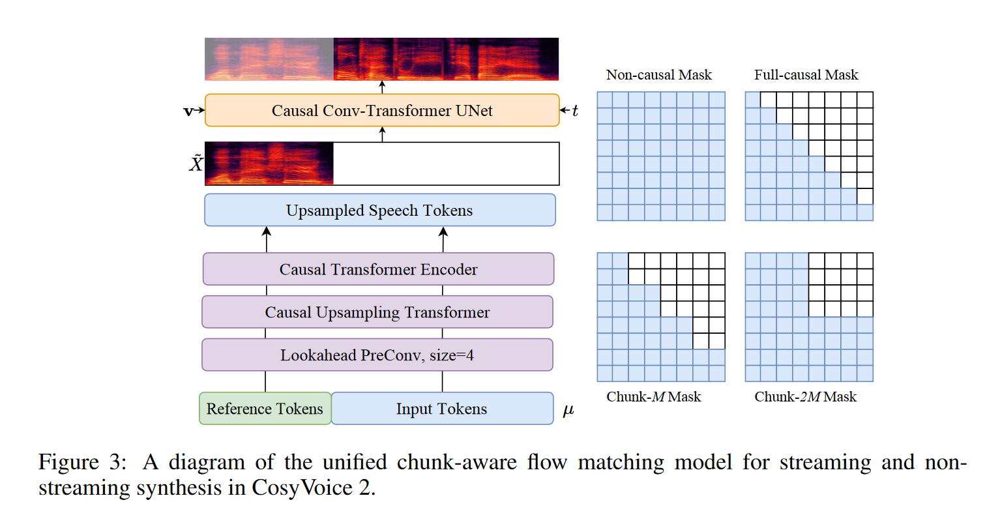

# CosyVoice 2: Scalable Streaming Speech Synthesis with Large Language Models

CosyVoice 2 是 CosyVoice 的重大升级，目标是统一离线与流式合成框架，在保持高自然度和说话人相似性的同时，将响应时延降低到可用于对话系统的水平。CosyVoice 2 实现了统一的流式/非流式、指令/零样本、多语种、多说话人的 TTS 框架，且基于大模型范式实现了结构解耦（语义-声学）、模块分离（LLM + FM）、语音-文本统一 token 建模，达到了人类可感知的自然度与控制力。其方法上的亮点包括：

- 离散空间设计上的 FSQ 代替 VQ;
- 将文本与语音统一建模并支持 streaming 的 LLM 训练策略;
- 流式的 flow matching 机制;
- 将自然语言指令与精细化语音标签相结合，实现大模型的高精度条件控制能力

## 1. 有监督语音离散化：Finite Scalar Quantization (FSQ)

FSQ（Finite Scalar Quantization）是 CosyVoice 2 中用于替代传统向量量化（VQ）的离散化方法。CosyVoice 采用 SenseVoice-Large ASR 模型作为音频编码器，在第六层插入 FSQ 模块，先将编码器输出映射到低秩空间后进行整数量化，再还原为原始维度特征，最后传入后续模块。具体过程如下：

$$
\bar{H} = \text{ROUND}(\text{Proj}_{\text{down}}(H)), \\ 
\hat{H} = \text{Proj}_{\text{up}}(\bar{H})
$$

每个量化向量  $\bar{h}_i \in \mathbb{Z}^D$ 被编码为整数 token：

$$
\mu_i = \sum_{j=0}^{D-1} \bar{h}_{i,j} (2K+1)^j
$$

该 tokenizer 在 25Hz 帧率下工作，不携带说话人信息，具有良好的语义解耦特性。

相比传统的向量量化（VQ），FSQ 避免了训练中常见的激活稀疏问题，即大量码本向量长期未被使用的问题，提高了码本利用率。由于引入直通估计（Straight-Through Estimator），FSQ 在端到端训练中具有良好的梯度传播特性，有助于与上下游模块协同优化。此外，实验表明， FSQ 量化后的 token 几乎不携带说话人信息，从而实现语义-音色建模的解耦。

## 2. 文本-语音联合语言模型（Unified Text-Speech LM）

相比于 CosyVoice, CosyVoice 2 放弃独立的文本 encoder，直接使用 **Qwen2.5-0.5B** 语言模型, 混合建模文本和语音 token。此外，cosyvoice 移除了说话人嵌入，以避免信息泄露。作者发现说话人向量不仅包含说话人身份信息，还包含语言和副语言信息，这会损害文本-语音语言模型的韵律自然度和跨语言能力。

模型训练时支持两种模式，如下图所示。

- **非流式模式**：输入序列为 `S, 文本, T, 语音, E`
- **流式模式**：交替拼接 N 个文本 token 与 M 个语音 token。这里流式结构面向的场景是，在LLM-TTS 的级联系统中，上游的 LLM 模型逐字生成文本，因此需要下游模型也具备流式生成能力。 

## 3. Causal Flow Matching for Streaming Synthesis

为了支持流式合成，CosyVoice 2 设计了 **chunk-aware causal Flow Matching 模型**，基于 OT-CFM，学习从高斯先验到目标 Mel 的映射：

$$
\phi_t^{OT}(X_0, X_1) = (1-t)X_0 + tX_1 \\ 
\omega_t(\phi_t^{OT}(X_0, X_1) | X_1) = X_1 - X_0
$$

训练目标为预测 ODE 解：

$$
\theta = \arg\min \mathbb{E}_{X_0,X_1,t} \left\| \omega_t(\phi_t^{OT}) - \nu_t(\phi_t^{OT}|\theta; \mu, \tilde{X}, v) \right\|_1
$$

采用 causal UNet 网络，输入包括：语音 token μ, 掩码参考 Mel $\tilde{X}$, 说话人 embedding v, 以及时间步 t。并引入四种因果掩码（mask）以适配不同延迟要求：Non-causal（离线）、Full-causal（极低延迟）、Chunk-M（低延迟）、Chunk-2M（高质量）。训练时多种 mask 方式随机选择，实现 implicit distillation，以兼容多种应用。

## 4. 指令控制与多说话人微调

- **自然语言指令**：通过自然语言可控制情感、语速、语种、方言等。如“请用开心语气说” 解析为 `<|endofprompt|> 今天真好！`

- **细粒度标记**：插入 `[laughter]`, `<strong>` 等标记，实现边笑边说、重读等表达；

- **多说话人微调：** 基于特定说话人对预训练模型进行微调 (SFT) 可以进一步提升生成质量和说话人相似度。本文引入多说话人微调 (mSFT)，即同时针对多个说话人而非单个说话人对预训练模型进行微调。这种方法确保了跨多个说话人的全面韵律和发音覆盖，并减轻了预训练模型潜在的灾难性遗忘。通过自然语言指令 `Speaker X<|endofprompt|>` 提供说话人控制标记，支持多说话人微调；

## 5. 强化学习优化

为进一步提升语音合成系统的自然度、语义一致性与可控性，CosyVoice 2 在微调阶段结合多说话人监督训练与强化学习技术，构建出更稳健的后验优化框架。该部分主要包含两项关键策略：

### 5.1 Direct Preference Optimization (DPO)

CosyVoice 2 将 DPO 应用于语音生成任务中， 旨在通过人类偏好对比样本来对语言模型进行后验指导。这里使用 ASR 和声纹模型作为奖励函数，从采样的结果中得到 win-loss pair。之后通过DPO 做优化：

$$
\mathcal{L}_{DPO} = -\log \sigma \left( \beta \log \frac{\pi_\theta(\mu^w|y)}{\pi_{ref}(\mu^w|y)} - \beta \log \frac{\pi_\theta(\mu^l|y)}{\pi_{ref}(\mu^l|y)} \right)
$$

### 5.2  ASR 重建损失

此外，为提升训练效率，进一步提升生成语音的语义一致性与可辨识度，CosyVoice 2 引入可微分的 ASR 模型进行辅助优化。LLM 的输出结果通过 gumble softmax 输出，之后送入到音频编码器的 FSQ模块，获得 ASR 结果。

$$
\bar{h}_{i,j} = \left\lfloor \frac{\mu_i}{(2K+1)^j} \right\rfloor \bmod (2K+1) \\
\hat{H} = \text{Proj}_{\text{up}}(\bar{H}) \\
\quad \\
L_{\text{ASR}} = -\log P(Y | \hat{H}; \theta_{\text{ASR}})
$$

