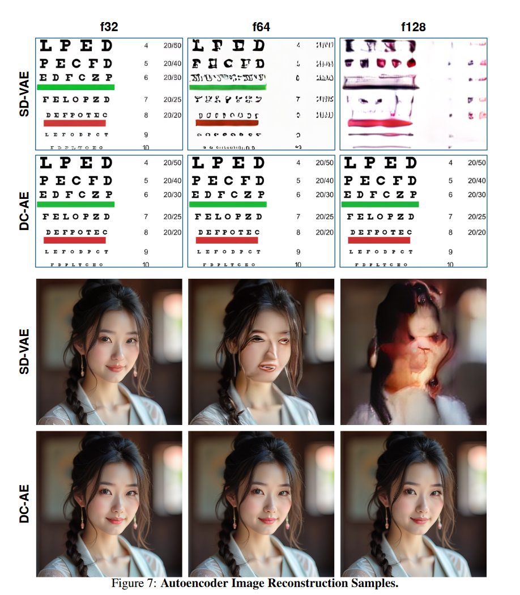

# ACE-Step

ACE-Step 是用于音乐生成的新型开源基础模型，它克服了现有方法的关键局限性，并通过整体架构设计实现了最佳性能。

之前的方法在生成速度、音乐连贯性和可控性之间面临 trade off。-

- 基于 LLM 的模型（例如 Yue、SongGen）擅长歌词对齐，但推理速度慢且存在结构性伪影。
- 另一方面，扩散模型（例如 DiffRhythm）可以实现更快的合成速度，但通常缺乏长距离的结构连贯性。

ACE-Step 通过将基于扩散的生成与 Sana 的深度压缩自编码器 (DCAE) 和轻量级线性变换器相结合，弥补了这一差距。它还利用 MERT 和 m-hubert 在训练期间对齐语义表示 (REPA)，从而实现快速收敛。最终，我们的模型在 A100 GPU 上仅用 20 秒即可合成长达 4 分钟的音乐——比基于 LLM 的基线模型快 15 倍——同时在旋律、和声和节奏指标上实现了卓越的音乐连贯性和歌词对齐。此外，ACE-Step 保留了精细的声学细节，从而支持语音克隆、歌词编辑、混音和音轨生成（例如，歌词到人声、歌唱到伴奏）等高级控制机制。我们的愿景并非构建另一个端到端的文本到音乐的流程，而是为音乐 AI 建立一个基础模型：一个快速、通用、高效且灵活的架构，使其能够轻松地在其上训练子任务。这为开发能够无缝集成到音乐艺术家、制作人和内容创作者创意工作流程的强大工具铺平了道路。简而言之，我们的目标是为音乐构建一个 "stable diffusion" 时刻。

从某种意义上来说，ace-step "没有创新"，因为该模型的各个部分几乎都来自现成的技术，这些技术在生成领域已经部分得到了验证。

## 1 数据预处理

---

### 1.1 数据集收集

- 训练语料库包含约 180 万首独特的音乐作品（约 10 万小时），涵盖 19 种语言，其中大部分为英语。

- 使用了 Audiobox 美学工具包 进行质量评估和过滤，识别并删除了低保真录音和现场表演。

### 1.2 音频注释

- The Qwen2.5-omini model generated textual descriptions detailing musical content and mood;
- 结构化标签： all-in-one;
- ASR：首先用 whisper3 转录，之后将转录结果转成IPA 音素序列后，与歌词库中的歌词进行匹配（通过locality-sensitive hashing (LSH)），最终将歌曲关联到歌词库的歌词；
- 音乐属性：Beats Per Minute (BPM) were extracted using ‘Beatthis‘ , while ‘Essentia‘  provided key and initial stylistic tags. These tags were subsequently refined and "recaptioned" into natural language phrases by Qwen-omini for consistency.
- Lyric tokenization： Lyric tokenization follows the methodology of SongGen , utilizing the XTTS VoiceBPE tokenizer  for its broad multilingual support. 
  - Romanized languages undergo minimal preprocessing；
  -  non-Romanized scripts (e.g., Chinese, Japanese, Korean) are converted to phonemic representations using grapheme-tophoneme (G2P) tools prior to tokenization. 
- 多样化的文本提示：
  - 该模型使用多样化的文本注释进行训练，包括逗号分隔的标签、描述性字幕和使用场景，这些注释由音频语言模型动态生成，以匹配上下文。
  - 为了进一步防止过度拟合特定的提示格式，歌词由 LLM 扩充为多种风格变体（例如，带或不带结构化标签），从而增强了对现实世界输入不一致的适应性。

## 2 模型结构

---

### 2.1 Deep Compression

该结构来自 发表于 ICLR 2025 的论文 **《Deep Compression Autoencoder for Efficient High-Resolution Diffusion Models》** 。其针对现有 VAE（如 SD-VAE）在压缩率高于 8× 时精度严重下降，难以适用于高分辨率场景的问题，提出了一种用于高分辨率扩散模型的高压缩率自编码器架构 DC-AE。DC-AE的主要创新点如下：

1. Residual Autoencoding

    - **动机**：高压缩比下的编码器难以优化，容易陷入低质量的局部最优。
    - **方法**：
      - 使用 非参数性空间-通道残差路径（space-to-channel shortcuts）；
      - 在 encoder / decoder 的下采样与上采样模块中引入 残差连接，但非传统 identity，而是空间维度重排的形式；
      - 显著提高了优化稳定性与重建精度，尤其在高压缩比下有效控制 rFID。

2. Decoupled High-Resolution Adaptation（解耦高分辨率适应）
    - **动机**：训练高压缩率自编码器在从低分辨率（如 256×256）泛化到高分辨率（如 1024×1024）时存在泛化惩罚（generalization penalty）。
    - **方法**：采用三阶段训练策略：
      1. 低分辨率全模型训练（无 GAN loss）；
      2. 高分辨率 latent 适应阶段：仅调整中间层，避免全图训练的高成本；
      3. 低分辨率局部细节精修阶段：引入 GAN loss，但只微调 decoder 头部，节省开销。

3. 模型应用与实验优势
    - 极高压缩率（高达 128×）仍能维持 rFID < 1，显著优于 SD-VAE；
    - 在 ImageNet 512×512 上：
      - DC-AE-f64 相比 SD-VAE-f8 提供 19.1× 推理速度提升，17.9× 训练速度提升；
      - 同时 FID 提升（如从 3.55 降至 3.01）；
    - 更大模型（如 UViT-2B）下效果更明显。

4. 和 1d-VAE 对比： “We also conducted preliminary explorations with 1D VAE architectures, including variants similar to those in Stable Audio  and DiffRhythm. **However, these approaches, possibly due to suboptimal integration with our diffusion model’s training recipe, exhibited persistent high-frequency artifacts in the generated vocals, particularly in later training stages.** Given project timelines, these alternatives would be pursued further in the next version”

   即虽然 1d-VAE 重建效果更好，但在训练阶段利用1d-VAE 合成的音频具有明显的高频伪影，因此在这一版不予采用;

   

### 2.2 Diffusion Transformers (DiT)

DiT 网络参考图像生成领域 Sana("SANA: EFFICIENT HIGH-RESOLUTION IMAGE SYNTHESIS WITH LINEAR DIFFUSION TRANSFORMERS")的结构。Sana 原始架构如下图所示。相比 vanilla transformer，包含主要两点改进

**Linear Attention**

给定输入序列 $X \in \mathbb{R}^{N \times d}$，经过投影得到：

- Queries: $Q = XW_Q \in \mathbb{R}^{N \times d}$
- Keys: $K = XW_K \in \mathbb{R}^{N \times d}$
- Values: $V = XW_V \in \mathbb{R}^{N \times d}$

Attention 的输出为：

$$
\text{Attention}(Q, K, V) = \text{softmax}\left(\frac{QK^\top}{\sqrt{d}}\right) V
$$

注意以上计算中，Q和K矩阵乘法计算复杂度为 $O(N^2  d)$ , 注意力权重和V的乘法操作复杂度也为 $O(N^2 d)$ 。当序列长度较大时，计算复杂度较高。

不妨思考，如果 softmax 操作不存在（或者是线性的），那么根据矩阵乘法的结合律，有 $QK^{T}V = Q(K^{T}V)$ 。注意到后者的计算复杂度只有 $O(nd^2)$ ! 所以采用后者似乎能极大提高计算效率。

Linear Attention 采用核函数近似 softmax 中的指数项 exp。所谓核函数即满足以下性质的函数

$$
K(Q_i, K_j) = \phi(Q_i)^T\phi(K_j)
$$

 这里用 $K(Q_i, K_j)$ 近似 softmax 中的 $e^{-Q_i^T K_j}$。用 ReLU 函数作为 $\phi$ ，则有 

 

> 具体细节参见 “Transformers are rnns: Fast autoregressive transformers with linear attention”

**Mix-FFN block**

与 softmax 注意力模型相比，线性注意力模型具有计算复杂度更低、延迟更低的优势。然而，由于缺少非线性相似性计算函数，其性能可能无法达到最优，如导致收敛速度却慢得多。为了进一步提高训练效率，Sana 用 Mix-FFN 替换了原始的 MLP-FFN。Mix-FFN 由一个 3×3 深度卷积和一个门控线性单元 (GLU) x 组成。深度卷积增强了模型捕获局部信息的能力，弥补了 ReLU 线性注意力模型较弱导致的局部信息捕获能力。

在 ace-step 中

- DC-AE 在时间和频率维度下采样均为8。最终得到的latent 频率维 dim=16, 时间维采样率10Hz（意味着 240s，latent时间维度大小是 2400）；
- DiT 的 Pathify 阶段，单个 patch 时间维大小为 1， 频率维大小16, 即最终送入 transformer 的长为 2400 的一维序列；

- 上述卷积由二维改成一维，以适应语音信号一维的特性。

### 2.3 特征编码器

- 文本编码器: 文本编码器： 基于 Google mT5 的冻结模型 ，从文本提示生成 768 维嵌入向量。之所以选择该模型，是因为它在处理描述性标签和自然语言字幕方面拥有强大的多语言处理能力。
- 歌词编码器： 6层 Conformer，该模块可训练（该设置继承自 SongGen）；
- 说话人编码器：
  - 说话人编码器将一段10秒的无伴奏人声片段（由demucs分割）处理成512维的嵌入向量。
  - 对于包含人声的完整歌曲，会对多个此类片段的嵌入向量取平均值。对于器乐音轨，使用零向量作为说话人嵌入向量。
  - 该编码器已在一个庞大且多样化的歌唱语料库上进行预训练，其架构灵感源自最初用于人脸识别的PLR-OSNet 。
  - 在ACE-Step的主要训练阶段，对这些说话人嵌入向量应用了50%的dropout率。这可以防止模型过度依赖音色信息进行风格解读，从而即使在没有明确的说话人输入的情况下也能生成合理的音色。
  - 在后续的微调阶段，说话人嵌入向量**被完全省略**。虽然这会降低语音克隆的精确度，但它将更大的风格控制权转移到文本提示上，从而增强了整体灵活性。(也就是说，我们拿到的开源版本不支持说话人克隆...)

## 3 损失函数

ACE-Step 的训练方法在于优化一个平衡生成保真度和语义一致性的复合目标函数。这包括一个用于学习潜在空间中数据分布的主要流匹配损失函数，以及一个利用预训练自监督学习 (SSL) 模型的辅助语义对齐损失函数。

### 3.1 REPA (Representation Alignment)

扩散模型倾向于优先学习低频结构（例如旋律、歌曲形式），然后再学习高频细节（例如精确的声音细微差别）。如果没有来自预先训练的自监督学习 (SSL) 模型（用于语音的 mHuBERT，用于音乐的 MERT）的强大语义指导，该模型可能会过早地关注声音细节，导致歌词错位或遗漏。REPA 强制执行来自这些 SSL 模型的持续语义约束，确保在整个生成过程中将歌词的遵循性视为基本的优先事项。

为了增强音乐的连贯性，尤其是歌词的对齐和清晰度，论文引入了基于 REPA 的辅助语义对齐损失函数。该损失函数限制了模型的线性 DiT 主干网络的中间表征，使其与强大的预训练音频自监督模型的表征保持一致。具体来说，我们从 ACE-Step 的线性 DiT 中间层（共 24 层，第 8 层）中提取 hDiT 特征。然后，将这些特征与从以下位置获得的目标表征对齐：

- MERT (Music Encoder Representations from Transformers) : 提供通用的音乐特征嵌入；

- mHuBERT (multilingual HuBERT) : 用于提升歌词的清晰度和拟真语音的特性；

## 4 训练设置

