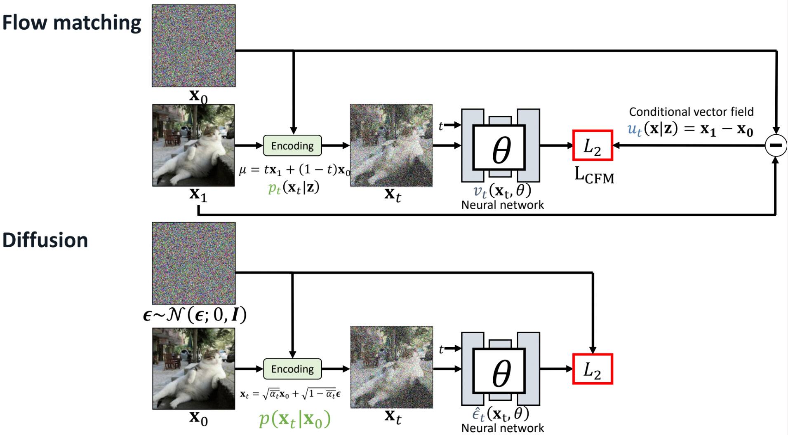

# Flow 

## 1 Normalizing Flows

在笔记 ['生成式算法概述' ](./生成式算法概述.md) 中，我们已经对 Normalizing Flows 技术有了大致的了解，其通过以下公式将输入的高斯分布转化为目标分布:

$$p_{G}(x)=\left| J_{G^{-1}} \right|\pi(G^{-1}(x))  $$

关于如何设计网络，使得雅可比矩阵的行列式可知, 目前应用较多的策略是基于Coupling Layer的策略，其结构如下图所示:

<div align="center"></div>

下图展现了几种常见的 Normalizing Flows 的实现策略，可以看到 Coupling Layer 策略的雅可比矩阵容易计算，但缺点是由于对其形式的限制，导致其函数的表现力不足。而对于下图的 Residual flow, 其具有形式 $x = z+u(z)$ , 即每一次更新残差。该方法虽然限制少，表现力强，但缺点在于雅可比矩阵不容易计算。 

<div align="center"></div>

### 伪代码实现

从伪代码可以看出，通过 Normalizing Flows 可以得到样本x对应的概率，该概率作为优化目标。

```python
import torch
import torch.nn as nn
import torch.optim as optim
import torch.nn.functional as F

# 1. Coupling Layer: 采用 RealNVP 风格的 Affine Coupling
class AffineCoupling(nn.Module):
    def __init__(self, in_channels):
        super().__init__()
        self.scale_net = nn.Sequential(
            nn.Conv2d(in_channels // 2, in_channels, kernel_size=3, padding=1),
            nn.ReLU(),
            nn.Conv2d(in_channels, in_channels // 2, kernel_size=3, padding=1),
            nn.Tanh()  # 输出 scale
        )
        self.translate_net = nn.Sequential(
            nn.Conv2d(in_channels // 2, in_channels, kernel_size=3, padding=1),
            nn.ReLU(),
            nn.Conv2d(in_channels, in_channels // 2, kernel_size=3, padding=1)
        )
    
    def forward(self, x, reverse=False):
        x1, x2 = x.chunk(2, dim=1)  # Split channels
        s = self.scale_net(x1)
        t = self.translate_net(x1)
        if not reverse:
            x2 = x2 * torch.exp(s) + t
        else:
            x2 = (x2 - t) * torch.exp(-s)
        return torch.cat([x1, x2], dim=1), torch.sum(s, dim=[1, 2, 3])  # 返回 log-determinant

# 2. Normalizing Flow Model
class RealNVP(nn.Module):
    def __init__(self, in_channels, num_flows=4):
        super().__init__()
        self.flows = nn.ModuleList([AffineCoupling(in_channels) for _ in range(num_flows)])

    def forward(self, x):
        log_det_jacobian = 0
        for flow in self.flows:
            x, log_det = flow(x, reverse=False)
            log_det_jacobian += log_det
        return x, log_det_jacobian

    def reverse(self, z):
        for flow in reversed(self.flows):
            z, _ = flow(z, reverse=True)
        return z

# 3. 训练函数
def train(model, data_loader, optimizer, num_epochs=10):
    model.train()
    for epoch in range(num_epochs):
        for x in data_loader:
            x = x.to(device)
            z, log_det = model(x)
            log_p_z = -0.5 * torch.sum(z ** 2, dim=[1, 2, 3])  # 假设标准正态分布
            loss = -torch.mean(log_p_z + log_det)  # 最大化对数似然
            optimizer.zero_grad()
            loss.backward()
            optimizer.step()
        print(f"Epoch {epoch+1}, Loss: {loss.item()}")

# 4. 生成图像
def generate_samples(model, num_samples=16):
    z = torch.randn(num_samples, 3, 32, 32).to(device)  # 采样标准正态分布
    samples = model.reverse(z)  # 通过逆变换生成
    return samples

# 初始化模型与优化器
device = torch.device("cuda" if torch.cuda.is_available() else "cpu")
model = RealNVP(in_channels=3, num_flows=6).to(device)
optimizer = optim.Adam(model.parameters(), lr=1e-3)

# 训练示例
# data_loader = ...  # 假设我们有一个图像数据集的 DataLoader
# train(model, data_loader, optimizer, num_epochs=10)

# 生成图像示例
# samples = generate_samples(model)
# visualize(samples)  # 假设有一个可视化函数

```


## 2 Continuous Normalizing Flows

注意到在 residual flows 中，可以通过每次更新残差的方式，让分布逐渐从高斯分布变到目标分布。假设这一更新过程是连续的，而不是离散的。t 时刻的数据点 $x_t$ 经过模型的变换，在 $t+dt$  时刻变换为了 $x_{t+dt}$ , 则定义向量场 $u(x_t, \theta)$ 为 :

$$\frac{dx_t}{dt}=u(x_t, \theta)$$

其中向量场u 即为 ”流” (flow),  或称为向量场 (Vector field)。如果我们可以对向量场  $u_t (x_t, \theta)$ 进行建模，那么只需从 $x_0 \in N(0, \textbf{I})$  中随机采样，再通 过积分，就可以得到 $x_1$(当然，实际的积分是采用数值积分，过程是离散的) 
$$
x_1 = x_0 + \int_{0}^{1} u(x_t, \theta) dt
$$
总结来说，Continuous Normalizing Flows 将数据从高斯分布演变到目标分布的过程视作为通过场来实现的，如下图所示 (或点击查看 [gif demo](./img/flow/demo.mp4))

<div align="center"></div>

这里将概率类比为流体，由于总的概率积分是1，就类似于流体的总量是一定的，因此对x点来说，有以下公式(Continuity Equation)成立

$$ \frac{\partial p_t(x)}{\partial t} + \text{div} \left( p_t(x) u_t(x) \right) = 0 $$

该公式的含义是某处概率密度的变化等于"流出"和"流入"x概率的"流量"之差。该公式是是向量场 u 产生对应的概率密度路径 p(x)的充要条件。换句话说，已知 $p_t$ 的情况下，只要找到一个符合上述等式的 $u_t$ , 那么该$u_t$ 就一定是合理的。

## 3 Flow Matching

Continuous Normalizing Flows 并不好求解，因为想要找到合适的 u 并不容易。Flow Matching 的思想是，构建一个模型，来学习去预测这个场。

$$
L_{\text{FM}} = \mathbb{E}_{t, p_t(\mathbf{x}_t)} \left[ \left\| v_t(\mathbf{x}_t, \theta) - u_t(\mathbf{x}_t) \right\|_2^2 \right]
$$

可以将总的概率视作通过对条件概率进行边缘积分得到：

$$
p_t(\mathbf{x}_t) = \int p_t(\mathbf{x}_t | \mathbf{z}) \, q(\mathbf{z}) \, d\mathbf{z}
$$

而也可以证明在数据点 x 处的向量场 $u_t(x)$ 是通过对所有可能的初始条件 x1 的条件向量场$ u_t(x∣x_1)$ 加权积分得到。 这里的z作为条件，其设置是灵活的。根据条件z的不同，flow matching 可以分为三种不同情况: 

<div align="center"></div>

### 3.1 conditional flow matching

首先假设已知生成目标, 即路径的终点是x1。只要满足如下两个边界条件，就能作为条件概率路径 $p_t$ ：

- t=0时是标准高斯分布;
- t=1时服从以均值为x1, 方差足够小的高斯分布;

而当构造了路径 $p_t$ 之后，变化速度 $u_t$ 也可以根据 Continuity Equation 构造出来。总而言之，对CFM 我们有以下的路径p和速度u

<div align="center"></div>


### 3.2 Independent coupling (I-CFM)

该条件下假设 x1 和 x0 均已知且独立，这种情况下路径如下。

<div align="center"></div>

### 3.3  Optimal transport CFM (OT-CFM)

在有多个x0和x1的情况下，OTT-CFM根据最佳传输理论, 为x0分配最优的x1，如下图所示

<div align="center"></div>

### 3.4 与 Diffusion

Flow match允许使用各种可微分函数来定义p和u ，可以根据不同的应用场景和边界条件选择合适的函数。事实上，可以将 flow matching 与diffusion 统一到一套框架下[^3]。可以看到，下图中 flow-matching 的训练方法和diffusion的训练过程高度相似。所以说虽然二者来源可能不一样，但最后实践下来形式是高度相似的。

<div align="center"></div>

## Ref

[^1]: Improving and Generalizing Flow-Based Generative Models with Minibatch Optimal Transport

[^2]: Flow Matching for Generative Modeling

[^3]: [深入解析Flow Matching技术 ](https://zhuanlan.zhihu.com/p/685921518)
[^4]: [扩散模型中，Flow Matching的训练方式相比于 DDPM 训练方法有何优势？](https://www.zhihu.com/question/664448167/answer/3634995742)