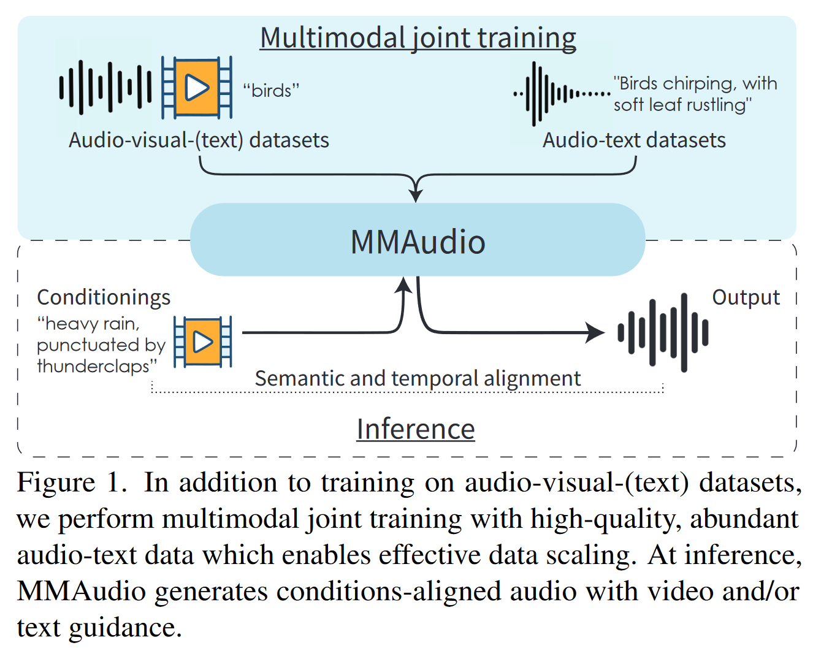
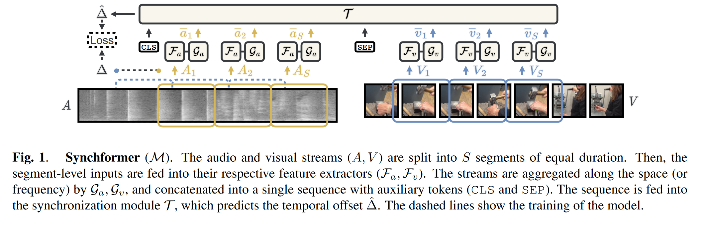
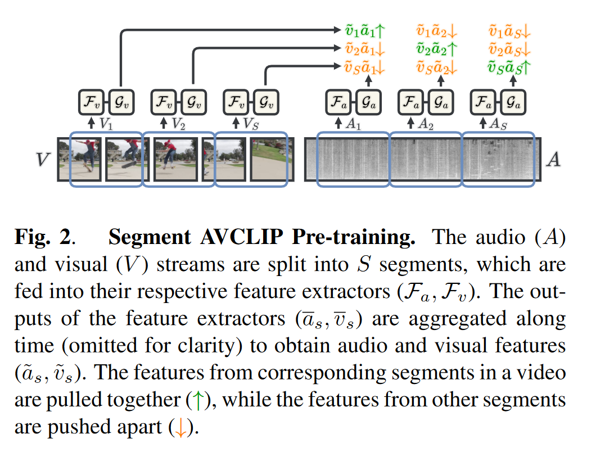
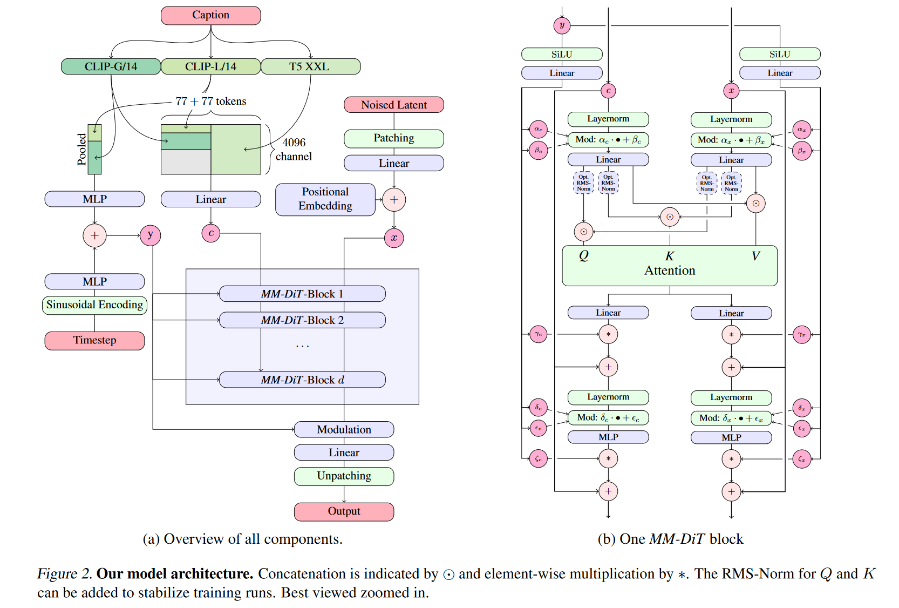
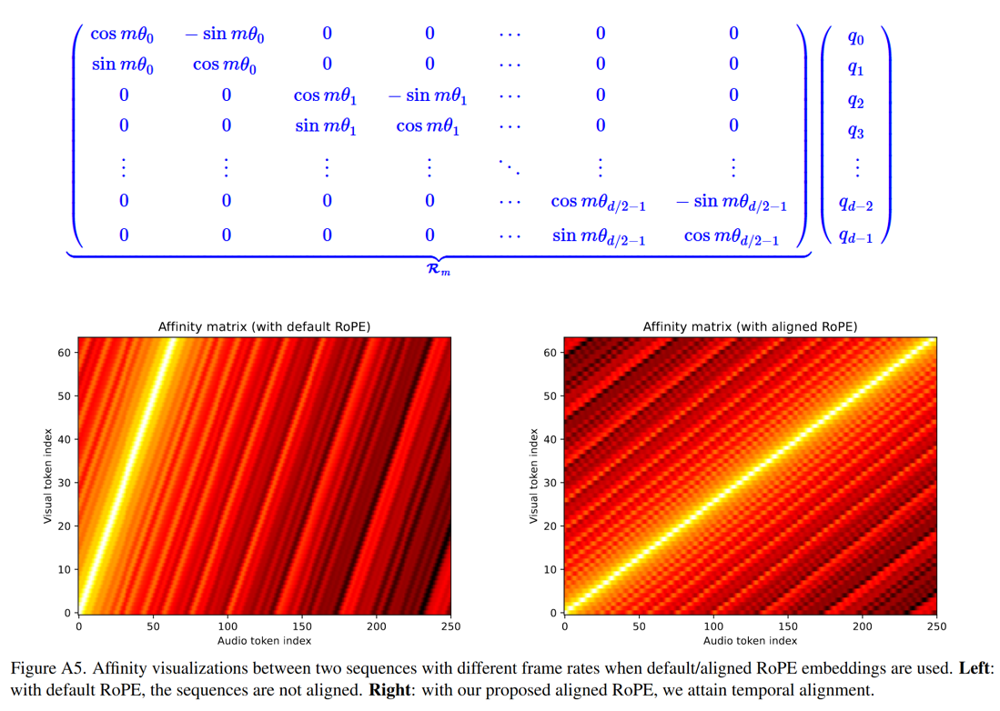
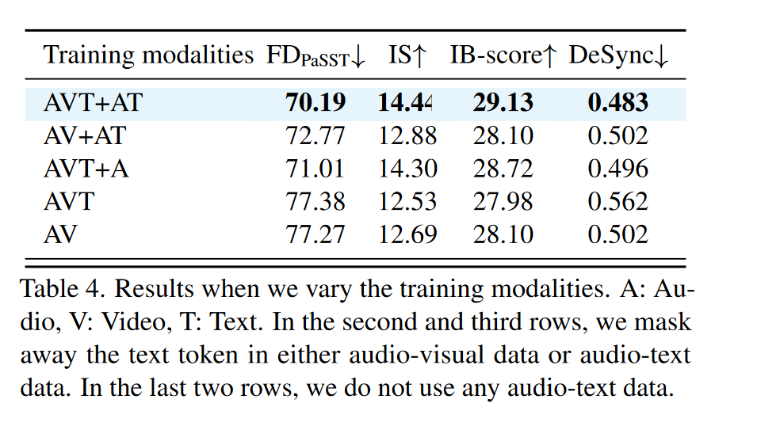
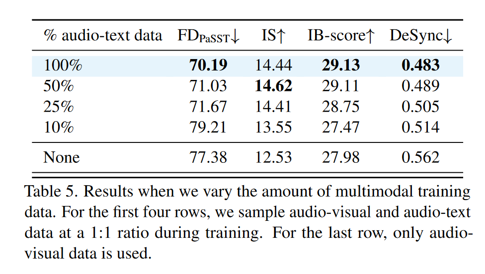
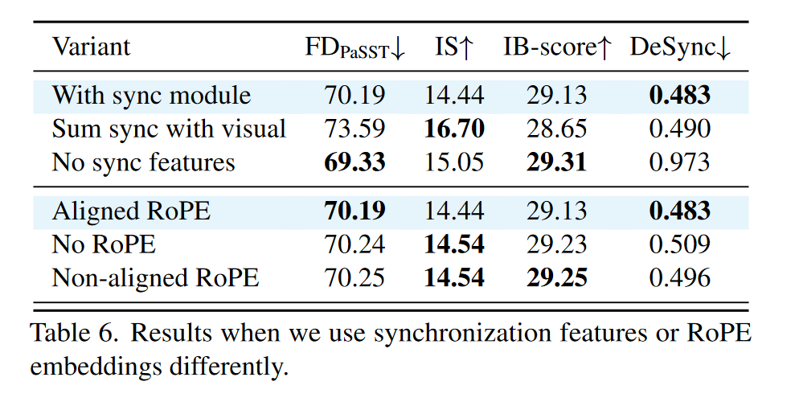
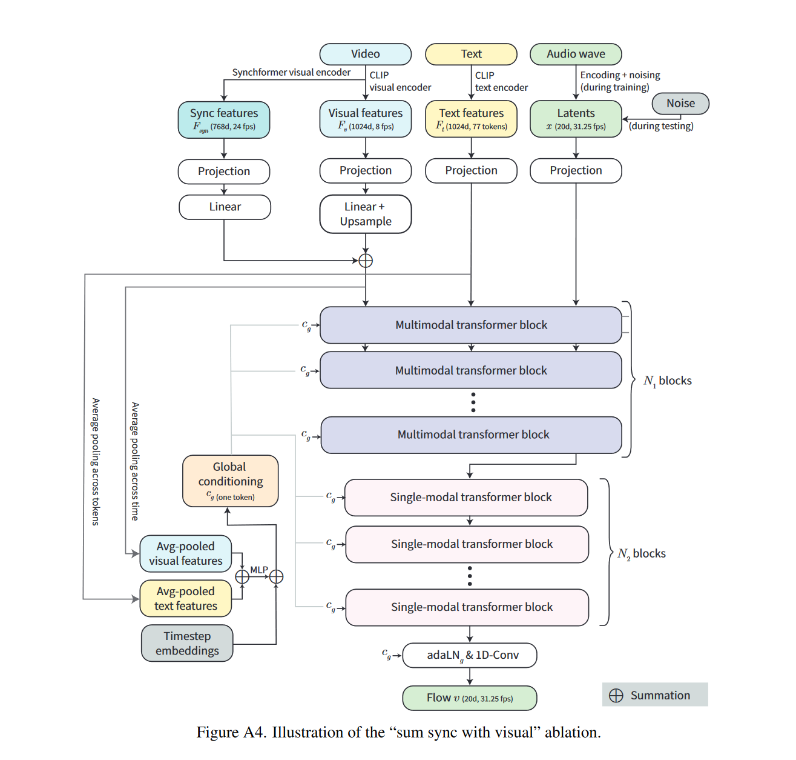

# MMAudio: Taming Multimodal Joint Training for High-Quality Video-to-Audio Synthesis

## 1 研究动机与贡献

### 1.1 背景

Foley 音频合成任务：为给定视频生成逼真的环境声音或事件声音，不包括背景音乐和语音（这两者通常在后处理过程中加入）。Foley 音频合成需满足两个要求：

1. **语义对齐（Semantic Alignment）**：如“雨”应与“雨滴声”对应。
2. **时间对齐（Temporal Alignment）**：如“狗叫”应与画面中狗张嘴同步（人的感知可识别 25ms 级别的错位）。

现有视频到音频（video-to-audio, V2A）方法。可分为两类

- 从零开始训练的音视频模型：
  - 优点：架构自由，适配性强；
  - 缺点：受限于训练数据规模，小规模数据（如VGGSound仅550小时）难以覆盖多样场景；来自互联网的视频中常含音乐和语音，对Foley模型帮助有限；存在“画外音”（如背景音乐、后期添加音效），不适合作为训练样本。

- 在大规模音频-文本模型基础上添加“控制模块”并微调
  - 优点：可利用大规模音频-文本数据（如WavCaps的7600小时）中学到的音频生成能力。
  - 缺点：网络架构复杂化，限制了设计空间；预训练的T2A模型是否具备充分的灵活性以应对所有V2A任务仍不明确。

### 1.2 核心贡献

1. **MMAudio 多模态联合训练框架**：将视频、音频、文本三种模态统一建模，融合 AV（Audio-Video）和 AT（Audio-Text）数据, 以便模型利用更多模态的数据进行训练。
2. **条件同步模块（Conditional Synchronization Module）**：提升时序对齐精度。
3. **训练效率与生成质量兼具**：仅157M参数即可达SOTA，生成速度快（8s音频仅1.23s生成）。

## 2 相关工作&前置知识

### 2.1 语义对齐（Semantic alignment）

音频和视频之间的语义对齐是通过在成对的视音频数据上进行训练来学习。为了进一步理解音频语义，本文额外引入成对的音频-文本数据。文章认为，从音频-文本对中学习到的语义理解可以迁移到视频-文本对，因为联合训练可以形成一个共享的语义空间，并使网络能够从更多样化的数据中学习到更丰富的语义。

### 2.2 时间对齐 (Temporal alignment)

除了直接从视听对中学习时间对齐之外，一些近期的研究首先从视频中学习一个单独的模型来预测手工制作的代理特征，如音频起始 、能量或波形的均方根 。本文不采用这些手工制作的特征，而是利用自监督预训练的音视频同步模型 Synchformer  的深度特征嵌入学习对齐，从而可以对输入信号进行更细致的解释。

> - 音视频同步 (audio-visual synchronization) 任务是预测视频中音频流和视频流之间的时间偏移;
> -  Synchformer 的预训练阶段通过对比学习的方式实现音视频表征的对齐;

### 2.3 多模态条件生成

支持多模态条件生成的最常见方法是向预训练的文本转音频网络添加“控制模块”，注入视觉特征, 如control-net。然而，这会额外增加参数数量。相比之下，我们在多模态训练方案中同时训练所有模态 ，以学习联合语义并实现模态间的全方位特征共享。

### 2.4 Flow matching

我们使用条件流匹配(conditional flow matching, CFM) [^1] 目标函数进行生成建模。简而言之，在测试阶段，为了生成一个样本，我们从标准正态分布中随机采样噪声 $x_0$，并使用一个常微分方程（ODE）求解器从时间 $t = 0$ 数值积分到 $t = 1$，跟随一个学习得到的、时间相关的条件速度向量场可表示为：

$$
v_\theta(t, \mathbf{C}, x): [0, 1] \times \mathbb{R}^C \times \mathbb{R}^d \to \mathbb{R}^d, \tag{1}
$$

其中 $t$ 是时间步，$\mathbf{C}$ 是条件（例如视频和文本），$x$ 是空间中的一个点。我们通过一个由参数 $\theta$ 控制的深度神经网络来表示该速度场。

在训练阶段，我们通过最小化以下条件流匹配目标函数来学习 $\theta$：

$$
\mathbb{E}_{t, q(x_0), q(x_1, \mathbf{C})} \left\| v_\theta(t, \mathbf{C}, x_t) - u(x_t | x_0, x_1) \right\|^2, \tag{2}
$$

其中 $t \in [0, 1]$，$q(x_0)$ 是标准正态分布，$q(x_1, \mathbf{C})$ 是从训练数据中采样的分布。进一步地，

$$
x_t = t x_1 + (1 - t) x_0 \tag{3}
$$

定义了一个在噪声与真实数据之间的线性插值路径。

并且，

$$
u(x_t | x_0, x_1) = x_1 - x_0 \tag{4}
$$

表示在 $x_t$ 处对应的流动速度。更多相关内容可参考笔记 [Flow](./Flow.md) 。

### 2.6 基于VAE的编码器

遵循之前音频生成领域的工作, 如 AudioLDM 等的做法，本文训练过程中采用预训练的VAE将音频梅尔谱编码到隐空间。关于VAE的作用可参考笔记 [LDM](./LDM.md)。

## 3 方法框架  

### 3.1 MMAudio 结构总览

模型结构分为以下模块：

- 多模态 Transformer：N1层，用于融合视频、音频、文本。
- 单模态 Transformer：N2层，仅处理音频表征，引入该部分是为了节省参数，遵照FLUX。
- 条件编码器: 包括基于CLIP以及synchformer的视觉编码器，和CLIP文本编码器;

### 3.2 多模态 Transformer 

1. 输入表征（Representation）

   - Video features：8fps，采用CLIP visual encoder 编码，1024维;
   - Audio latent：31.25fps，20维，经VAE压缩;
   - Text features：77 tokens，1024维;
   - 同步特征 $F_{syn}$：24fps，768维，来自Synchformer视觉编码器;

   上述特征经过MLP映射之后，维度统一转换为D维(D的大小取决于具体模型设定);

2. Joint Attention

   

   注意力的设计主要基于 SD3[^2]，如上图所示。视频/文本/音频三模态拼接后做 attention，输出再分回各模态。各模态的FFN层不共享;

3. 位置编码 

   对视频和音频特征使用 RoPE（Rotary Position Embedding）[文本由于是粗粒度的全局特征，无需加位置编码]。由于帧速率不一致（视觉流为 8 fps，音频流为 31.25 fps），我们按比例缩放视觉流中位置嵌入的频率，即按 31.25/8 进行缩放, 以使视频和音频流同一位置的位置编码对应。注意无需对文本加位置编码，因为文本和音视频在位置上并无线性的对应关系；

   

4. ConvMLP

   将视觉、音频模态的FFN从MLP替换为 1D Conv（kernel=3, padding=1），以更好捕捉局部时序信息。

### 3.3 条件同步模块（Conditional Sync Module）

- 全局条件注入: 通过 adaLN (更通用的称呼是FiLM(Feature-wise Linear Modulation)，只不过这里的FiLM加到了LayerNorm之后)实现，其中全局条件$c_g$融合 timestamp 编码、视觉和文本池化后的全局特征。

$$
\mathrm{adaLN}_g(y, c_g) = \mathrm{LayerNorm}(y) \cdot \mathbf{1} \mathbf{W}_\gamma(c_g) + \mathbf{1} \mathbf{W}_\beta(c_g), \tag{5}
$$

​	其中 $W_{\gamma}$ 和 $W_{\beta}$ 为 MLP;

- 帧级条件注入: 尽管前文采取了一些有助于帧级同步的策略，例如位置编码对齐等，但这些并不能有效的保证合成的音频与视频的同步性。为实现帧级同步，有必要显示的注入同步信息。模型利用Synchformer提取 24fps 的视觉同步特征 ，同步特征经过以下处理，得到帧级条件:
  $$
  c_f = \mathrm{Upsample}\left( \mathrm{ConvMLP}(F_{\mathrm{syn}}) \right) + \mathbf{1} c_g, \tag{6}
  $$
  帧级特征仍然通过 adaLN 注入，以实现细粒度的对齐:
  $$
  \mathrm{adaLN}_f(x, c_f) = \mathrm{LayerNorm}(x) \cdot \mathbf{A}_\gamma(c_f) + \mathbf{A}_\beta(c_f), \tag{7}
  $$
  其中 $A_{\gamma}$ 和 $A_{\beta}$ 为 MLP;

## 4 实验与评估

### 4.1 训练与推理

#### 数据集构建

- **AVT 模态**：VGGSound（500小时，带 class label 的视频音频=18万条10s片段）
- **AT 模态**：AudioCaps、Clotho、WavCaps（共计7600+小时）

#### 推理细节

- 采用 [Euler 采样](https://kexue.fm/archives/9881)（25步），支持 classifier-free guidance (CFG)。
- 生成时 video/text 可选。

### 4.2 评估指标

### 4.2.1 分布匹配

采用三个encoder提取特征嵌入: PaSST、PANNs、VGGish;

- Fréchet Distance（FD）:若我们有两个多维高斯分布：

  - 真实数据分布：$\mathcal{N}(\mu_r, \Sigma_r)$
  - 生成数据分布：$\mathcal{N}(\mu_g, \Sigma_g)$

  它们之间的 Fréchet Distance 定义为：

  $$
  \text{FD}(\mathcal{N}_r, \mathcal{N}_g) = \|\mu_r - \mu_g\|_2^2 + \mathrm{Tr}\left(\Sigma_r + \Sigma_g - 2\left(\Sigma_r \Sigma_g\right)^{1/2}\right)
  $$
  Fréchet Distance是基于正态分布假设下最优传输的Wasserstein距离得到;

- KL散度: 略;

#### 4.2.2 音质评价

Inception Score (IS)： Inception Score 的核心思想是，让生成内容满足以下两个性质：

- 单个类别预测应当确定性强（低熵），说明是一个清晰有意义的对象；
- 所有图像整体预测标签分布应具有多样性（高熵），表示样本多样化。

Inception Score (IS) 公式如下
$$
D_{\mathrm{KL}}(p(y|x) \| p(y)) = \sum_y p(y|x) \log \frac{p(y|x)}{p(y)}
$$
其中 p(y)即真值， p(y|x) 是模型的预测结果。该值可视作p(y)的条件熵减去p(y|x)的熵。p(y) 的条件熵高而p(y|x)的熵低，则该值大。

#### 4.2.3 其他指标

- **语义对齐**：assesses the semantic similarity between the input video and the generated audio。指标为ImageBind得分[^3]（IB-score），该指标从音频和视频特征中分别提取嵌入并计算相似度.
- **时序对齐**：DeSync误差，由Synchformer输出音视频时间偏移误差；

### 4.3 结果

- MMAudio 在 VGGSound 数据集（约 15K 视频）上的评估显示出显著优越的性能。此外尽管 MMAudio 并非专门为 text-to-audio 设计，但其在 AudioCaps 测试集上仍表现出色：

- 消融:

  - 跨模态联合训练: 作者通过遮蔽训练过程中的部分模态，考察各模态对性能的影响。"A: Audio, V: Video, T: Text. Our default setting (AVT+AT) means that we train on audio-visual-text data (VGGSound class labels as text input) and audio-text data."

    - 无论在音视频文本数据 (AVT+AT) 或音频文本数据 (AVT+A) 中移除文本模态，都会导致性能下降，说明共享文本语义空间至关重要；
    - 加入无文本的音频数据 (AVT vs. AVT+A) 依然提升性能，这表明我们的网络甚至可以从无条件生成数据的训练中受益，由于可以利用无条件数据学习自然声音的分布；
    - 在完全没有音频文本数据的情况下，加入类别标签 (AVT vs. AV) 提升效果有限，这表明，在大型多模态数据集上进行训练，而不是在网络中添加变换器分支或使用类标签，才是关键。

    > 思考: 如果我们有相当大一批无标记的音频数据集和少量有标记的音频数据集，完全可以先用无标记数据集做预训练，之后在用有标记数据集做微调；

    

  - 多模态数据规模影响: 更多多模态训练数据能持续提升性能，但存在边际效益递减；

    

  - 条件同步模块分析：作者比较了三种方式融合同步特征的效果：默认同步模块， 将同步特征与 CLIP 特征求和，不使用同步特征。 

    - 默认同步模块达到了最佳时间对齐;

    - 注意到“与视觉同步求和”方法实现了更高的音频质量（IS）——作者认为假设，由于上采样 CLIP 特征将视觉流中的标记数量增加了三倍，因此该模型受益于使用更长的序列进行更细粒度的计算；

      

    

  - RoPE 位置编码对比:  - 对比不使用 RoPE、使用未对齐 RoPE 与对齐 RoPE。结果表明对齐的 RoPE显著提升时间同步性;

  - ConvMLP vs MLP： ConvMLP 的 DeSync 更低，说明在捕捉局部时序结构 方面更优。

  - 多模态与单模态 Transformer block 比例：文中比较了在参数预算大致相同的情况下，多模态 (N1) 和单模态 (N2) Transformer 块数量的不同分配。注意到，默认分配 (N1 = 4, N2 = 8) 的性能与使用更多单模态块 (N1 = 2, N2 = 13) 的性能相似，并且优于使用较少单模态块 (N1 = 6, N2 = 3) 的性能。作者认为这是因为使用单模态块使我们能够在参数数量相同的情况下构建更深的网络。

## Ref

[^1]: Improving and generalizing flow-based generative models with minibatch optimal transport
[^2]: Scaling Rectified Flow Transformers for High-Resolution Image Synthesis

[^3]: Imagebind: One embedding space to bind them all, CVPR 2023

