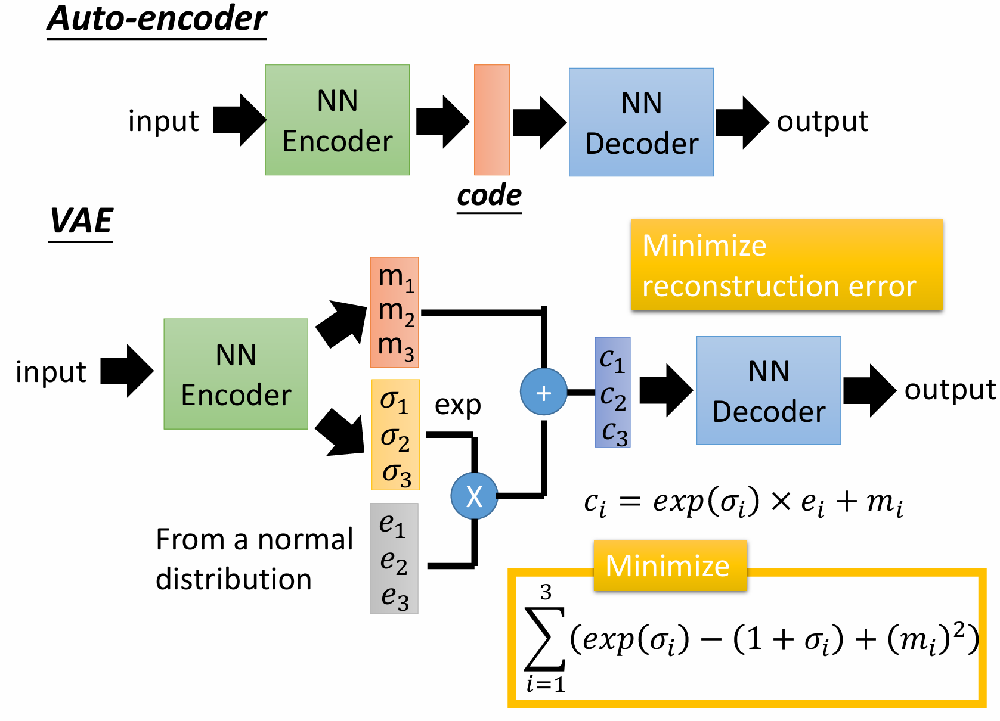

# VAE

VAE的具体结构如下图所示。输入经过编码器后，得到分布的均值和方差。利用重参数化技巧，根据得到的均值和方差，获得隐变量的正态分布。从正态分布中采样后，解码获得输出。通过这种方式，以输入嵌入为中心，其周围的数据输出将属于同一种类型。在之前的笔记中，已经对VAE的基本概念做过了介绍。该笔记主要从数学角度理解VAE。

VAE（变分自编码器）是一种生成模型，旨在通过最大化数据的对数似然来学习潜在空间的分布。在VAE中，目标是近似数据的潜在分布，并能够通过对潜在变量的采样生成新的数据。为了优化这个模型，我们引入了变分推断和重参数化技巧，避免了直接计算后验分布的困难。以下是从优化变分下界的角度来理解VAE的数学原理。

VAE的核心思想是通过变分推断来近似真实后验分布。对于给定的观测数据 x，假设其潜在变量为 z ，我们希望学习模型的对数似然 $\log p(x)$ ，即生成数据的概率。形式如下：

$$
\log p(x) = \log \int p(x, z) \, dz
$$

上述似然无法直接计算。我们引入一个变分分布 q(z|x)，用来近似真实的后验分布 p(z|x)。通过引入变分分布 q(z|x)，我们可以将对数似然分解成两个部分：

$$
log p(x) = \log \int p(x, z) \, dz = \log \int q(z|x) \frac{p(x|z) p(z)}{q(z|x)} \, dz  
$$

这里的 q 即为编码器，将x映射到z。$q(z|x)$ 可以采用重参数化策略，建模为高斯分布:

$$
z = \mu(x) + \sigma(x) \cdot \epsilon, \quad \epsilon \sim \mathcal{N}(0, I)
$$

运用对数不等式, 可以得到 logp(x) 的下界为

$$
\begin{align}
log p(x) &= \log \int q(z|x) \frac{p(x|z) p(z)}{q(z|x)} \, dz  \geq   \int  q(z|x)  \log\frac{p(x|z) p(z)}{q(z|x)} \, dz=\mathbb{E}_{q(z|x)}  \log \frac{p(z)p(z|x)}{q(z|x)} \\
&=\mathbb{E}_{q(z|x)}  \log q(z|x) - \mathbb{E}_{q(z|x)}  \log \frac{q(z|x)} {p(z)}=\mathbb{E}_{q(z|x)}\log p(x|z) - D_{KL}[q(z|x) \parallel p(z)]
\end{align}
$$

可以看到，变分下届分为两项，第一项为VAE输出 $p(x|z)$ 的对数似然，而第二项则是KL散度。

- 关于第一项，可以理解成优化编码器q和解码器p，使得输出尽可能的接近输入 x， 可以理解成简单的自编码器;
- 第二项可以是 p(z|x) 和 p(z) 之间的KL散度， 即让先验分布 p(z)和后验分布 p(z|x)接近。这里先验分布可以设置为标准的高斯分布。这一项可以理解成正则项，目的是让不同x对应的分布均值拉近点，方差别太小，从而有利于生成时采样。 

