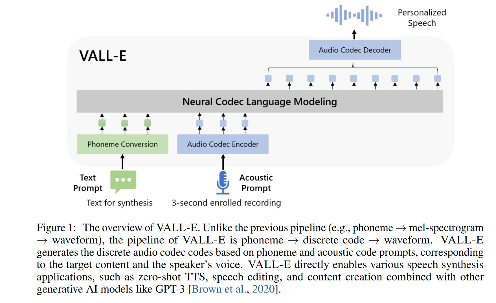
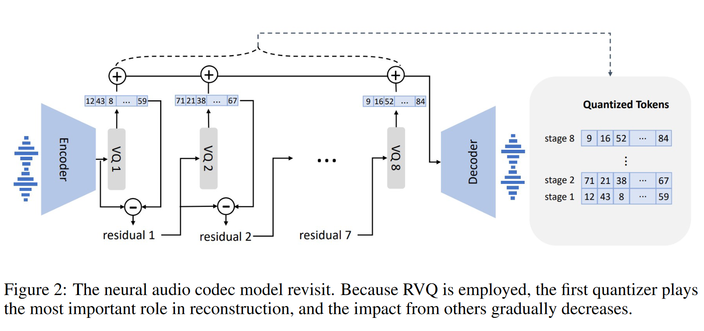
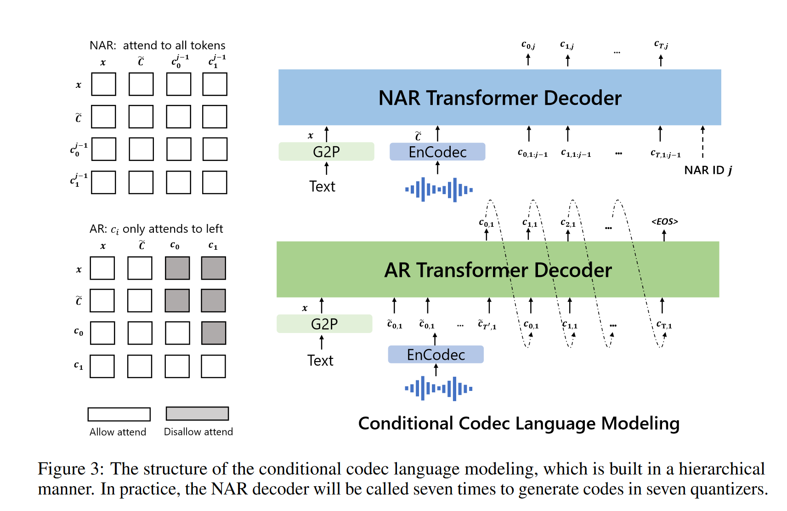

# VALLE: Neural Codec Language Models are Zero-Shot Text to Speech Synthesizers

VALLE 使用从已有的音频编解码器模型中获得的离散编码，以训练语言模型 。VALLE将 TTS 任务视为条件语言建模任务，而不是像以前的工作那样将 TTS 视为连续信号回归。在预训练阶段，本文将 TTS 训练数据扩展到 **60K 小时**的英语语音，这比现有系统大数百倍。VALL-E 具有上下文学习 (in-context learning) 能力，可用仅使用 3 秒的未见过的说话者的注册录音作为声音提示，来合成高质量的个性化语音。实验结果表明，VALL-E 在语音自然度和说话者相似性方面明显优于最先进的零样本 TTS 系统。此外，我们发现 VALL-E 可以在合成过程中保留说话者的情绪和声音提示的声学环境。

## 1 动机

文中首先分析了当前TTS系统存在的问题:

- 数据规模太小: 需要来自录音棚的高质量的干净数据，从网上爬取的数据质量不够高，可能会导致模型性能退化；
- 在 zero-shot 的场景下，合成未知说话人的说话人相似性和音频自然性很差；

本文提出的 VALL-E模型首次尝试使用60K 小时的大规模无文本标记数据集进行训练。具体来说，VALLE 使用了 LibriLight 训练。LibriLight 是一个包含 60K 小时英语语音的语料库，拥有超过 7000 名不同的说话者。原始数据只有音频，因此本文使用语音识别模型来生成转录。与之前的 TTS 训练数据集, 例如 LibriTTS 相比，我们的数据包含更多嘈杂的语音和不准确的转录，但提供了多样化的说话者和韵律。这使得得到的模型对噪声具有鲁棒性，并且通过利用大数据可以很好地推广。

在方法上，VALLE将 TTS 视为语言模型任务，以音频编解码器的编码作为中间表示来取代传统的梅尔频谱图。VALL-E具有上下文学习能力，并支持基于prompt的零样本 TTS 能力，以 3 秒注册录音和音素提示的声学标记为条件生成相应的声学标记，以分别限制说话者和内容信息。

## 2. 方法

### 2.1 音频编码与语音量化

若将音频以16bit进行量化，则一帧有 $2^{16}$ 种状态。考虑1s的音频包含上万帧，这使得计算量非常大。语义量化用于压缩每一帧的状态和序列长度。 WeNet 采用 μ律量化，可以将每帧状态数压缩到256，但u律量化无法减小序列长度，所以 WeNet 训练和推理非常慢。之前也有一些工作采用音频自监督模型得到的离散表征用于量化，但自监督模型的离散表征重建质量差，说话人信息丢失较多。

与其他量化方法相比，音频编解码器具有以下优势：

1. 它包含丰富的说话人信息和声学信息，与 HuBERT 码相比，可以在重建中保持说话人身份；
2. 可利用已有的音频编码器，无需像基于频谱的 VQ 方法那样在声码器训练上做额外努力 ；
3. 它可以减少时间步长以提高效率，相比于使用μ律量化;

本文采用EnCodec作为音频编码器，该编码器在对 AudioGen 的笔记中已有记录。该编码器采用残差量化，如下图所示，其输入音频为24kHz, 编码的分辨率为75Hz， 码本大小为8。

### 2.2 训练

VALLE是decoder-only的架构, 如下图所示。模型接受输入文本以及音频prompt。 文本被编码为音素序列，记作 $\textbf{x}$, 音频 prompt 则通过音频编码器进行编码。而对于音频prompt，训练过程中不明确地提取音频片段作为训练的提示, 训练过程是纯粹的因果语言模型训练。在推理过程中，则是给定一个已注册的录音，将已注册录音的音素序列和音素序列连接在一起进行合成。同时，将已注册录音的声学 token 序列用作prompt。这也就是为什么在使用基于 VALL-E架构的TTS模型进行 zero-shot合成时，一定要提供语音prompt对应的文本，因为我们需要将语音prompt对应的音素序列连接到待合成的音素序列之前。

训练具体来说分为自回归(AR) 和非自回归(NAR)两个阶段。自回归的语言模型训练作用于第一个码字上，而剩下7个码字采用非自回归 (因为训练第i个码字时，1到i-1个码字对应的全体序列都是已知的)。总的训练目标如下:
$$
\begin{equation}
p(C|x; \theta) = p(c_{:,1}| x; \theta_{AR}) \prod_{j=2}^{8} p(c_{:,j}|c_{:,<j}, x; \theta_{NAR})
\end{equation}
$$

- 每个阶段acoustic embedding layers $W_a$的权重是独立的, 而输出映射层则是和音频嵌入层共享参数$W_a$, 这一策略继承了GPT系列一贯的传统，具体解释可参考博客 [语言模型输出端共享Embedding的重新探索 ](https://zhuanlan.zhihu.com/p/647054514)。
- 音素也需要经过一个矩阵$W_x$的映射才被送入LLM中(这里$W_x$可以理解成音素对应的码本);
- NAR训练阶段中，每次随机抽取一个训练阶段 $i \in [2, 8]$ 。之前阶段得到的码字嵌入被加起来送入NAR模型；

### 2.3  推理

上下文学习是基于文本的语言模型的一项令人惊奇的能力，它能够在不更新额外参数的情况下预测未见过的输入的标签。对于 TTS，如果模型可以在不进行微调的情况下为未见过的说话人合成高质量的语音，则该模型被认为具有上下文学习能力。VALLE模型基于语言模型框架，具有很强的上下文学习能力。

关于推理时的解码策略，对于 AR 模型，我们使用以prompt为条件的, 基于采样的解码，因为我们观察到 beam-search 可能会导致语言模型陷入无限循环。此外，基于采样的方法可以显著增加输出的多样性。对于 NAR 模型，我们使用贪心解码来选择具有最高概率的 token。最后，我们使用音频解码器生成以八个码字序列为条件的波形。

## 3 实验与结果

### 3.1 数据集

- We use LibriLight as the training data which contains 60K hours of unlabelled speech from audiobooks in English. The number of distinct speakers is around 7000 in LibriLight.

- We train a hybrid DNN-HMM ASR model on 960 hours labeled LibriSpeech following Kaldi recipe. Once the hybrid model is trained, unlabeled speech data is decoded and transduced to the best phoneme-level alignment paths where the frameshift is 30ms.
-  The EnCodec model is used to generate the acoustic code matrix for the 60K hours of data
- LibriSpeech以及VCTK数据集被用于评估合成效果;

### 3.2 模型

- Both the AR model and the NAR model have the same transformer architecture with 12 layers, 16 attention heads, an embedding dimension of 1024, a feed-forward layer dimension of 4096, and a dropout of 0.1；
- During training, we randomly crop the waveform to a random length between 10 seconds and 20 seconds；

### 3.3 指标

本文采用客观和主观指标来比较模型效果：

- 客观指标
  - WavLM-TDNN被使用，用于评估prompt和合成与语音之间的相似性，指标为说话人相似性;
  - HuBERT-Large 被用于对合成的语音进行ASR，以评估合成的鲁棒性, 采用指标为词错误率WER；
- 主观指标: We calculate the comparative mean option score (CMOS) and similarity mean option score (SMOS) by crowdsourcing, where 12 and 6 native speakers are invited as CMOS and SMOS contributors. The scale of SMOS is from 1 to 5 with 0.5-point increments. CMOS ranges from -3 (the new system is much worse than baseline) to 3 (the new system is much better than baseline) with intervals of 1. <u>CMOS is an indicator of speech naturalness, and SMOS measures whether the speech is similar to the original speaker’s voice</u>.

### 3.4 实验结果

- 在两个评估集上，VALL-E 在语音自然度和说话者相似度方面都明显优于最先进的零样本 TTS 系统。甚至于在VCTK数据集上，VALL-E取得的CMOS分数要略高于真值；
- 此外，定性分析表明，VALL-E合成的音频具有足够的多样性，能够保留prompt中的背景环境以及说话人情绪。

