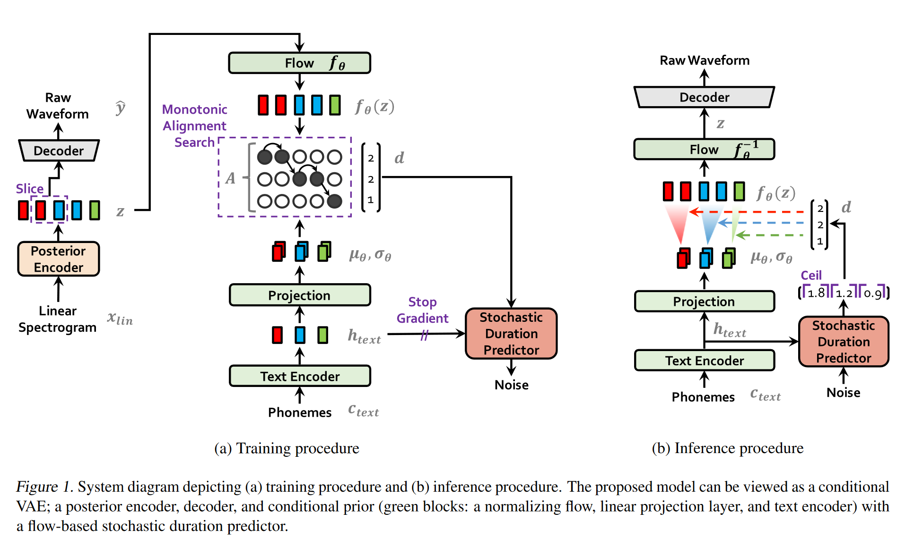
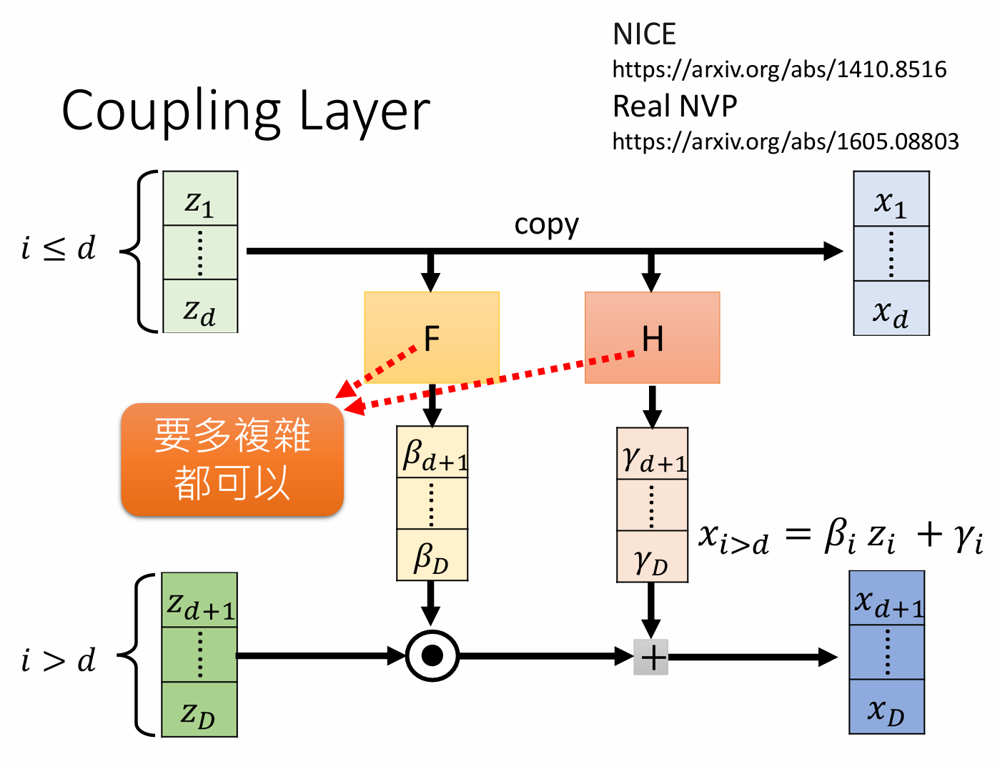

# VITS

Conditional Variational Autoencoder with Adversarial Learning for End-to-End Text-to-Speech， ICML 2021

本文之前主流的语音合成策略是二阶段的合成策略，基于单阶段训练和并行采样的端到端文本转语音 (TTS) 模型的样本质量要比两阶段 TTS 系统更差。本文提出了VITS, 一种并行端到端 TTS 方法，该方法可以生成比当前二阶段模型更自然的音频。VITS采用**变分推理**，并辅以**规范化流（normalizing flows）**和对抗训练，从而提高了生成模型的表达能力。我们还提出了一个**随机持续时间预测器 (stochastic duration predictor)**，用于从输入文本中合成具有不同节奏的语音。通过对潜在变量和随机持续时间预测器的不确定性建模，我们的方法表达了自然的一对多关系，其中文本输入可以以多种方式以不同的音调和节奏说出。对单个说话者数据集 LJ Speech 的主观人工评估（mean opinion score, MOS）表明，我们的方法优于最好的公开 TTS 系统，并实现了与真值相当的 MOS。

## 1 动机

传统的TTS方法多为二阶段合成策略:

1. 第一阶段[声学模型, acoustic model]: 是从预处理的文本生成中间语音表征，例如梅尔谱；
2. 第二阶段[声码器, vocoder]: 以中间表征(谱图)为条件，生成音频;

尽管并行 TTS 系统取得了进展，但两阶段策略仍然存在问题：

- 两阶段策略需要顺序的训练或微调，其中后期模型使用早期模型生成的样本进行训练，这导致训练和推理的低效率;
- 此外，对预定义中间特征的依赖, 阻碍了学习到更好的隐藏表示, 来进一步提高性能。例如，采用梅尔谱作为中间表征会丢失相位信息，而端到端的策略有可能可以保留相位特征(尽管对VITS，保留不了...)

之前的一些方法尝试使用端到端的训练策略，但是性能要低于二阶段系统。本文提出的VITS是第一个音频合成质量超过二阶段方法的端到端TTS模型。

## 2 方法

### 2.1 变分推断

VITS采用条件VAE进行变分推断:

$$
\log p_\theta(x | c) \geq \mathbb{E}_{q_\phi(z | x)} \left[ \log p_\theta(x | z) - \log \frac{q_\phi(z | x)}{p_\theta(z | c)} \right]
$$

其中第一项可以理解成让自编码器的输出接近输入内容; 第二项为KL散度, 其中 $q_\phi(z \vert x)$ 是后验编码器，将音频编码为隐表征 z, 而 $p_\theta(z \vert c)$ 则是z的先验，表示在给定文本条件的前提下，隐变量z的先验分布。

值得注意的是，标准的VAE对后验 q(z\|x) 做重参数化，而VITS对先验和后验都做了重参数化，由于是条件VAE；

> A conditional VAE is a conditional generative model where the observed conditions **modulate** the prior distribution of latent variables used to generate outputs.

#### 2.1.1 重建损失

首先需要计算对数似然损失。由基本的机器学习知识可以知道，假设数据符合高斯分布时，最大化对数似然等价于最小化L2 loss; 而VITS则是假设数据符合拉普拉斯分布，则其重建损失 $L_{recon}$ 是L1 Loss

$$
L_{recon} = \Vert x_{mel}-\hat{x}_{mel}\Vert_{1}
$$

注:

- 损失在梅尔谱空间上计算，由于梅尔谱和人的感官更一致；而输入则是提供的线性谱，因为其分辨率更高，提供更多的信息；
- 在实际训练过程中，在解码器端使用加窗的训练策略，每次只将隐变量z的一部分送到解码器中。这种做法的可能好处:
  - 提高训练效率, 降低内存占用，节省计算量;

  - 缓解长序列依赖， 关注局部特征： 长序列可能引入复杂的依赖关系，这并不是vocoder需要的特性。通过将长序列划分为多个窗口，模型可以更容易地学习局部特征；

  - 增强模型的泛化能力： 窗口化训练使模型能够在不同的上下文窗口中学习特征，从而提高了模型对未见数据的泛化能力;

#### 2.1.2 KL 散度

KL散度的计算中，先验和后验编码器均采用了正态分布进行重参数化处理。

- 先验编码器 (文本编码器) 的输出长度小于特征z在时间维度的长度。实验中通过单调的对齐矩阵 A 来确定每一个音素的持续时间。矩阵A的求法见下一节。

- 对特征z还采用了一个额外的 Flow 来做对其分布做转化，以更好的对齐先验和后验分布:
  $$
  \begin{align}
      p_{\theta}(z|c) &= \mathcal{N} \big( f_{\theta}(z); \mu_{\theta}(c), \sigma_{\theta}(c) \big) 
      \left| \det \frac{\partial f_{\theta}(z)}{\partial z} \right|, \\
      c &= [c_{\text{text}}, A]
  \end{align}
  $$

### 2.2 对齐估计(Alignment Estimation)

对齐估计是通过对齐矩阵A确定每个因素持续时间的过程。训练过程中， Monotonic Alignment Search (MAS) 策略被使用，其采用动态规划的方式寻找最优的单调对齐矩阵A：

$$
\begin{aligned}
\hat{A} &= \arg \max\limits_{\hat{A}} \log p_{\theta}(x_{\text{mel}} | z) - \log \frac{q_{\phi}(z | x_{\text{lin}})}{p_{\theta}(z | c_{\text{text}}, \hat{A})} \\
&= \arg \max\limits_{\hat{A}} \log p_{\theta}(z | c_{\text{text}}, \hat{A}) \\
&= \log \mathcal{N}(f_{\theta}(z); \mu_{\theta}(c_{\text{text}}, \hat{A}), \sigma_{\theta}(c_{\text{text}}, \hat{A}))
\end{aligned}
$$

但注意到仅在训练过程中 z是已知的，但在测试的时候，需要我们通过一个时长预测器 (duration predictor) 来进行时长预测，获取对齐矩阵 A。之前的工作中预测器预测固定的值，无法体现人的语音的随机性。VITS 采用了一个 flow-based 生成式模型，以得到一个随机的时长预测器(stochastic duration predictor)。预测器的训练过程主要基于之前的一些基于flow的工作，在此不做详细叙述，可自行参考原文引用文献。

### 2.3 总的损失函数

上述内容包含三个损失函数， 重建损失 $L_{recon}$ 和 KL损失 $L_{KL}$, 二者构成变分下界；	时长预测器的损失 $L_{dur}$， 用于训练时长预测器。此外，模型还额外具有一个判别器，用于判断合成音频是真是假, 进行类似GAN的对抗训练。判别器产生对抗损失 $L_{adv}$ 和逐层的特征图损失 $L_{fn}$,  对抗损失包括训练生成器和训练判别器的对抗损失两部分，而特征图损失则是让判别器的每一层真实音频和合成音频的特征均保持相似。

### 2.4 模型结构

- 后验编码器: non-causal WaveNet residual blocks. A WaveNet residual block consists of layers of dilated convolutions with a gated activation unit and skip connection. 最后由线性投影层得到 p(z\|x) 的均值和方差。对多说话人的情况，Wavenet 中的全局条件(global conditioning) 在残差网络的activation单元中被使用，如下所示,  其中 h 是条件，具体来说是对应说话人的嵌入, 可以由声纹模型获得：

$$
z = \tanh \left( W_{f,k} * x + V_{f,k}^T h \right) \odot \sigma \left( W_{g,k} * x + V_{g,k}^T h \right)
$$

- 后验编码器: 由 vanilla Transformer 构成的文本编码器将音素编码序列 $c_{text}$ 编码为 $h_{text}$ ，之后一个线性投影层将 $h_{text}$ 转化为先验概率p(z\|c)的均值和方差。

- Flow 层:  "The normalizing flow is a stack of affine coupling layers  consisting of a stack of WaveNet residual blocks"， 具体如下图所示。多说话人的情况下，说话人嵌入也被通过 global conditioning 引入到了 flow 结构中。

  此外，"For simplicity, we design the normalizing flow to be a **volume-preserving transformation** with the Jacobian determinant of one"。

  即这里作者控制了flow的雅可比行列式的值恒为1，所以损失计算时不需要考虑行列式项;

- 解码器和判别器: 基于HiFi-GAN V1。"It is composed of a stack of transposed convolutions, each of which is followed by a multireceptive field fusion module (MRF). The output of the MRF is the sum of the output of residual blocks that have different receptive field sizes." 对多说话人的情况下，说话人向量经过映射后会被加到输入的特征 $z$ 中以注入说话人信息。同样，判别器的设计也和 HiFi-GAN 一样。

## 3 实验

### 3.1 数据集

LJ数据集(24 hours) 和VCTK数据集(44 hours)。注意到数据集规模还是比较小的。

### 3.2 测试指标和结果

实验仅采用主观指标 MOS(mean opinion score)。 MOS评分通常由一组听众对语音样本的主观评分计算得出，评分范围通常为1到5，分数越高表示语音质量越好。实验结果表明VITS在两个数据集上均取得了高于传统二阶段方法的MOS分数，并且其MOS分数和Ground Truth很接近，证明了其效果有效性。

### 3.3 风格多样性与合成速度

VITS 的一个卖点是其采用了随机时长预测器。文章通过对同一个合成内容( "How much variation is there?” ) 对总的说话人时长和不同说话人时长统计表明，VITS能够很好的生成不同长短的内容，从而提高合成语音的自然度。而提取的 10 条话语的 F0 轮廓表明VITS对不同说话人, 生成了具有不同音调和节奏的语音。

> 在语音合成中，F0 contours（基频轮廓）是指语音信号中**基频**（F0）的变化模式。基频是声波的最低频率，通常与音高相关。基频轮廓描述了基频在时间上的变化情况，是语音合成和语音识别中的重要参数。通过分析和合成基频轮廓，可以更好地模拟自然语音的音调和韵律，从而提高语音合成的自然度和可理解性。

VITS的另一个优点是其是端到端的，因此合成速度比二阶段的要块。论文中也设计了实验来反应这一优点。