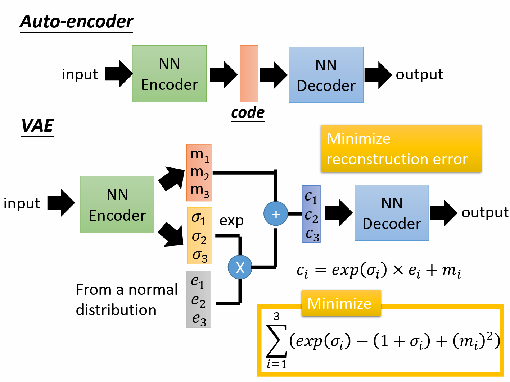

# 生成式算法概述

现有的生成式算法可以大体分为基于似然的方法(likelihood-based methods)、基于自回归的方法(autoregressive-based methods) 以及基于GAN的方法。本页笔记对这三种方法进行简要的概述。

## 1 基于似然的方法

顾名思义，基于似然的方法通过最大化似然函数的方式来对模型参数进行优化。著名的基于似然的算法包括变分自编码器(Variational autoencoders, VAE)，基于流的模型(flow-based models)，以及目前大火的diffusion算法。之后简单介绍VAE和flow-based model 的思想，关于difffusion将在之后单独开一页笔记记录。

### 1.1 Variational autoencoders

VAE的具体结构如下图所示。输入经过编码器后，得到分布的均值和方差。利用重参数化技巧，根据得到的均值和方差，获得隐变量的正态分布。从正态分布中采样后，解码获得输出。通过这种方式，以输入嵌入为中心，其周围的数据输出将属于同一种类型。VAE的损失函数由两项组成，一项是最小化重建损失，同自编码器；另一部分是最小化下图中右下角黄色框中的多项式。

从直观的角度来看，黄色框中的项起到了正则的作用，约束隐变量的均值尽可能接近于0，方差接近于1(若是不对方差进行约束，方差趋近为0，则VAE退化为AE，丧失了其作用)。约束均值尽可能接近0，使得不同类别的分布尽可能靠近，从而压缩隐空间的分布范围，使隐空间分布相对于输入空间更加密集。

而从数学的角度来看，VAE是在优化似然函数 $logP(x)$ 的变分下界。详细的推导可参见 [该pdf](../assets/generative_model.pdf) 。

### 1.2 flow-based models

基于流的方法希望获得一个生成器，使得输入满足高斯分布，而输出分布与目标数据分布尽可能一致(即两者KL散度小)。可以证明，最小化KL散度和极大似然等效，因而优化目标是极大似然问题。

由概率与统计的知识可知，随机变量 Z 和 X 之间满足如下关系:

$$\pi(z) =\left| J_{G} \right| p_{G}(x)$$

其中 $ J_{G}$ 为函数G的雅可比矩阵。该式可变形为

$$p_{G}(x)=\left| J_{G^{-1}} \right|\pi(G^{-1}(x))  $$

可以看到，对上式进行优化需要解决两件事：

1. 如何求 $J_{G^{-1}}$ ;
2. 如何求 $G^{-1}(x)$ ;

目前常见的两种策略是使用Coupling Layer和1x1 Convolution(参考[该pdf](../assets/flow.pdf))。

此外，由于一层生成器的空间转化能力可能不足，所以往往采用多层生成器级联的方式。

VAE 和 flow-based 方法速度较快，相比GAN比较容易优化，但和GAN相比，合成的图片质量较差。

## 2 基于自回归的方法

经典的基于自回归的方法包括PixelRNN和PixelCNN。当前在NLP方面，大火的GPT系列模型 (见下方图2) 基于自回归方法工作; 而DALL-E(见下方图1) 等自回归方法在CV领域也取得了广泛的成功。

自回归方法简单的说，就是根据现有预测结果，预测序列下一个token的结果，将得到token的结果包含进预测结果序列中，继续重复进行预测，直到检测到结束标识为止。

相比其他方法, 基于自回归的方法合成质量较高，缺点在于合成速度很慢。

## 3 基于GAN的方法

基于GAN的方法曾经引领了CV中图像生成的潮流, 其利用生成器将正态分布转化为目标分布，利用判别器判断图片是否为合成图。

GAN以其高合成质量而闻名，但缺点在于，优化困难(即很难训)。

