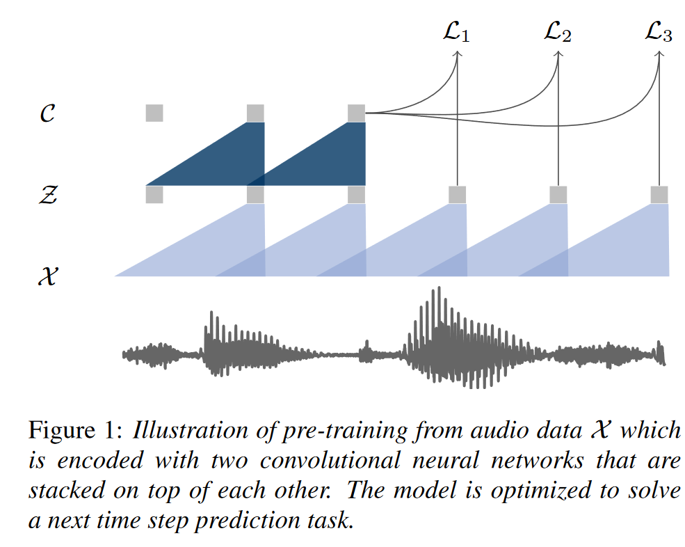
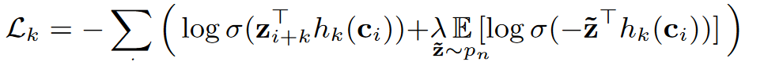
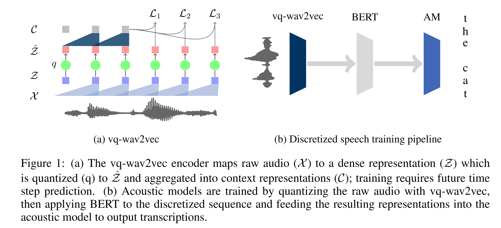
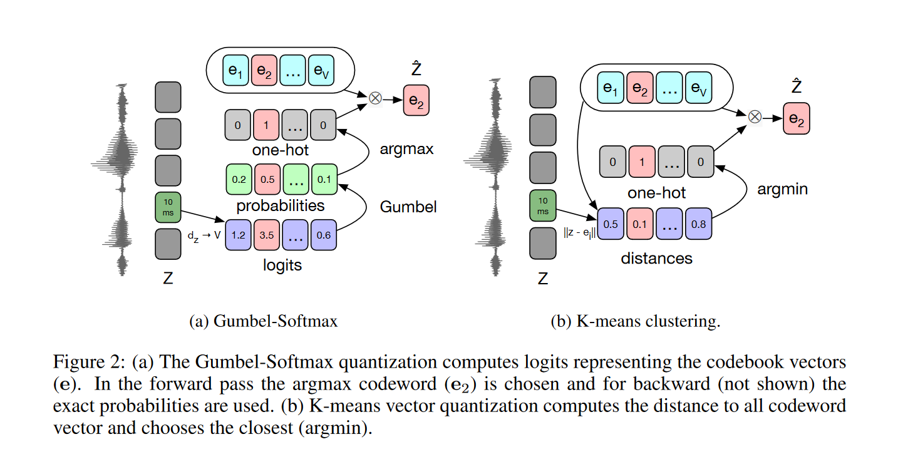
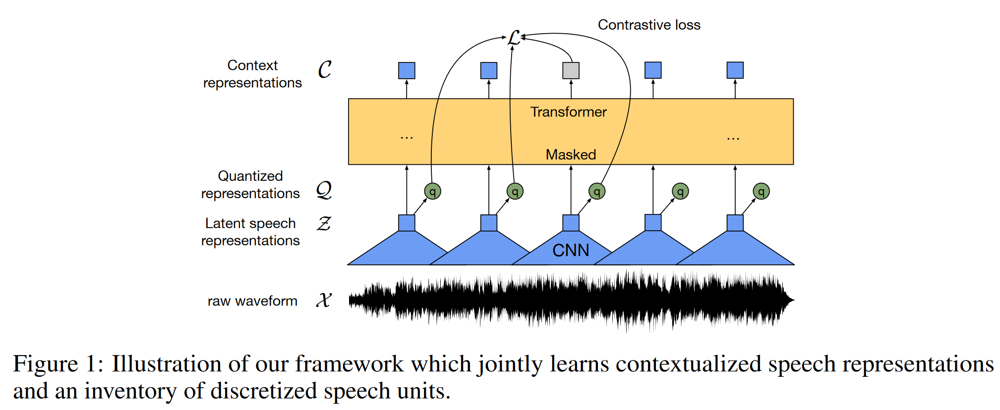
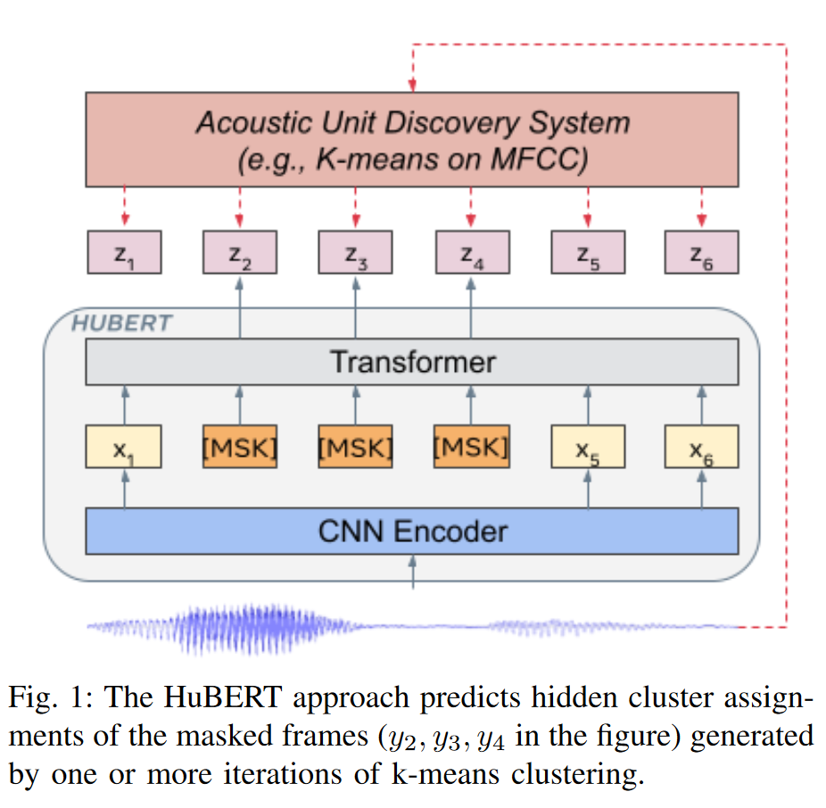

# 自监督 ASR

本文介绍利用自监督方法训练语音识别的三个经典模型： wav2vec、wav2vec2.0 和 HuBert

## 1. wav2vec[^1]

### 1.1 动机

The key idea is to learn general representations in a setup where substantial amounts of labeled or unlabeled data is available and to leverage the learned representations to improve performance on a downstream task for which the amount of data is limited. This is particularly interesting for tasks where substantial effort is required to obtain labeled data, such as speech recognition

核心思想是利用有**大量**有标签/无标签数据学习通用表征(representation),利用学到的表征改善**数据受限**的情况下下游数据的效果。

## 1.2 方法

### 1.2.1 预训练任务

Given an audio signal as input, we optimize our model  to **predict** future samples from a given signal context。

#### 损失函数

We train the model to distinguish a sample $z_{i+k}$ that is k steps in the future from distractor samples  $\widetilde{z}​$ drawn from a proposal distribution pn, by minimizing the contrastive loss for each step.

We optimize the loss $L = \sum_{k=1}^{K}L_k$, summing (1) over different step sizes.

- 即让预测 $h_k(c_i)$ 和  标签 $z_{i+k}$ 余弦相似度尽可能高，和随机采样的 余弦相似度尽可能低；
- 注意这里预测目标是连续的,没有量化 (同之后工作, 如VQ-wav2vec, wav2vec2的重要区别)；
- 本文取K=12；

### 1.2.2 模型结构

#### 编码网络(Encoder network)

- Embeds the audio signal in a latent space.

- 五层CNN构成。

#### 上下文网络(context network)

- Combines multiple timesteps of the encoder to obtain contextualized representations。即语言模型建模 $p(z_{i+k} \vert z_i . . . z_{i−r})​$ 。

- 9层CNN构成；

## 2. VQ-wav2vec

本文承接上文的wav2vec，在上文的编码器和上下文网络之间添加了量化模块，对来自编码器的特征进行量化，以便使用来自NLP领域的一些方法。具体来说，本文使用了如下两种量化策略: 

- 基于 Gumbel softmax : 类似于查找表，编码器的表征通过MLP获得不同码字的概率 (logit)。之后通过gumbel softmax后采样，从查找表里面获取对应的码字。
- 类似VQ-VAE的在线 K-means模块，在线的进行聚类。

此外，本文还讨论了分组量化策略对避免码本的模式塌陷中发挥的作用。本文的工作是之后的wav2vec2的基础。

## 3. wav2vec2.0[^2]

We show for the first time that learning powerful representations from speech audio alone followed by fine-tuning on transcribed speech can outperform the best semi-supervised methods while being conceptually simpler.

本文第一次展示了从语音信号中学习强大的表征，并在转录的语音上微调，可以取得超过最好的半监督方法的结果，并且在概念上更简单。

### 3.1 动机

1. 神经网络受益于大量标记的训练数据。然而，在许多情况下，有标记数据比未标记数据更难获得；
2. 单纯从有标记数据中进行学习的范式与人类的学习语言的方式不同：婴儿通过聆听周围成年人的说话来无监督的学习语言——这个过程婴儿可以学到良好的言语表征；
3. 自监督方法在NLP和自然语言处理领域已经得到了相当广泛的应用，证明了其有效性；

### 3.2 方法

- 编码器：七层CNN；

- 上下文网络：transformer网络+CNN的相对位置编码。其中Base模型有12层，Large模型有24层。

- 量化模块：For self-supervised training we discretize the output of the feature encoder z to a **finite** set of speech representations via **product quantization**

  - [乘积量化](https://github.com/facebookresearch/fairseq/blob/fad2c4d1ebe14d974876de52dcb06db6d99b0b4a/fairseq/modules/gumbel_vector_quantizer.py)：Product quantization amounts to choosing quantized representations from multiple codebooks and concatenating them. Given G codebooks, or groups, with V entries $e\in R^{V\times d/G}$ we choose one entry from each codebook and concatenate the resulting vectors $e_1,...,e_G$ and apply a linear transformation $R^d  \rightarrow R^f$ to obtain $q \in R^f$ .

  > Gumbel softmax 是重参数化的一种技巧，能够按照特定概率进行采样，并且保证计算题可导的特性。参考：[Gumbel Softmax 是什么? - 知乎 ](https://zhuanlan.zhihu.com/p/349933379)

- 预训练：

- - **掩码**: To pre-train the model we mask a certain proportion of time steps in the latent feature encoder space， similar to masked language modeling in BERT：We mask a proportion of the feature encoder outputs, or time steps before feeding them to the context network and **replace them with a trained feature vector shared between all masked time steps**

  - **损失函数**：

    $$\mathcal{L}=\mathcal{L}_m + \mathcal{L}_d$$

    其中 $\mathcal{L}_m $ 是对比损失（Contrastive Loss），用于计算对掩码部分预测的准确度；$\mathcal{L}_d$ 是多样性损失，通过最大化码本的熵来鼓励码本中使用不同的向量，以避免所有表征取同一向量导致对比损失的塌陷；

### 3.3 其他细节

1. wav2vec2 的CNN编码器接受 raw waveforme 而不是梅尔谱，代码见[该处](https://github.com/facebookresearch/fairseq/blob/d9a627082fd03ec72a27a31a4e56289bfcb2e4e4/fairseq/models/wav2vec/wav2vec2.py#L844)；

## 4. HuBert[^3]

### 4.1 动机

自监督学习的意义：

1. The north star for many research programs has been learning speech and audio representations through listening and interaction, similar to how babies learn their first language;
2. self-supervised learning methods can learn universal representations since labels, annotations, and textonly material ignores rich information in the input signal;
3. Learning speech representations without reliance on large volumes of labeled data is crucial for industrial applications and products with ever-increasing coverage of new languages and domains.

语音和CV、NLP自监督的区别：

- **The presence of multiple sounds in each input utterance** breaks the instance classification assumption used in many CV pre-training approaches;
- During pre-training, there is no prior lexicon of discrete sound units available, as in NLP applications in which words or word pieces are used, hindering the use of **predictive losses**;
- Lastly, the boundaries between sound units are not known, which complicates **masked prediction pre-training**.

### 4.2 方法

#### Representation Learning via Masked Prediction

 使用掩码预测任务进行预训练。

掩码预测任务的两个关键问题：怎么掩码和在哪计算预测损失。

怎么掩码：采用 wav2vec中的方案，随机取采样点，之后延长 l 步

损失函数计算：不失一般性的，认为预测损失由未掩码部分的预测和掩码部分的预测构成。当预测损失仅有未掩码部分构成时，类似于混合语音识别系统中的声学模型；当只预测掩码部分，模型需要根据上下文内容预测掩码区域内容，类似于语言模型。HuBert中采用只预测掩码部分。

In the other extreme with α = 1, the loss is only computed over the masked timesteps where the model has to predict the targets corresponding to the unseen frames from context, analogous to language modeling. It forces the model to learn both the acoustic representation of unmasked segments and the long-range temporal structure of the speech data.

#### Learning with Cluster Ensembles

HuBert利用多种聚类模型集成的方式制造伪标签。聚类方式采用 k-means。wav2vec中的集成量化技巧在这里也可以使用。

最开始在MFCC上进行聚类。之后每一轮迭代过程中，在上一轮编码器某一层的特征上做聚类。

### 4.3 实现细节

During fine-tuning, the convolutional waveform audio encoder parameters are fixed. Like wav2vec 2.0, we introduce a freeze-step hyperparameter to control how many fine-tuning steps the transformer parameters are fixed, and only the new softmax matrix is trained.

### 4.4 比较 wav2vec 和 HuBert

wav2vec 和 Hubert 都使用了掩码预测的任务进行自监督预训练。两者区别在于：

- HuBert 的量化特征不一定取编码器的最后一层；
- wav2vec2.0和HuBerr都是通过对特征进行量化的方式获得伪标签，进行监督学习，但wav2vec2.0的伪标签是通过全连接层得到，即是通过分类器获得，而HuBert的伪标签是通过kmeans聚类获得;
- wav2vec2.0预训练是端到端的，非迭代的；HuBert需要进行迭代以提高伪标签质量；

## Reference

[^1]: wav2vec: Unsupervised Pre-training for Speech Recognition, INTERSPEECH 2019
[^2]: wav2vec 2.0: A Framework for Self-Supervised Learning of Speech Representations,NIPS,2020
[^3]: HuBERT: Self-Supervised Speech Representation Learning by Masked Prediction of Hidden Units, *IEEE/ACM Transactions on Audio, Speech, and Language Processing* 29, 2021