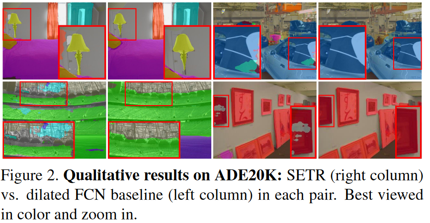

# 语义分割中的 ViT decoder

本文主要探讨语义分割任务中对 ViT 解码器的设计。

## 1. Rethinking Semantic Segmentation from a Sequence-to-Sequence Perspective with Transformers[^1]

本文提出了一个纯基于ViT的语义分割模型SEgmentation TRansformer (SETR)，并讨论了如何更好的设计解码器，以使ViT结构能够更好的用于语义分割任务。

### 1.1 动机

之前的语义分割工作的主流结构是全卷积神经网络(fully convolutional network,FCN)。该结构由编码器和解码器构成：编码器用于提取表征学习，解码器以编码器学习到的特征作为输入，进行逐像素的分类。基于CNN的架构具有平移等变性(translation equivariance)和局部性(locality)：平移等变性质很好地尊重了成像过程的本质，这支撑了模型对不可见图像数据的泛化能力；而局部性通过空间参数共享控制模型复杂度。然而，基于CNN的策略受限于有限的感受野，无法捕捉长程依赖信息(long range dependency), 而这对语义分割是很重要的。

> 思考：SED基线模型CRNN中，最后一层CNN输出的感受野多大？
>
> 基线SED模型一共有七层CNN，CNN卷积核大小为3*3,步长为1；前两层的CNN接有大小为2的池化层。
>
> 
>
> 注意到，最后一层输出的CNN感受野居然只有50，折合成时间，意味着CRNN的CNN输出只能看到周围0.7s的时间，如果考虑到，并非感受野内的所有区域都对最后的输出有着同等的影响，最后发挥作用的时间可能比0.7s还短...这种情况下，不加GRU分类效果差自然是应该的。


之前的一系列基于CNN的工作立足于扩大感受野，包括引入注意力机制。本文中，作者以纯transformer结构(ViT)作为编码器，以获取足够大的感受野。作者希望说明，传统CNN从局部到全局的结构可能是不必要的。文章贡献如下

1. 利用transformer结构作为特征编码器；
2. 研究了三种针对transformer的解码器设计；


###　1.2 解码器设计

从编码器得到的特征维度为$\frac{H}{16}\times\frac{W}{16}\times C$ ,解码器需要进行升维。作者提出了以下三个解码器方案

1. **Naive upsampling (Naive)**  通过 1 × 1 conv + sync batch norm (w/ ReLU) + 1 × 1 conv 将通道维度从C（这里C=1024）转移到类别数，之后做简单的双线性插值，接softmax后得到输出。
2. **Progressive UPsampling (PUP)**  见图(b)所示，一次性上采样可能引入噪声预测，因此采用逐步的上采样策略，每次只上采样2倍；
3. **Multi-Level feature Aggregation (MLA)**  该设计旨在利用多尺度的特征，分别从等间隔的编码器输出中提取不同的层，卷积并相加后，将结果拼接起来，上采样+接全连接层得到最终结果。注意为了引入层与层之间的关联，这里还加了一个自上而下的传递过程，类似UNet。


### 1.3 实验结果

**数据集：** 作者在Cityscapes、ADE20K和PASCAL Context三个数据集上检验了模型效果。

- Cityscapes  densely annotates **19 object categories** in images with urban scenes. It contains **5000 finely annotated images**, split into 2975, 500 and 1525 for training, validation and testing respectively. **The images are all captured at a high resolution of 2048 × 1024**. In addition, it provides **19,998 coarse annotated images** for model training.
- ADE20K is a challenging scene parsing benchmark with **150 fine-grained semantic concepts**. It contains 20210, 2000 and 3352 images for training, validation and testing.




**多尺度推断（Multi-scale test）**： 我们使用 mmsegmentation [38] 的默认设置。 具体来说，首先将输入图像缩放到统一的尺寸。 然后以缩放因子（0.5、0.75、1.0、1.25、1.5、1.75）对图像进行多尺度缩放和随机水平翻转。 采用**滑动窗口**进行测试（例如，Pascal Context 为 480 × 480）。 如果短边小于滑动窗口的大小，则将图像的短边缩放到滑动窗口的大小（例如 480），同时保持宽高比。 同步BN用于解码器和辅助丢失头。 为了训练简单性，我们在模型训练中没有采用广泛使用的技巧，例如 OHEM  损失。 


> **多尺度推理**：通常用于改善语义分割的结果。 <font color="red"><b>多个图像比例通过网络传递，然后将结果与平均或最大池合并。</b> </font> 精细的细节（例如物体的边缘或薄的结构）通常可以通过放大图像尺寸来更好地预测。 同时，对于较大结构的预测（需要更多的全局上下文），在缩小图像尺寸时通常会做得更好，因为网络的接收场可以观察到更多必要的上下文。
>
> SED方向今年的interspeech是有类似思想的论文[^3]

> **滑窗策略**：主要针对大图，采用滑动窗扫描整张图，以提高对精细细节的分辨。

在CityScape 和 ADE20k实验结果见下图。可以看到的是

- 消融实验表明，在Cityscape数据集上，SETR-PUP更好，而在ADK20K上，SETR-MLA略好。作者认为造成SETR-MLA表现略差的原因是每层的分辨率相同，没法提供像特征金字塔结构那样不同层次的表征。
- Naive 结构总是不如 PUP结构；
- 多尺度推断的效果好的惊人，几乎稳高两个点...


## SegFormer: Simple and Efficient Design for Semantic Segmentation with Transformers[^2]

仍然是21年的工作...考虑到Swin也是发表在2021ICCV上，2021真是神仙打架...

### 2.1 动机

本文主要是以SETR为基线，在其基础上进一步改进，以解决SETR和基于ViT结构的缺点：

- ViT 只能生成单种分辨率的特征；
- ViT在大图片上计算代价太高；

在该文之前，已经有一系列工作解决这方面的问题，如Swin 和 Twins, 但作者认为这些模型关注编码器设计，但忽略了解码器的设计。不同于之前这些模型，SegFormer同时关注了编码器和解码器的设计。文章的创新点如下：

- 无需位置编码的层次化Transformer编码器：无需位置编码能使模型在推理时能够接受任意尺度的图片（虽然有位置编码的模型可以通过对位置编码插值做到这件事，但作者认为这样对性能有损失），而层次化的编码器能够生成多尺度特征 (这点和Swin是一样的)。
- 轻量化的全mlp解码器，能够同时利用底层的局部特征和顶层的全局特征，从而获得强大的表征。
- 在分割任务上，和目前主流的基于transformer的策略相比，SegFormer在效率、准确性和鲁棒性三方面全部SOTA。

### 2.2 结构

关于代码实现可参考: [SegFormer: Simple and Efficient Design for Semantic Segmentation with Transformers 论文解读 - 知乎 (zhihu.com)](https://zhuanlan.zhihu.com/p/586619383)


### 2.2.1 Encoder

**Efficent Self-Attention:** 编码器首先对输入图像编码，将 4*4的块转成一个token。编码器使用的transformer结构来源于 Pyramid Vision Transformer[^4] ,其基本思想是把transformer的 K 和 V 压缩了$R^2$ 倍，从而达到节省计算量的目的 (从 attention 的计算公式上可以看出，其实把K和V同时降维，保留Q维度不变，输出维度也不变化。感觉这个技巧的本质是利用了图像信息的高度冗余性，对NLP来说，相邻的两个token可能完全不相似，但对于图像来说，相邻的两个token大概率差不多...)。这里R的取值4阶段分别为[64, 16, 4, 1]。所以kernelsize取[8, 4, 2, 1]。


```python
class Attention(nn.Module):
    def __init__(self, dim, num_heads=8, qkv_bias=False, qk_scale=None, attn_drop=0., proj_drop=0., sr_ratio=1):
        super().__init__()
        assert dim % num_heads == 0, f"dim {dim} should be divided by num_heads {num_heads}."

        self.dim = dim
        self.num_heads = num_heads
        head_dim = dim // num_heads
        self.scale = qk_scale or head_dim ** -0.5

        self.q = nn.Linear(dim, dim, bias=qkv_bias)
        self.kv = nn.Linear(dim, dim * 2, bias=qkv_bias)
        self.attn_drop = nn.Dropout(attn_drop)
        self.proj = nn.Linear(dim, dim)
        self.proj_drop = nn.Dropout(proj_drop)

        self.sr_ratio = sr_ratio
        if sr_ratio > 1:
            self.sr = nn.Conv2d(dim, dim, kernel_size=sr_ratio, stride=sr_ratio)
            self.norm = nn.LayerNorm(dim)

        self.apply(self._init_weights)
        #pass

    def forward(self, x, H, W):
        B, N, C = x.shape
        q = self.q(x).reshape(B, N, self.num_heads, C // self.num_heads).permute(0, 2, 1, 3)

        if self.sr_ratio > 1:#sr_ratio就是根号R
            x_ = x.permute(0, 2, 1).reshape(B, C, H, W)
            x_ = self.sr(x_).reshape(B, C, -1).permute(0, 2, 1)
            x_ = self.norm(x_)
            kv = self.kv(x_).reshape(B, -1, 2, self.num_heads, C // self.num_heads).permute(2, 0, 3, 1, 4)
        else:
            kv = self.kv(x).reshape(B, -1, 2, self.num_heads, C // self.num_heads).permute(2, 0, 3, 1, 4)
        k, v = kv[0], kv[1]

        attn = (q @ k.transpose(-2, -1)) * self.scale
        attn = attn.softmax(dim=-1)
        attn = self.attn_drop(attn)

        x = (attn @ v).transpose(1, 2).reshape(B, N, C)
        x = self.proj(x)
        x = self.proj_drop(x)

        return x
```


**Mix-FFN:**  该结构就是 CNN+MLP。这里靠CNN发挥位置编码的作用（这里可以参见苏建林的博客：[让研究人员绞尽脑汁的Transformer位置编码 - 科学空间|Scientific Spaces (kexue.fm)](https://kexue.fm/archives/8130) ，有文章证明，CNN可以通过填0的操作来获取位置信息[^5]）。作者认为，CNN相比于位置编码可以更好的处理推理过程中不同大小的图片。


**Overlapped Patch Merging：** 为了保持patch周围之间的局部连续性，使用重叠的patch。实际上就是将输入图片x送入卷积，卷积中设定kernel_size，stride, padding分别设置为7，4，3和3，2，1(7, 4, 3 应该是用作最初的patch获取上)。


#### 2.2.2 Lightweight All-MLP Decoder

相当简单，就是上采样完了直接拼起来。由于其输入patch大小是4*4,因此没进行上采样恢复到原始分辨率。


> 注意：拼特征的时候似乎都不加激活函数;

```python
class MLP(nn.Module):
    """
    Linear Embedding
    """
    def __init__(self, input_dim=2048, embed_dim=768):
        super().__init__()
        self.proj = nn.Linear(input_dim, embed_dim)

    def forward(self, x):
        x = x.flatten(2).transpose(1, 2)
        x = self.proj(x)
        return x


@HEADS.register_module()
class SegFormerHead(BaseDecodeHead):
    """
    SegFormer: Simple and Efficient Design for Semantic Segmentation with Transformers
    """
    def __init__(self, feature_strides, **kwargs):
        super(SegFormerHead, self).__init__(input_transform='multiple_select', **kwargs)
        assert len(feature_strides) == len(self.in_channels)
        assert min(feature_strides) == feature_strides[0]
        self.feature_strides = feature_strides

        c1_in_channels, c2_in_channels, c3_in_channels, c4_in_channels = self.in_channels

        decoder_params = kwargs['decoder_params']
        embedding_dim = decoder_params['embed_dim']

        self.linear_c4 = MLP(input_dim=c4_in_channels, embed_dim=embedding_dim)
        self.linear_c3 = MLP(input_dim=c3_in_channels, embed_dim=embedding_dim)
        self.linear_c2 = MLP(input_dim=c2_in_channels, embed_dim=embedding_dim)
        self.linear_c1 = MLP(input_dim=c1_in_channels, embed_dim=embedding_dim)

        self.linear_fuse = ConvModule(
            in_channels=embedding_dim*4,
            out_channels=embedding_dim,
            kernel_size=1,
            norm_cfg=dict(type='SyncBN', requires_grad=True)
        )

        self.linear_pred = nn.Conv2d(embedding_dim, self.num_classes, kernel_size=1)

    def forward(self, inputs):
        x = self._transform_inputs(inputs)  # len=4, 1/4,1/8,1/16,1/32
        c1, c2, c3, c4 = x

        ############## MLP decoder on C1-C4 ###########
        n, _, h, w = c4.shape

        _c4 = self.linear_c4(c4).permute(0,2,1).reshape(n, -1, c4.shape[2], c4.shape[3])
        _c4 = resize(_c4, size=c1.size()[2:],mode='bilinear',align_corners=False)

        _c3 = self.linear_c3(c3).permute(0,2,1).reshape(n, -1, c3.shape[2], c3.shape[3])
        _c3 = resize(_c3, size=c1.size()[2:],mode='bilinear',align_corners=False)

        _c2 = self.linear_c2(c2).permute(0,2,1).reshape(n, -1, c2.shape[2], c2.shape[3])
        _c2 = resize(_c2, size=c1.size()[2:],mode='bilinear',align_corners=False)

        _c1 = self.linear_c1(c1).permute(0,2,1).reshape(n, -1, c1.shape[2], c1.shape[3])

        _c = self.linear_fuse(torch.cat([_c4, _c3, _c2, _c1], dim=1))

        x = self.dropout(_c)
        x = self.linear_pred(x)

        return x
```

**感受野分析: ** Here, we use **effective receptive field (ERF) **[70] as a toolkit to visualize and interpret why our MLP decoder design is so effective on Transformers。该图应该是分析了图片最中间点的感受野。图中 DeepLabV3 是基于CNN 的目标检测网络。

- DeepLabV3 最后一层的感受野比SegFormer小不少，尽管该结构采用了诸多策略提升感受野；
- SegFormer 的底层具有局部感受野，而顶层具有全局感受野；
- mlp聚合后的感受野(蓝色框)比聚合前的更加聚焦于局部；

**由于CNN顶层感受野太小，因此采用mlp聚合的解码器效果不明显**。这点从之后的实验中可以看出。


#### 2.2.3 和SETR的比较

- We only use ImageNet-1K for pre-training. ViT in SETR is pre-trained on larger ImageNet-22K.

- SegFormer’s encoder has a hierarchical architecture, which is smaller than ViT and can capture both high-resolution coarse and low-resolution fine features. In contrast, SETR’s ViT encoder can only generate single low-resolution feature map. 

- We remove Positional Embedding in encoder, while SETR uses fixed shape Positional Embedding which decreases the accuracy when the resolution at inference differs from the training ones. 

- Our MLP decoder is more compact and less computationally demanding than the one in SETR. This leads to a negligible computational overhead. In contrast, SETR requires heavy decoders with multiple 3×3 convolutions.


### 3 实验设置

**数据集：** Cityscapes , ADE20K  and COCOStuff 

**实现细节：** 

- We used a batch size of 16 for ADE20K and COCO-Stuff, and a batch size of 8 for Cityscapes；

- For Cityscapes, we do inference using sliding window test by cropping 1024 × 1024 windows（注意 Cityscape一张图片大小是2048*1024）；


**消融实验**


[^1]: Rethinking Semantic Segmentation from a Sequence-to-Sequence Perspective with Transformers, CVPR 2021
[^2]: SegFormer: Simple and Efficient Design for Semantic Segmentation with Transformers, NIPS2021
[^3]: Resolution Consistency Training on Time-Frequency Domain for Semi-Supervised Sound Event Detection, interspeech2023
[^4]: Pyramid Vision Transformer: A Versatile Backbone for Dense Predictionwithout Convolutions, CVPR 2021
[^5]: HOW MUCH POSITION INFORMATION DO CONVOLUTIONAL NEURAL NETWORKS ENCODE?, ICLR, 2020