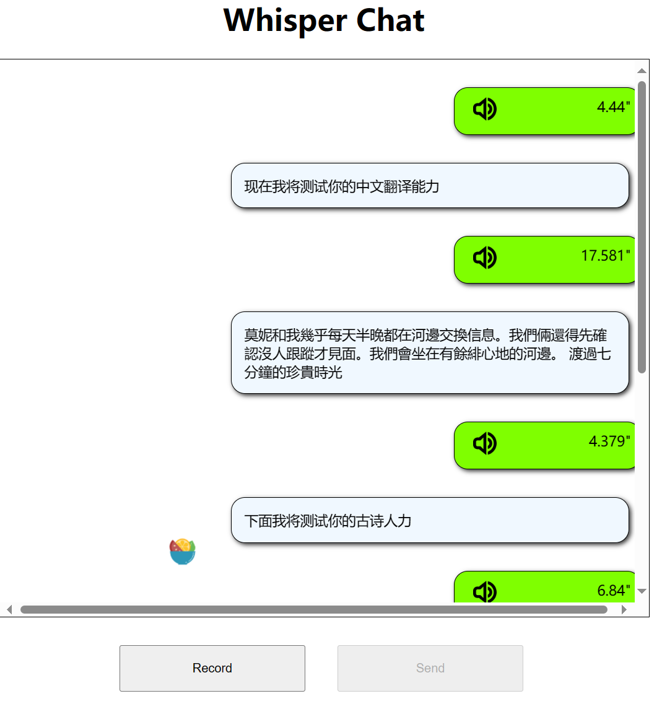
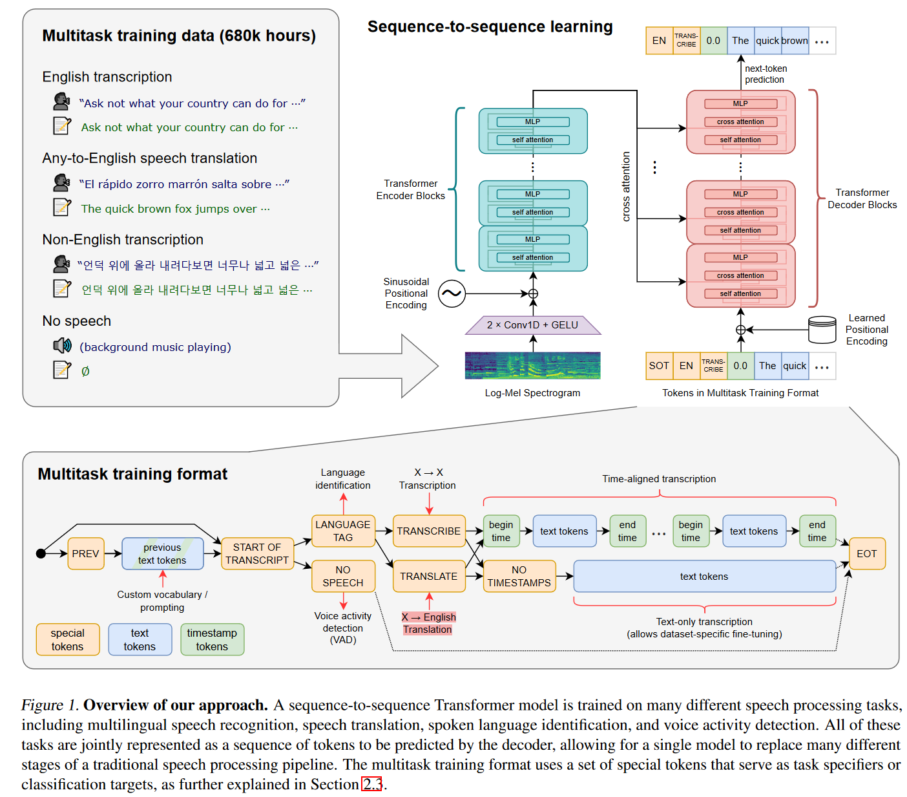
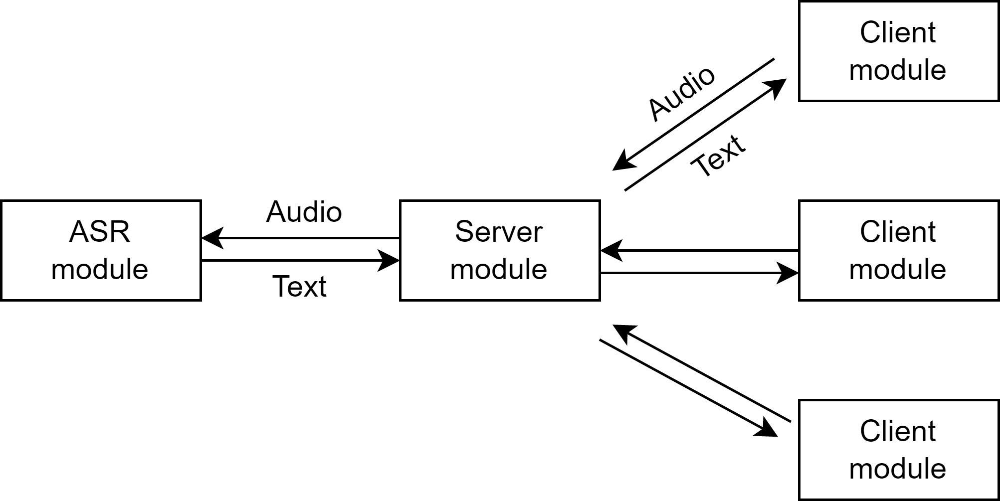

# 基于whisper的ASR服务器

该项目旨在实现一个用于语音识别(Automatic Speech Recognition)服务器，使用 openai 的 **[whisper]((https://github.com/openai/whisper))** 模型进行语音识别。用户可通过浏览器访问网站，使用类似微信语音聊天的界面来进行识别，如下图所示。

项目见：[cai525/whisper-based-ASR-server (github.com)](https://github.com/cai525/whisper-based-ASR-server)

## 1. 何为 Whisper?

Whisper是OpenAI开发的一种自动语音识别（ASR）模型，它可以将多种语言的语音转换为文本或翻译成英语。Whisper使用了一个由网络收集的680,000小时的多语言和多任务的监督数据集进行训练，这是目前最大的语音识别数据集之一，使其具有极强的鲁棒性和泛化性。Whisper是目前开源界最好的ASR模型(至少目前在英文识别领域确实如此)。

## 2. 设计思路

整个项目大体可分为三个模块

- ASR模块: 用于提供语音识别服务；
- 后端服务器模块: 与多客户端进行通信，负责提供https服务以及接受客户端音频文件，发送识别结果(文本);
- 前端模块: 前端使用 html+css+js 编写网页，用于与用户进行交互;

### 2.1 ASR模块

ASR模块采用开源的whisper模型进行语音识别。在该部分，需要解决两个核心问题: **如何让ASR更准**以及**如何让ASR更快**

#### 如何更准

影响模型识别效果的因素可大体分为音频本身质量、预处理策略、模型本身性能、以及后处理策略等。

对模型性能影响最大的因素自然是模型本身的性能。whisper各个版本模型如下表所示。更大的模型识别效果自然更好，但同时识别速度会更慢，对硬件的要求也更高。

|  Size  | Parameters | English-only model | Multilingual model | Required VRAM | Relative speed |
| :----: | :--------: | :----------------: | :----------------: | :-----------: | :------------: |
|  tiny  |    39 M    |     `tiny.en`      |       `tiny`       |     ~1 GB     |      ~32x      |
|  base  |    74 M    |     `base.en`      |       `base`       |     ~1 GB     |      ~16x      |
| small  |   244 M    |     `small.en`     |      `small`       |     ~2 GB     |      ~6x       |
| medium |   769 M    |    `medium.en`     |      `medium`      |     ~5 GB     |      ~2x       |
| large  |   1550 M   |        N/A         |      `large`       |    ~10 GB     |       1x       |

预处理策略对识别结果有一定影响。例如 [faster-whisper](https://github.com/SYSTRAN/faster-whisper) 中在whisper之前使用说话人活动检测(VAD)模块对音频做预处理，以去除音频中的空白段落。这一策略在实践中被证明对识别准确度有所提升。

据我所知，Whisper并没有在解码过程中添加额外的语言模型，而语言模型在之前的工作中被证明是十分有用的。通过引入语言模型，可以使ASR模型生成更加合理的识别结果，而不是被发音相似的词语迷惑，得出让人不知所云的"胡言乱语"。幸运的是，伴随NLP大模型的迅速发展，可以通过NLP大模型来充当语言模型的功能，对识别结果进行纠错。

最后是音频本身的质量问题，这一点可以通过外置麦克风来解决。另一方面，在通信过程中，需要保证语音传输的质量，以避免传输过程中发生失真。当然在我们的项目中，这一点相比于其他三点并不是太重要。

#### 如何更快 

识别速度也将直接影响使用体验。用户很难忍受说一句话，等上一分多钟才产生转录的结果。如果要追求较高的翻译准确度，就需要选择较大的ASR模型，而若要同时兼顾到翻译的速度，就需要进行合适的优化策略。

最直接的加速方案是堆算力，用GPU来加速推理。但问题是，在实际应用中，不是每一台服务器都具有足够好的GPU，针对CPU场景进行模型部署上优化是有必要的。不少开源项目致力于提高whisper的推理速度，例如前文提到的  [faster-whisper](https://github.com/SYSTRAN/faster-whisper) ，以及 [whisper.cpp](https://github.com/ggerganov/whisper.cpp) .  对过长的语音，可以考虑语音分段后，对每段语音并行识别。另外在存在多个服务端连接时，如何同时高效的进行多段语音翻译，也是值得思考的问题。

### 2.2 服务器模块

该模块负责

- 支持https服务，在用户访问网址时发送html网页；
- 待客户端完成录音后，接受客户端发送的音频文件，并将翻译完成后的文本传回客户端。

对于https服务，项目采用Nginx提供支持。**Nginx**（发音同“engine X”）是异步框架的网页服务器，也可以用作反向代理、负载平衡器和HTTP缓存。该软件由俄罗斯程序员伊戈尔·赛索耶夫（Игорь Сысоев）开发并于2004年首次公开发布。

而对于音频和文本通信服务，该项目采用tornado实现音频和文本的通信服务。 Tornado是一个Python web框架和异步网络库. 通过使用非阻塞网络I/O, Tornado 可以支持上万级的连接，处理 长连接、WebSockets、和其他需要与每个用户保持长久连接的应用。

### 2.3 前端设计

前端界面使用 html+css+js 编写网页，其中html控制页面中有哪些组成部分，css控制各组成部分的外观，JS控制页面的执行逻辑。

前端页面的关键在于需要支持录音以及利用套接字与服务器建立连接，以发送音频文件，接受识别结果。

