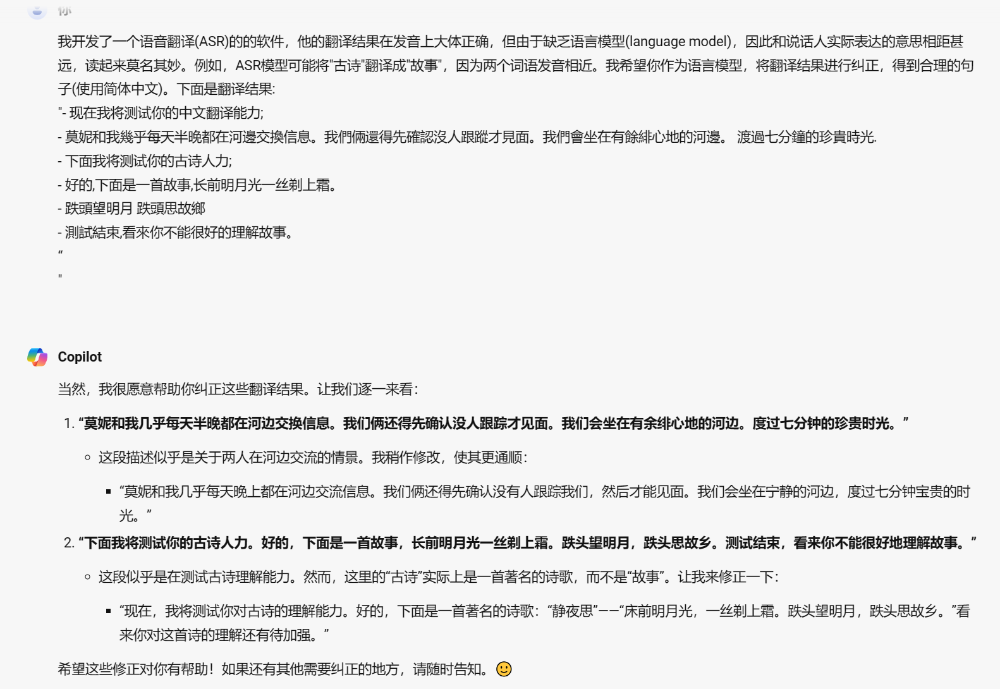

# 后端设置

## 1. 基于Whisper的ASR模块

识别模块基于openai的开源代码 [openai/whisper: Robust Speech Recognition via Large-Scale Weak Supervision (github.com)](https://github.com/openai/whisper) 和 [mli/autocut: 用文本编辑器剪视频 (github.com)](https://github.com/mli/autocut) 改编得到。后者是李沐老师在读论文系列[whisper一期](https://www.bilibili.com/video/BV1VG4y1t74x) 做的一个基于whisper的视频剪辑工具。

为了保证识别效果，我采用了 whisper medium 模型。从测试来看，medium 对英文和中文的识别效果均让人比较满意，但缺点是识别速度比较慢——一段几秒的音频，在CPU模式下whisper 需要采用约18s 才能完成识别。**后续的工作侧重于如何优化其推理速度**，如采用  [faster-whisper](https://github.com/SYSTRAN/faster-whisper) 等。另一方面，由于当前是在本地电脑上采用CPU进行推理，未来考虑换换用带有更好GPU的服务器，从硬件端提高推理速度。


## 2. VAD

whisper之前使用说话人活动检测(VAD)模块对音频做预处理，以分割空白片段。这样做有两个好处: 一是减小了单次推理的音频长度，将长音频分割为若干短音频，从而提升推理速度(考虑到Transformer的平方复杂度)；另一方面，有测试发现，whisper遇到长空白时，会错误输出 "thank you" 这种表示结束的词(可能和训练集数据有关)。去除空白能避免这种现象。

代码中的VAD模块采用了[SileroVAD](https://github.com/snakers4/silero-vad)，这是一个基于CRNN结构的语音活动检测模型。关于SileroVAD的介绍可参见[SileroVAD : Machine Learning Model to Detect Speech Segments](https://medium.com/axinc-ai/silerovad-machine-learning-model-to-detect-speech-segments-e99722c0dd41)


## 3. 语言模型

在Whisper的原始论文中，并没有提到其使用了语言模型(language model)。个人猜测，未使用语言模型的原因在于，一方面原始数据量足够大；另一方面，由于whisper支持几百种语言，在当时(2022)为每种语言都配置语言模型，难度较大。

由于缺乏语言模型，Whisper在一些复杂的语言场景下，表现的差强人意。下面这段文字，来源于whisper的中文转录结果:

```tx
- 现在我将测试你的中文翻译能力;
- 莫妮和我幾乎每天半晚都在河邊交换信息。我們倆還得先確認沒人跟蹤才見面。我們會坐在有餘緋心地的河邊。 渡過七分鐘的珍貴時光
- 下面我将测试你的古诗人力;
- 好的,下面是一首故事,长前明月光一丝剃上霜。
- 跌頭望明月 跌頭思故鄉
- 測試結束,看來你不能很好的理解故事.
```

可以看到，结果存在三个主要问题:

- 简体中文和繁体中文混乱；
- 对同音字识别较差，如"故事"和”古诗“；
- 对诗歌这种复杂的，高度依赖先验的内容，识别较差(考虑到训练过程中，诗歌这种类型的音频文本对出现较少，甚至有些诗根本没有出现)

这里采用的解决方案是，调用文本大模型作为额外的语言模型，对翻译结果进行修正。下图分别展现了采用文心一言和new bing 修正的结果, 可以看到， 这里文心一言完美的修正了由于同音字造成的错误（包括正确识别出了《静夜思》），相比之下，newbing的结果要拉跨很多，考虑到其采用较少的中文数据集进行训练。

<div align="center"></div>


<div align="center"></div>


## 4. 基于tornado的服务器

项目使用tornado实现服务器，用于音频和文本传输。Tornado是一个Python web框架和异步网络库. 通过使用非阻塞网络I/O, Tornado 可以支持上万级的连接，处理 长连接、WebSockets、和其他需要与每个用户保持长久连接的应用。由于我们的ASR识别是非实时的，因此服务器逻辑相对简单，接受到音频信号后，首先将音频从ogg格式转为wav格式，之后调用 ASR 模块翻译， 最后回传文本信息即可。

