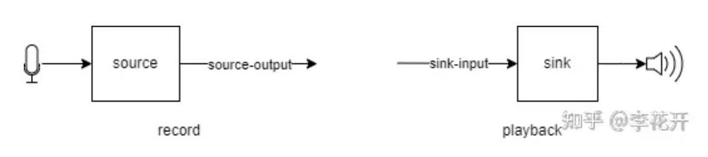

# 实验准备

## 1. 利用PulseAudio配置服务器音频

当在远程服务器或在WSL上编程时，在本地无法直接听到服务器(WSL)上的音频，也无法在服务器(WSL)上直接利用本地的麦克风进行录音。这不方便我们进行后续的编程和调试工作。为了解决这一问题，我们配置[PulseAudio](https://wiki.archlinuxcn.org/zh/PulseAudio) 以实现服务器(WSL)音频和本地电脑音频之间的转发。

### 1.1 配置 windows 端

1. 下载 [PulseAudio on Windows ](https://www.freedesktop.org/wiki/Software/PulseAudio/Ports/Windows/Support/)

2. 打开 `pulseaudio-1.1\etc\pulse\default.pa`文件

   - 修改第39行如下，其中 sink_name 指的是音频流的末端，source_name指音频流的起始段(参考下图)；`record=0` 表示不进行录音，`=1`表示录音。所以下面的配置，第一行表示将音频从远程传音频到本地，即接受远程播放的声音；第二行则是将本地麦克风录制的声音发送到远程。

        ```
        ### Load audio drivers statically
        ### (it's probably better to not load these drivers manually, but instead
        ### use module-udev-detect -- see below -- for doing this automatically)
        load-module module-waveout sink_name=output source_name=input record=0
        load-module module-waveout sink_name=input source_name=output record=1 
        ```

   <div align="center"></div>


   - 修改第60行如下，其中**auth-ip-acl=127.0.0.1;172.16.0.0/12**：设置一个 IP 地址的白名单，只允许来自这些地址的连接，以防止未授权的访问。127.0.0.1 是本地回环地址，172.16.0.0/12 是一个私有网络地址段，可以覆盖大部分的局域网地址(例如WSL2的地址)。如果需要添加其他的地址(如远程服务器)，可以用分号隔开。

        ```
        ### Network access (may be configured with paprefs, so leave this commented
        ### here if you plan to use paprefs)
        #load-module module-esound-protocol-tcp
        load-module module-native-protocol-tcp auth-ip-acl=127.0.0.1;172.16.0.0/12
        load-module module-esound-protocol-tcp auth-ip-acl=127.0.0.1;172.16.0.0/12
        ```


### 1.2 配置远程

这里默认远程采用Linux系统。

1. 安装 libpulse0

   ```shell
   sudo apt install libpulse0
   ```

2. 在 ~/.bashrc 文件中添加配置，使在每个shell启动时，自动完成远程的配置

   ```shell
   # For PulseAudio
   export HOST_IP="$(ip route |awk '/^default/{print $3}')"
   export PULSE_SERVER="tcp:$HOST_IP"
   #export DISPLAY="$HOST_IP:0.0"
   ```

   其中第一行 这行命令获取了默认路由的 IP 地址，即本地主机的 IP 地址。它使用了`ip route` 命令来获取路由信息，并通过`awk`  过滤出默认路由的 IP 地址;

   `export PULSE_SERVER="tcp:$HOST_IP"` 告诉 PulseAudio 使用 TCP 协议连接到指定的 IP 地址上的服务器。如果这里需要使用远程服务器，则将 `$HOST_IP` 换成服务器的地址；

   `export DISPLAY="$HOST_IP:0.0"`最后一行用于在远程显示图形界面, 这里并不需要。

3. 最后在 windows 下打开 `pulseaudio-1.1\bin\pulseaudio`, 即可在远程linux环境和本地windows环境中实现音频转发。

### 参考

[How To Get Sound (PulseAudio) To Work On WSL2 - Linux Uprising Blog](https://www.linuxuprising.com/2021/03/how-to-get-sound-pulseaudio-to-work-on.html)

[PulseAudio实用手册 ](https://zhuanlan.zhihu.com/p/589527476)


## 2. 配置Nginx

nginx的配置参考以下教程: [Linux Nginx的安装与配置（全程图文记录超详细](https://blog.csdn.net/qq_39420519/article/details/126322909)。 需要注意的是，由于前端的音频录制服务(MediaRecorder)需要https环境下才能正常工作，因此nginx中必须配置https。https所需的SSL证书可使用openssl得到。
